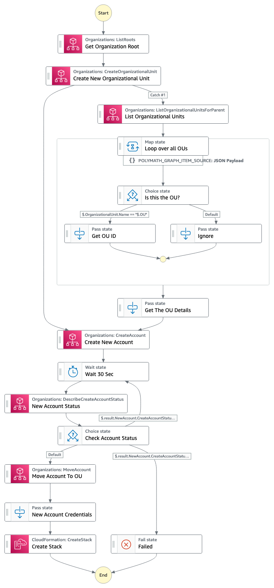

# Account Vending Machine 

This workflow is an Account Vending Machine, it help automate new AWS accounts creation within an AWS Organizations. It needs to be deployed on the AWS Organizations management account to help create new AWS Account under an existing Organizational Unit (OU) that you provide as an input. If the OU does not exist, the workflow will create a new one under the root OU. If the account is created successfully it will be moved under the provided OU and the workflow will deploy a CloudFormation template, that is provided as input, to the new account.

For more Step Functions workflows check [ServerlessLand Workflows](https://serverlessland.com/workflows)

Important: this application uses various AWS services and there are costs associated with these services after the Free Tier usage - please see the [AWS Pricing page](https://aws.amazon.com/pricing/) for details. You are responsible for any AWS costs incurred. No warranty is implied in this example.

## Requirements

* [Create an AWS account](https://portal.aws.amazon.com/gp/aws/developer/registration/index.html) if you do not already have one and log in. The IAM user that you use must have sufficient permissions to make necessary AWS service calls and manage AWS resources.
* [AWS CLI](https://docs.aws.amazon.com/cli/latest/userguide/install-cliv2.html) installed and configured
* [Git Installed](https://git-scm.com/book/en/v2/Getting-Started-Installing-Git)
* [AWS Serverless Application Model](https://docs.aws.amazon.com/serverless-application-model/latest/developerguide/serverless-sam-cli-install.html) (AWS SAM) installed

## Deployment Instructions

1. Create a new directory, navigate to that directory in a terminal and clone the GitHub repository:
    ``` 
    git clone https://github.com/aws-samples/step-functions-workflows-collection
    ```
1. Change directory to the pattern directory:
    ```
    cd account-vending-machine
    ```
1. From the command line, use AWS SAM to deploy the AWS resources for the workflow as specified in the template.yaml file:
    ```
    sam deploy --guided
    ```
1. During the prompts:
    * Enter a stack name
    * Enter the desired AWS Region
    * Allow SAM CLI to create IAM roles with the required permissions.

    Once you have run `sam deploy --guided` mode once and saved arguments to a configuration file (samconfig.toml), you can use `sam deploy` in future to use these defaults.

1. Note the outputs from the SAM deployment process. These contain the resource names and/or ARNs which are used for testing.

## How it works


1. Deploy this to your AWS Organizations management account, in order to automate the creation of new AWS accounts
2. Run the workflow to 
    - Check if you have an existing OU with the provided name or not. It will create a new one under the root if non existed
    - Create a new AWS account, and wait until it is successfully created
    - Move the new account under the provided OU
    - Create a new CloudFormation stack based on the CloudFormation template provided. This step will be done by assuming the default IAM role `OrganizationAccountAccessRole` that AWS Organizations automatically creates.


## Testing

1. Go to the AWS [Step Functions Console](https://console.aws.amazon.com/states/home) and find the State Machine from the Terraform Output. It should be named `AccountVendingStateMachine`
2. Select `Start Execution` and use a valid JSON data as input similar to the below.
3. The inputs required are
    - **OU** - Organization Unit Name
    - **AccountName** - The name of the new AWS account
    - **AccountEmail** - The new email address to use for the new AWS account
    - **TemplateBody** - AWS CloudFormation template in JSON format
4. Sample input:
  ```
    {
          "OU": "Production",
          "AccountName": "Aboushady Organization 2 Account",
          "AccountEmail": "aboushad+org1@amazon.com",
          "TemplateBody": {
                "AWSTemplateFormatVersion": "2010-09-09",
                "Description": "Template description",
                "Resources": {
                    <The Resources you will create goes here>
                }
          }
    }
  ```
5. Observe the State Machine workflow execution.

## Cleanup
 
1. Delete the stack
    ```bash
    aws cloudformation delete-stack --stack-name STACK_NAME
    ```
1. Confirm the stack has been deleted
    ```bash
    aws cloudformation list-stacks --query "StackSummaries[?contains(StackName,'STACK_NAME')].StackStatus"
    ```
----
Copyright 2023 Amazon.com, Inc. or its affiliates. All Rights Reserved.

SPDX-License-Identifier: MIT-0