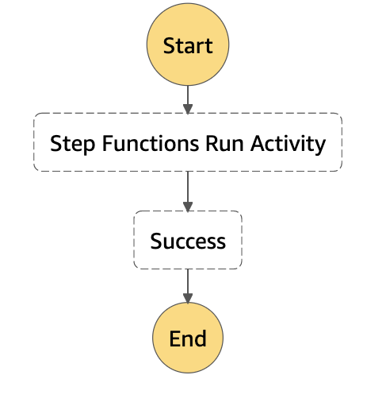

# Activity state machine

This application creates a State Machine with Activity state that enables you to implement a worker hosted anywhere. An activity worker can be an application running on EC2 instance/ AWS Lambda or a mobile device application that can make HTTP connection. 

The example workflow runs an activity task state which waits for activity worker running on AWS Lambda. When State Machine workflow reaches activity task state, it pauses in "In progress" status and waits for activity worker to poll for a task. Once the function polls for activity task, the workflow then waits for the time configured in "TimeoutSeconds" to allow worker complete and report success/failure.

## Requirements

* [Create an AWS account](https://portal.aws.amazon.com/gp/aws/developer/registration/index.html) if you do not already have one and log in. The IAM user that you use must have sufficient permissions to make necessary AWS service calls and manage AWS resources.
* [AWS CLI](https://docs.aws.amazon.com/cli/latest/userguide/install-cliv2.html) installed and configured
* [Git Installed](https://git-scm.com/book/en/v2/Getting-Started-Installing-Git)
* [AWS Serverless Application Model](https://docs.aws.amazon.com/serverless-application-model/latest/developerguide/serverless-sam-cli-install.html) (AWS SAM) installed

## Deployment Instructions

1. Create a new directory, navigate to that directory in a terminal and clone the GitHub repository:
    ``` 
    git clone https://github.com/aws-samples/step-functions-workflows-collection
    ```
1. Change directory to the pattern directory:
    ```
    cd activity-state-machine
    ```
1. From the command line, use AWS SAM to deploy the AWS resources for the workflow as specified in the template.yaml file:
    ```
    sam deploy --guided
    ```
1. During the prompts:
    * Enter a stack name
    * Enter the desired AWS Region
    * Allow SAM CLI to create IAM roles with the required permissions.

    Once you have run `sam deploy --guided` mode once and saved arguments to a configuration file (samconfig.toml), you can use `sam deploy` in future to use these defaults.

1. Note the outputs from the SAM deployment process. These contain the resource names and/or ARNs which are used for testing.

## How it works

1. When the task state "Step Functions Run Activity" runs the Activity "TestActivity", the workflow execution pauses for activity worker to poll the task using "GetActivityTask" API call.
2. Once the activity worker(Lambda function) polls for the task, then the workflow waits for "Timeout" seconds, thus allowing worker to return it's success/failure/heartbeat.
3. The workflow execution succeeds only if the activity worker has completed it's execution succesfully.




## Testing

1. After deployment, navigate to AWS Step Functions console and select the "ActivityStateMachine" workflow.
2. Select 'Start Execution' and use any valid JSON data as input.
3. As the workflow reaches activity task state, it pauses for worker to poll. Navigate to AWS Lambda console and select "WorkerFunction".
4. Test the function from console using any valid JSON data as input.
5. Observe the State Machine workflow execution.

## Cleanup
 
To delete the resources created by this template, use the following command:

```bash
sam delete
```

----
Copyright 2022 Amazon.com, Inc. or its affiliates. All Rights Reserved.

SPDX-License-Identifier: MIT-0