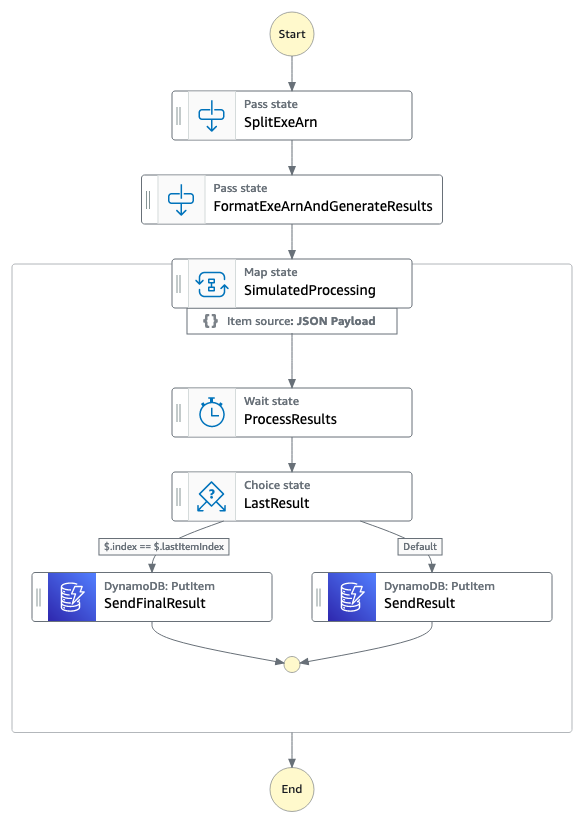
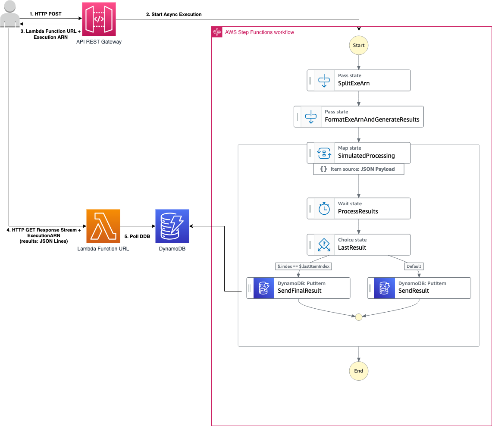

# Asynchronous Notifications using a Streaming Lambda Function URL

This workflow uses an asynchronous Express Step Functions state machine to perform a simulated multi-step workflow. The results from the workflow are streamed back to the client using DynamoDB and a Streaming Lambda Function URL written in NodeJS. The Streaming Lambda Function URL enables results to be sent immediately when they become available in the workflow using a streaming HTTP response and without the need for any other connection mechanisms or services. Results are retrieved from DynamoDB which also acts as a persistent storage for the results if they need to be retrieved at a later point after the workflow has completed.

Learn more about this workflow at Step Functions workflows collection: << Add the live URL here >>

Important: this application uses various AWS services and there are costs associated with these services after the Free Tier usage - please see the [AWS Pricing page](https://aws.amazon.com/pricing/) for details. You are responsible for any AWS costs incurred. No warranty is implied in this example.

## Requirements

* [Create an AWS account](https://portal.aws.amazon.com/gp/aws/developer/registration/index.html) if you do not already have one and log in. The IAM user that you use must have sufficient permissions to make necessary AWS service calls and manage AWS resources.
* [AWS CLI](https://docs.aws.amazon.com/cli/latest/userguide/install-cliv2.html) installed and configured
* [Git Installed](https://git-scm.com/book/en/v2/Getting-Started-Installing-Git)
* [AWS Serverless Application Model](https://docs.aws.amazon.com/serverless-application-model/latest/developerguide/serverless-sam-cli-install.html) (AWS SAM) installed

## Deployment Instructions

1. Create a new directory, navigate to that directory in a terminal and clone the GitHub repository:
    ``` 
    git clone https://github.com/aws-samples/step-functions-workflows-collection
    ```
1. Change directory to the pattern directory:
    ```
    cd async-state-machine-streaming-lambda-results
    ```
1. From the command line, use AWS SAM to deploy the AWS resources for the workflow as specified in the template.yaml file:
    ```
    sam build && sam deploy --guided
    ```
1. During the prompts:
    * Enter a stack name
    * Enter the desired AWS Region
    * Allow SAM CLI to create IAM roles with the required permissions.

    Once you have run `sam deploy --guided` mode once and saved arguments to a configuration file (samconfig.toml), you can use `sam deploy` in future to use these defaults.

1. Note the outputs from the SAM deployment process. These contain the resource names and/or ARNs which are used for testing.

## How it works

An asynchronous Express Step Functions workflow is triggered by a HTTP POST request to an API Gateway REST endpoint. The API Gateway endpoint returns the executionARN, a unique identifier for the Step Functions execution, together with a URL for the Lambda Function URL. The ExecutionArn effectively correlates the executed workflow with the results streamed back to the client by the Lambda Function URL. Upon calling the API Gateway route to trigger the asynchronous workflow, the client can then immediately call the Lambda Function URL with the ExecutionARN as a Query String Parameter to receive streamed results from the workflow (see architecture diagram below). The results are streamed back as raw DynamoDB items in a JSON Lines format.

The streamed response from the Lambda Function URL has two termination conditions: 
1. A final result is retrieved which is signaled by the presence of a field with the name specified by the `FinalResultFieldName` parameter in the template.yml 
2. The Lambda Function URL reaches its execution timeout (default execution timeout: 60s).


## Image

### Workflow


### Architecture


## Testing

This pattern can be tested in a number of ways as described below. Each method has its own dependencies, however, all methods require valid AWS Credentials set in the environment.

The NodeJS client and integration test harness require the following environment variables to be set to appropriate values:

- AWS_SAM_STACK_NAME 
- AWS_REGION

### BASH Test Client

The BASH client requires the [JQ library](https://jqlang.github.io/jq/download/) to be installed.

```bash
bash test.sh
```

### NodeJS test client

This test client requires a version NodeJS that has fetch available (v18+).

```bash
node test.js
```

### Integration Tests

You can also execute the pattern and learn more about how to call and interrogate the results using the integration tests.

The test dependencies can be installed as follows:

```bash
npm install
```

To run the integration tests:

```bash
npm run test:integration
```

## Cleanup
 
1. The pattern can be deleted by running:
    ```bash
    sam delete --no-prompts
    ```
----
Copyright 2023 Amazon.com, Inc. or its affiliates. All Rights Reserved.

SPDX-License-Identifier: MIT-0
