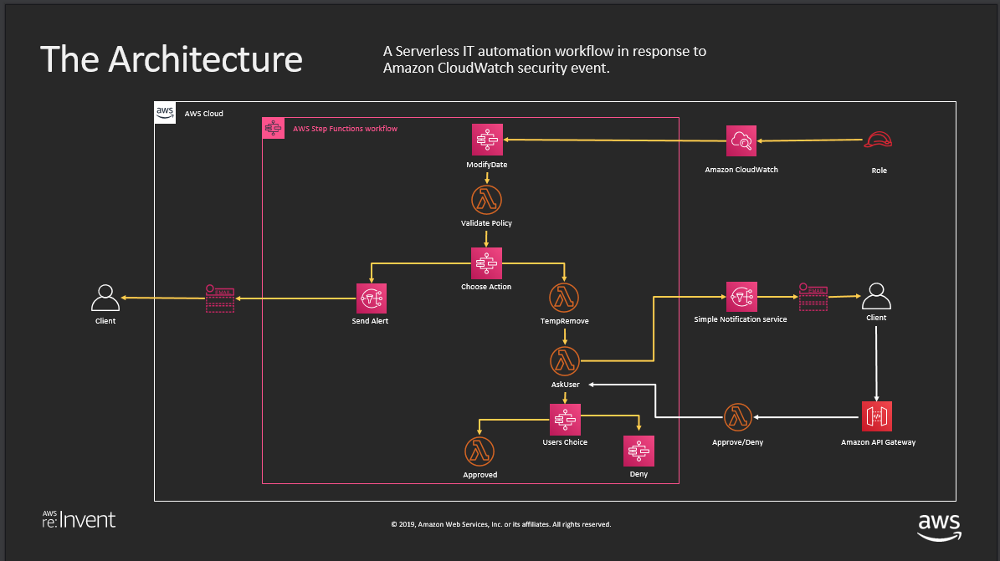

# Automated security orchestrator with AWS Step Functions 

This AWS Stepfunctions based workflow automates the process of verifying if newly created IAM Policies contain any of the predefined list of restricted actions. It then takes care of notifying the admin through Amazon SNS email notification and provides them with an option to either approve or deny the changes. 

It currently looks for CreatePolicy event from cloudtrail and examines the policy content being created. However, this pattern can be extended to other events such as update policy or delete policy, etc. 

The SAM version of this pattern with more details can be found [here](https://github.com/aws-samples/automating-a-security-incident-with-step-functions)

Here is the architecture diagram.

