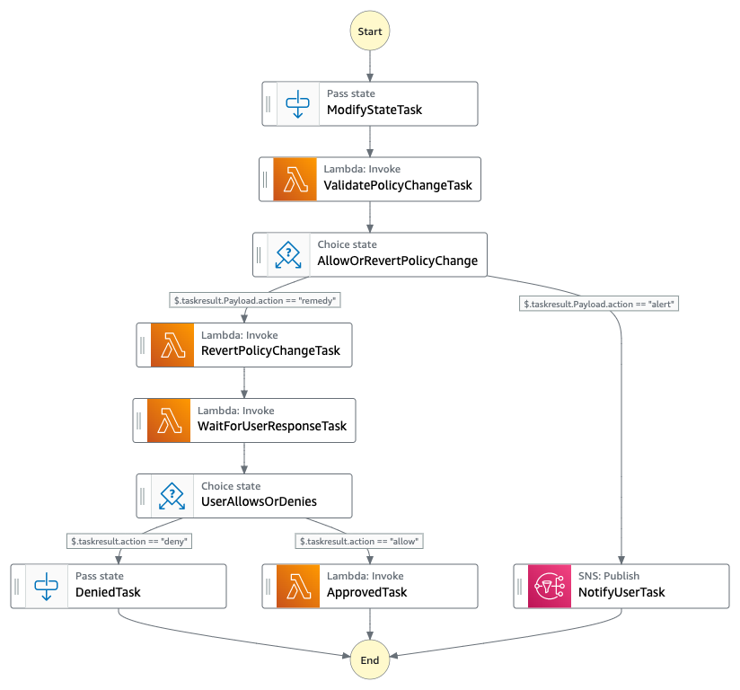

# Automated security orchestrator with AWS Step Functions 


This AWS Stepfunctions based workflow automates the process of verifying if newly created IAM Policies contain any of the predefined list of restricted actions. It then takes care of notifying the admin through Amazon SNS email notification and provides them with an option to either approve or deny the changes. 

It currently looks for CreatePolicy event from cloudtrail and examines the policy content being created. However, this pattern can be extended to other events such as update policy or delete policy, etc. 

The SAM version of this pattern with more details can be found [here](https://github.com/aws-samples/automating-a-security-incident-with-step-functions)

## How it works
Here is the application architecture. An event rule is created which specifically looks for IAM CreatePolicy event. When a new policy is created, this event gets triggered and the step function is started. First, the step function validates the policy document to see if the actions contain any of the restricted actions. If yes, it creates a temporary policy with the same ARN as the new policy and sends a notification to the email configured with links to either approve or deny.  

If the admin approves the change, the original policy statement is put back into the same ARN. If the admin deines the change, the original policy statement is never put back and the policy changes are denied. 

Here is the step function workflow.



## Requirements

- [Create an AWS account](https://portal.aws.amazon.com/gp/aws/developer/registration/index.html) if you do not already have one and log in. The IAM user that you use must have sufficient permissions to make necessary AWS service calls and manage AWS resources.
- [AWS CLI](https://docs.aws.amazon.com/cli/latest/userguide/install-cliv2.html) installed and configured
- [Git Installed](https://git-scm.com/book/en/v2/Getting-Started-Installing-Git)
- [Python 3](https://www.python.org/downloads/)

## Deployment Instructions

_Note: The stack expects 2 parameters_
* admin_email_address - the email address to which the subscription email and subsequent approval request will be sent to. 
* restricted_actions - list of comma separated IAM actions that are restricted.  
These values are passed into the stack from the app.py file. Please edit these values and update them as needed 

1. Create a new directory, navigate to that directory in a terminal and clone the GitHub repository:
   ```
   git clone https://github.com/aws-samples/serverless-patterns
   ```
2. Change directory to the pattern directory:
   ```
   cd serverless-patterns/automating-a-security-incident-with-step-functions-cdk
   ```
3. Create a virtual environment for Python:
   ```
   python3 -m venv .venv
   ```
4. Activate the virtual environment
   ```
   source .venv/bin/activate
   ```
   For a Windows platform, activate the virtualenv like this:
   ```
   .venv\Scripts\activate.bat
   ```
5. Install the Python required dependencies:
   ```
   pip install -r requirements.txt
   ```
6. Review the CloudFormation template the cdk generates for you stack using the following AWS CDK CLI command:
   ```
   cdk synth
   ```
7. From the command line, use AWS CDK to deploy the AWS resources for the serverless application as specified in the app.py file:
   ```
   cdk deploy 
   ```

Once the deployment is succesful, Amazon SNS will send an email to the email address configured in the app.py file to confirm the subscription. Please confirm the subscription by clicking on the link provided in the email.

## Testing

To test this pattern, you can use AWS CLI to create a 'bad' policy using the policy document found in this repository(resources/badpolicy.json)

Use the following aws cli command to create this policy

```
aws iam create-policy --policy-name my-bad-policy --policy-document file://resources/badpolicy.json

```

This will trigger the step function workflow, and it will send an email to the email address provided during the cdk deploy step. Open the email and approve or deny the changes. 


## Cleanup

Run the given command to delete the resources that were created. It might take some time for the CloudFormation stack to get deleted.

```
cdk destroy
```

---

Copyright 2021 Amazon.com, Inc. or its affiliates. All Rights Reserved.

SPDX-License-Identifier: MIT-0
