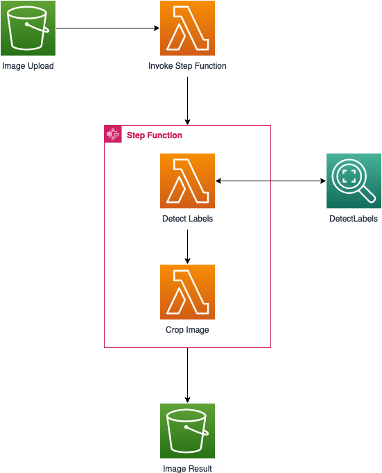

# Smart Image Cropper

### Description

This AWS Step Functions workflow automates the process of intelligently cropping pictures of individuals. Its main purpose is to crop around a picture of a person, removing any unnecessary background and focusing solely on the person in the image. The workflow is triggered whenever an image is uploaded to an S3 bucket. Once triggered, the image is retrieved and sent to Amazon Rekognition, where the detect_labels function is utilized to identify the objects within the image. If the function returns a person label, the image is cropped accordingly and saved to another S3 bucket.

Currently, the workflow is designed specifically for cropping individuals, but it can be easily customized or expanded to crop other objects or support additional image processing functionalities provided by Amazon Rekognition.

### Architecture Diagram

### Requirements

- Create an AWS account if you do not already have one and log in. The IAM user that you use must have sufficient permissions to make necessary AWS service calls and manage AWS resources.
- AWS CLI installed and configured
- Git installed
- AWS Cloud Development Kit installed
- Python 3 installed

### Deployment instructions
1. Create a new directory, navigate to that directory in a terminal and clone the GitHub repository:

        git clone https://github.com/aws-samples/step-functions-workflows-collection

2. Change directory to the workflow directory:

        cd ingest-and-analyze-historical-storm-events

3. Bootstrap CDK, if needed:

        cdk bootstrap aws://{your-aws-account-number}/{your-aws-region}

4. Deploy the stack: 

        cdk deploy

### Testing
1. Navigate to the S3 bucket created by the stack. The upload bucket should contain the prefix `backgroundcroppercdkstack-imageupload`.
2. Upload an image of your choice, make sure there is one person in the picture. Below is an example image that is suitable:

3. Navigate to the Step Function created by the Stack. Once the execution is complete, the output of the workflow will contain the S3 URI where the image has been written to. Below is an example output from the Step Function:

        {
        "output": {
        "Bucket": "backgroundcroppercdkstack-imageresult28985dd4e7e3-mxro3t7a43p5",
        "FileName": "person_looking.jpg"
                },
        "outputDetails": {
        "truncated": false
                }
        }

4. Navigate to the other S3 bucket and download the image. The output bucket should contain the prefix `backgroundcroppercdkstack-imageresult`.
5. Open the image on your local machine. It should be cropped like the example image below.

### Cleanup

Delete the stack:

    cdk destroy