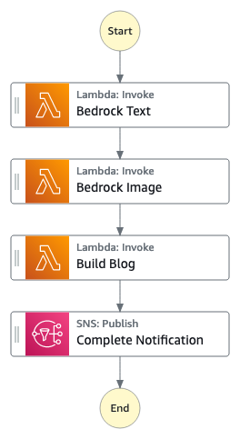

# Bedrock Blog Generator

Leverage Generative AI to take a simple prompt and generate an entire blog article with an image that is delivered directly to your email.  This workflow uses Amazon Bedrock, Lambda, and S3 to generate content, store it for processing, and delivers a download link via signedURL. The entire process takes about 40 secs and creates Markdown and HTML files.

Important: this application uses various AWS services and there are costs associated with these services after the Free Tier usage - please see the [AWS Pricing page](https://aws.amazon.com/pricing/) for details. You are responsible for any AWS costs incurred. No warranty is implied in this example.

## Requirements

* [Create an AWS account](https://portal.aws.amazon.com/gp/aws/developer/registration/index.html) if you do not already have one and log in. The IAM user that you use must have sufficient permissions to make necessary AWS service calls and manage AWS resources.
* [AWS CLI](https://docs.aws.amazon.com/cli/latest/userguide/install-cliv2.html) installed and configured
* [Git Installed](https://git-scm.com/book/en/v2/Getting-Started-Installing-Git)
* [AWS Serverless Application Model](https://docs.aws.amazon.com/serverless-application-model/latest/developerguide/serverless-sam-cli-install.html) (AWS SAM) installed

## Deployment Instructions

1. Create a new directory, navigate to that directory in a terminal and clone the GitHub repository:
    ``` 
    git clone https://github.com/aws-samples/step-functions-workflows-collection
    ```
2. Change directory to the pattern directory:
    ```
    cd ./bedrock-blog-generator
    ```
3. From the command line, use AWS SAM to deploy the AWS resources for the workflow as specified in the template.yaml file:
    ```
    cd ./functions
    npm install
    cd ..
    sam build && sam deploy --guided
    ```
4. During the prompts:
    * Enter a stack name
    * Enter the desired AWS Region
    * Enter Email for SNS Notification delivery
    * Allow SAM CLI to create IAM roles with the required permissions.

    Once you have run `sam deploy --guided` mode once and saved arguments to a configuration file samconfig.toml, you can use `sam deploy` in future to use these defaults.

5. <span style="color:red">*You must enable Amazon Bedrock models in your account and in the SAME REGION you have deployed your code.* </span> Navigate to [Amazon Bedrock Console](https://console.aws.amazon.com/bedrock/home#/modelaccess).

6. Under Model Access click `Edit` in the upper left.  Enable `Anthropic-Claude` & `Stability AI-Stable Diffusion` and click `Save changes` 

    

## How it works

1. On execution of the workflow the input is passed to the *Bedrock Text* Lambda that is responsible for invoking Amazon Bedrock model `Anthropic - Claude v2`
2. *Bedrock Text* Lambda parses the response from Bedrock to make sure the formatting is correct and saves content to S3 and outputs the introduction text onto the next task.
3. *Bedrock Image* Lambda takes the introduction text and invokes Bedrock model `Stability AI - Stable Diffusion`.  This image is saved to S3 and ouputs location of S3 contents to next task.
4. *Build Blog* Lambda gets the text and image content from S3.  It stitches the image and the text into a single Markdown and HTML document.  These are zipped up and saved into S3. A pre-signedURL is created on this object and passed as an output to the next task.
5. *Complete Notification* SNS takes the pre-signedURL and send this to the SNS Topic, which then routes to your email address that is subscribed.




## Testing

1. After deployment you will receive an email titled `AWS Notification - Subscription Confirmation`. Click on the link in the email to confirm your subscription. This will allow SNS to send you emails.

2. Navigate to the [AWS Step Functions](https://console.aws.amazon.com/states/home) console and select the `BedrockBlogGenerator` workflow. If you don't see it, make sure you are in the correct Region.

3. Click  button. Enter the following JSON in the Start Execution Input.
    ```json
    { "input": "Write a blog on the benefits of owning a truck." }
    ```

4. Observe the workflow as it moves through each task.  Be sure to inspect the input and out of each task.  The `Complete Notification` task will have the signedURL in the input if you do not want to wait for the email.


## Cleanup
 
1. Delete the stack
    ```bash
    sam delete
    ```
1. Confirm the stack has been deleted
    ```bash
    aws cloudformation list-stacks --query "StackSummaries[?contains(StackName,'STACK_NAME')].StackStatus"
    ```
----
Copyright 2022 Amazon.com, Inc. or its affiliates. All Rights Reserved.

SPDX-License-Identifier: MIT-0
