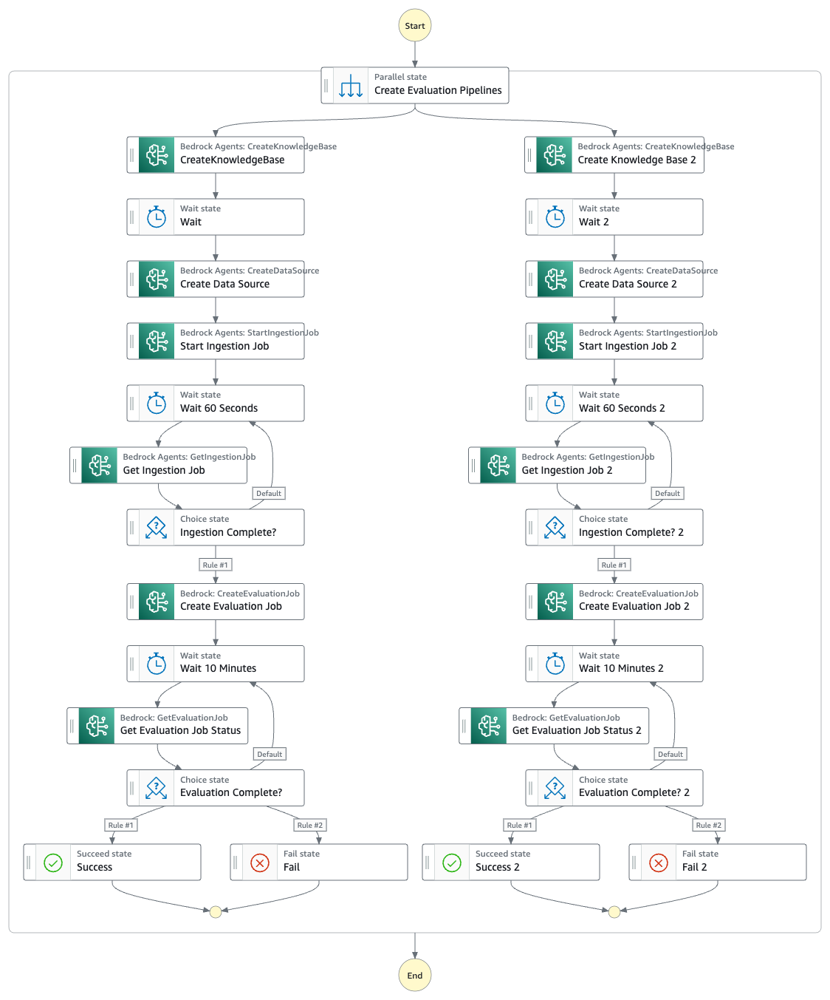

# Amazon Bedrock Knowledge Base parallel evaluations

This Amazon Step Functions workflow ingests data into multiple Knowledge Bases and evaluates the performance of your Knowledge Bases with your test suite of prompts.

Learn more about this workflow at Step Functions workflows collection: << Add the live URL here >>

Important: this application uses various AWS services and there are costs associated with these services after the Free Tier usage - please see the [AWS Pricing page](https://aws.amazon.com/pricing/) for details. You are responsible for any AWS costs incurred. No warranty is implied in this example.

## Requirements

* [Create an AWS account](https://portal.aws.amazon.com/gp/aws/developer/registration/index.html) if you do not already have one and log in. The IAM user that you use must have sufficient permissions to make necessary AWS service calls and manage AWS resources.
* [AWS CLI](https://docs.aws.amazon.com/cli/latest/userguide/install-cliv2.html) installed and configured
* [Git Installed](https://git-scm.com/book/en/v2/Getting-Started-Installing-Git)
* [AWS Serverless Application Model](https://docs.aws.amazon.com/serverless-application-model/latest/developerguide/serverless-sam-cli-install.html) (AWS SAM) installed

## Deployment Instructions

1. Create a new directory, navigate to that directory in a terminal and clone the GitHub repository:
    ``` 
    git clone https://github.com/aws-samples/step-functions-workflows-collection
    ```
1. Change directory to the pattern directory:
    ```
    cd step-functions-workflows-collection/bedrock-evaluations
    ```
1. From the command line, use AWS SAM to deploy the AWS resources for the workflow as specified in the template.yaml file:
    ```
    sam deploy --guided --capabilities CAPABILITY_NAMED_IAM
    ```
1. During the prompts:
    * Enter a stack name
    * Enter the desired AWS Region
    * Allow SAM CLI to create IAM roles with the required permissions.

    Once you have run `sam deploy --guided --capabilities CAPABILITY_NAMED_IAM` mode once and saved arguments to a configuration file (samconfig.toml), you can use `sam deploy` in future to use these defaults.

1. Note the outputs from the SAM deployment process. These contain the resource names and/or ARNs which are used for testing.

## How it works

This workflow creates multiple Knowledge Bases, performs an ingestion job into a vector database, and runs evaluation jobs for you to assess the effectiveness of your ingestion jobs. This is done by making use of Step Functions Parallel state to run multiple testing flows in parallel."

## Image


## Testing

1. Upload raw documents to the S3 Documents Bucket. These will act as the data source for your Knowledge Bases.
2. Create "input" and "output" folders in your S3 Evaluations bucket.
3. In the "input" folder, upload your test suite of prompts and ground truth responses. For more info on the format of these files, see the [documentation](https://docs.aws.amazon.com/bedrock/latest/userguide/knowledge-base-evaluation-prompt-retrieve-generate.html).
4. Create your Opensearch Vector Indices. Create one vector index for each knowledge base configuration you are testing. You can use the "setup_opensearch" file or build your own custom script to do so.
5. Start a new execution of the deployed state machine.
6. You can view the evaluation reports in the Bedrock console when the workflow is complete.

## Cleanup
1. Delete the documents uploaded to both S3 buckets.
1. Delete the stack
    ```bash
    aws cloudformation delete-stack --stack-name STACK_NAME
    ```
1. Confirm the stack has been deleted
    ```bash
    aws cloudformation list-stacks --query "StackSummaries[?contains(StackName,'STACK_NAME')].StackStatus"
    ```
----
Copyright 2025 Amazon.com, Inc. or its affiliates. All Rights Reserved.

SPDX-License-Identifier: MIT-0
