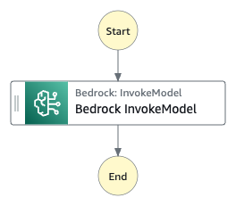

# Invoke Bedrock Model

AWS Step Functions announced an optimized integration for Amazon Bedrock, making it easier to integrate generative AI capabilities into Step Functions workflows, accelerating development of generative AI applications. 
In this pattern, InvokeModel API integration will be implemented to enable the interactions with foundation models.

Learn more about this workflow at Step Functions workflows collection: [Invoke a Bedrock Model](https://serverlessland.com/workflows/bedrock-invokemodel)

Important: this application uses various AWS services and there are costs associated with these services after the Free Tier usage - please see the [AWS Pricing page](https://aws.amazon.com/pricing/) for details. You are responsible for any AWS costs incurred. No warranty is implied in this example.

## Requirements

* [Create an AWS account](https://portal.aws.amazon.com/gp/aws/developer/registration/index.html) if you do not already have one and log in. The IAM user that you use must have sufficient permissions to make necessary AWS service calls and manage AWS resources.
* [AWS CLI](https://docs.aws.amazon.com/cli/latest/userguide/install-cliv2.html) installed and configured
* [Git Installed](https://git-scm.com/book/en/v2/Getting-Started-Installing-Git)
* [AWS Serverless Application Model](https://docs.aws.amazon.com/serverless-application-model/latest/developerguide/serverless-sam-cli-install.html) (AWS SAM) installed


## Deployment Instructions

1. Create a new directory, navigate to that directory in a terminal and clone the GitHub repository:
    ``` 
    git clone https://github.com/aws-samples/step-functions-workflows-collection
    ```
1. Change directory to the pattern directory:
    ```
    cd bedrock-invokemodel
    ```
1. From the command line, use AWS SAM to deploy the AWS resources for the workflow as specified in the template.yaml file:
    ```
    sam deploy --guided
    ```
1. During the prompts:
    * Enter a stack name
    * Enter the desired AWS Region
    * Allow SAM CLI to create IAM roles with the required permissions.

    Once you have run `sam deploy --guided` mode once and saved arguments to a configuration file (samconfig.toml), you can use `sam deploy` in future to use these defaults.

1. Note the outputs from the SAM deployment process. These contain the resource names and/or ARNs which are used for testing.

## How it works



1. Send your prompt and model ID as input.
    ```
    {
      "prompt": "YOUR-PROMPT",
      "modelID": "ARN-OF-BEDROCK-MODEL"
    }    
    ```
2. Step Functions will invoke the selected model on Amazon Bedrock.

## Testing

1. Navigate to the AWS Step Functions console and select the `bedrock-invokemodel` workflow.
2. Select `Start Execution` and use the following JSON data as input.
   ```
    {
      "prompt": "where is the largest city",
      "modelID": "arn:aws:bedrock:us-west-2::foundation-model/anthropic.claude-v2"
    }    
    ```
3. Select `Start Execution`
4. Observe the task in the Step Functions console.

## Cleanup
 
To delete the resources created by this template, use the following command:

```bash
sam delete
```

----
Copyright Amazon.com, Inc. or its affiliates. All Rights Reserved.

SPDX-License-Identifier: MIT-0
