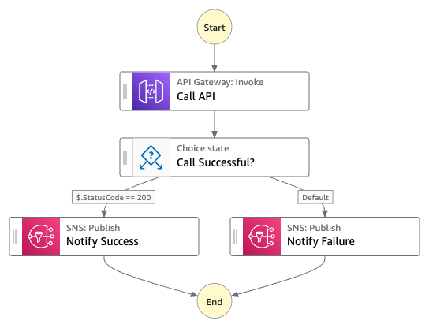
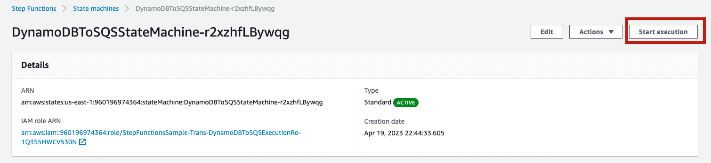

# Call a microservice running on Fargate using API Gateway integration

This sample project demonstrates how to use Step Functions to make a call to API Gateway in order to interact with a service on AWS Fargate, and also to check whether the call succeeded. This sample project creates the following:

* An Amazon API Gateway HTTP API that is called by the state machine.
* An Amazon API Gateway Amazon VPC Link.
* An Amazon Virtual Private Cloud.
* An Application Load Balancer.
* A Fargate cluster.
* An Amazon SNS topic
* Related AWS Identity and Access Management (IAM) roles

For more Step Functions workflows check [ServerlessLand Workflows](https://serverlessland.com/workflows)

Important: this application uses various AWS services and there are costs associated with these services after the Free Tier usage - please see the [AWS Pricing page](https://aws.amazon.com/pricing/) for details. You are responsible for any AWS costs incurred. No warranty is implied in this example.

## Requirements

* [Create an AWS account](https://portal.aws.amazon.com/gp/aws/developer/registration/index.html) if you do not already have one and log in. The IAM user that you use must have sufficient permissions to make necessary AWS service calls and manage AWS resources.
* [AWS CLI](https://docs.aws.amazon.com/cli/latest/userguide/install-cliv2.html) installed and configured
* [Git Installed](https://git-scm.com/book/en/v2/Getting-Started-Installing-Git)
* [AWS Serverless Application Model](https://docs.aws.amazon.com/serverless-application-model/latest/developerguide/serverless-sam-cli-install.html) (AWS SAM) installed

## Deployment Instructions

1. Create a new directory, navigate to that directory in a terminal and clone the GitHub repository:
    ``` 
    git clone https://github.com/aws-samples/step-functions-workflows-collection
    ```
1. Change directory to the pattern directory:
    ```
    cd call-microservice-apigw
    ```
1. From the command line, use AWS SAM to deploy the AWS resources for the workflow as specified in the template.yaml file:
    ```
    sam deploy --guided
    ```
1. During the prompts:
    * Enter a stack name
    * Enter the desired AWS Region
    * Allow SAM CLI to create IAM roles with the required permissions.

    Once you have run `sam deploy --guided` mode once and saved arguments to a configuration file (samconfig.toml), you can use `sam deploy` in future to use these defaults.

1. Note the outputs from the SAM deployment process. These contain the resource names and/or ARNs which are used for testing.

## How it works

In this project, Step functions is calling an API Gateway endpoint, checking the response status code, and notifying a specified SNS topic of the success or failure of the API call.

1.	Calls an API Gateway HTTP endpoint using an IAM role for authentication.
2.	Checks if the response status code is 200 using a Choice state.
3.	If the response status code is 200, publishes a success message to an SNS topic using a Task state.
4.	If the response status code is not 200, publishes a failure message to the same SNS topic using a Task state.

## Image
Provide an exported .png of the workflow in the `/resources` directory from [Workflow stuio](https://docs.aws.amazon.com/step-functions/latest/dg/workflow-studio.html) and add here.


## Testing

1. Deploy the application as listed above.
2. Open the work flow in the AmWS Step Functions console. Choose **Start execution** 
1. Leave the event as is and choose **Start execution** again 

## Cleanup
 
1. Delete the stack
    ```bash
    aws cloudformation delete-stack --stack-name STACK_NAME
    ```
1. Confirm the stack has been deleted
    ```bash
    aws cloudformation list-stacks --query "StackSummaries[?contains(StackName,'STACK_NAME')].StackStatus"
    ```
----
Copyright 2023 Amazon.com, Inc. or its affiliates. All Rights Reserved.

SPDX-License-Identifier: MIT-0
