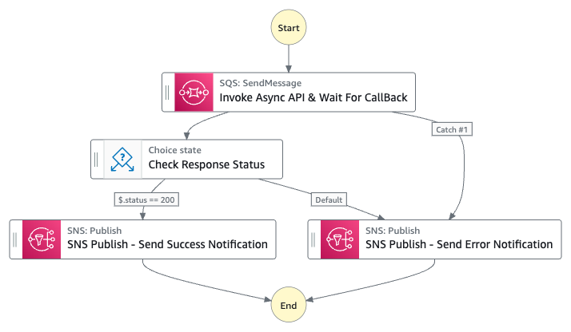
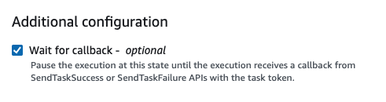
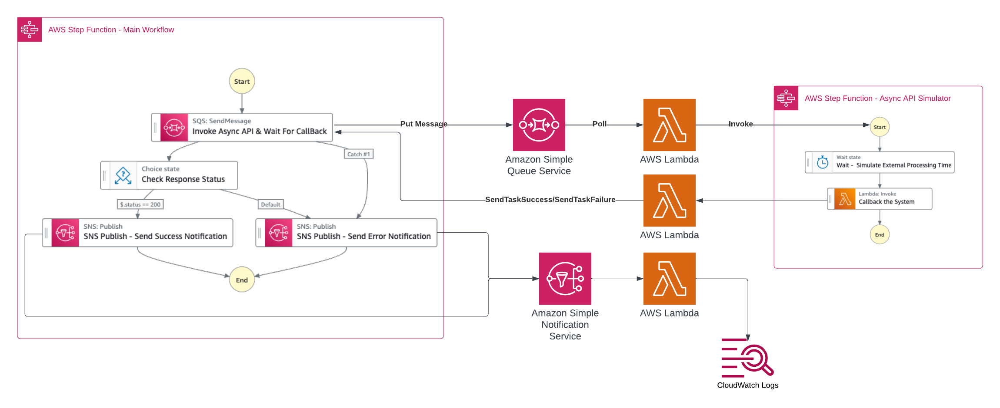

# Calling Asynchronous API with Callbacks

This workflow is a sample usage of AWS Step Functions to invoke Asynchronous API whether this API is provided by an internal or external system, then pause the state machine and wait for this system to complete processing and call your workflow back when it is done.

The pattern is relying on [waitForTaskToken](https://docs.aws.amazon.com/step-functions/latest/dg/connect-to-resource.html#connect-wait-token) feature provided by AWS Step Functions as a way to pause a workflow until a task token is returned. This pattern assumes that the Async API supports the callbacks.

Learn more about this workflow at Step Functions workflows collection: [ServerlessLand Workflows](https://serverlessland.com/workflows)

Important: this application uses various AWS services and there are costs associated with these services after the Free Tier usage - please see the [AWS Pricing page](https://aws.amazon.com/pricing/) for details. You are responsible for any AWS costs incurred. No warranty is implied in this example.

## Requirements

* [Create an AWS account](https://portal.aws.amazon.com/gp/aws/developer/registration/index.html) if you do not already have one and log in. The IAM user that you use must have sufficient permissions to make necessary AWS service calls and manage AWS resources.
* [AWS CLI](https://docs.aws.amazon.com/cli/latest/userguide/install-cliv2.html) installed and configured
* [Git Installed](https://git-scm.com/book/en/v2/Getting-Started-Installing-Git)
* [AWS Serverless Application Model](https://docs.aws.amazon.com/serverless-application-model/latest/developerguide/serverless-sam-cli-install.html) (AWS SAM) installed

## Deployment Instructions

1. Create a new directory, navigate to that directory in a terminal and clone the GitHub repository:
    ``` 
    git clone https://github.com/aws-samples/step-functions-workflows-collection
    ```
1. Change directory to the pattern directory:
    ```
    cd calling-async-api-callback
    ```
1. From the command line, use AWS SAM to deploy the AWS resources for the workflow as specified in the template.yaml file:
    ```
    sam deploy --guided
    ```
1. During the prompts:
    * Enter a stack name: `calling-async-api-callback`
    * Enter the desired AWS Region
    * Allow SAM CLI to create IAM roles with the required permissions.

    Once you have run `sam deploy --guided` mode once and saved arguments to a configuration file (samconfig.toml), you can use `sam deploy` in future to use these defaults.

1. Note the outputs from the SAM deployment process. These contain the resource names and/or ARNs which are used for testing.

## How it works

Workflow Diagram


1. When the state machine get executed, it will send the API payload to Amazon SQS to be consumed by AWS Lambda function which will call the Async API.
2. The SQS send message step is configured to wait for callback in order to resume the state machine execution. This is configured by using the [waitForTaskToken](https://docs.aws.amazon.com/step-functions/latest/dg/connect-to-resource.html#connect-wait-token) functionality. 
    
    If you are building the state machine using  [**Amazon States Language** (**ASL**)](https://docs.aws.amazon.com/step-functions/latest/dg/concepts-amazon-states-language.html) then you can use the following resource `arn:aws:states:::sqs:sendMessage.waitForTaskToken` in the required task.

    If you are building the state machine using the Workflow Studio, you can configure it from the UI as below:

    


## Testing Architecture



## Testing

After deploying the SAM stack, two state machines will be deployed, the starting point state machine will have a name **`WorkflowAsyncAPICallbackPattern-[random-characters]`**. This state machine will send the API payload, then this state machine will be in a wait state until it receives the callback.

Another state machine will be deployed with the following name **`WorkflowExternalAsyncAPISimulator-[random-characters]`**. This state machine will be responsible for simulating the Async API, basically it waits for a configurable number of seconds, then trigger the callback to the main state machine which in wait state.

To test this architecture with end-to-end scenario, please follow below steps after you successfully deploy the SAM template:

1. Make sure you have deployed the SAM stack as explained in **Deployment Instructions** section.
2. Navigate to "Step Functions" from the console UI.
3. Click on **`WorkflowAsyncAPICallbackPattern-[random-characters]`** to view the state details.
4. Click on "`Start execution`".
5. Use the following JSON object as an input value and then click on "`Start execution`"
```json
  {
    "waitTime": 3,
    "status": "success"
  }
```
The values in this JSON object controls the behaviour of the second state machine which simulate the Async API.`"waitTime"` will be used as the waiting time, in seconds, for the API before calling back your main state machine to resume the execution. It can accept any number between `0` and `99999999`.

`"status"` will be used in the simulator state machine to choose between sending a success callback or failure one. It can be one of the following options `"success"` or `"failure"`.

6. Observe the state machine execution and based on the status you sent the state machine will execute the corresponding step whether it is `"SNS Publish - Send Success Notification"` or  `"SNS Publish - Send Error Notification"`.
7. To see the notification sent to SNS, you can navigate to "CloudWatch" service then select "Log groups" under "Logs" section. Then navigate to `/aws/lambda/calling-async-api-callback-WorkflowResponseLogger-[random-characters]` to check the messages sent to SNS which are logged by another Lambda function as per as the test architecture.
You should find logs with `"API Executed Successfully"` or `"API Failed"` based on which case you have tested.
8. Feel free to change the values of `"waitTime"` and `"status"` to test different scenarios.
9. For more details, explore the implmention of AWS Lambda function called `calling-async-api-callbac-WorkflowCallbackSimulato-[random-characters]` to see how to call `SendTaskSuccess` or `SendTaskFailure` state machines APIs.


## Cleanup
 
1. Delete the stack
    ```bash
    aws cloudformation delete-stack --stack-name calling-async-api-callback
    ```
    Replace `calling-async-api-callback` with your CloudFormation stack name if different.

1. Confirm the stack has been deleted
    ```bash
    aws cloudformation list-stacks --query "StackSummaries[?contains(StackName,'calling-async-api-callback')].StackStatus"
    ```
----
Copyright 2024 Amazon.com, Inc. or its affiliates. All Rights Reserved.

SPDX-License-Identifier: MIT-0