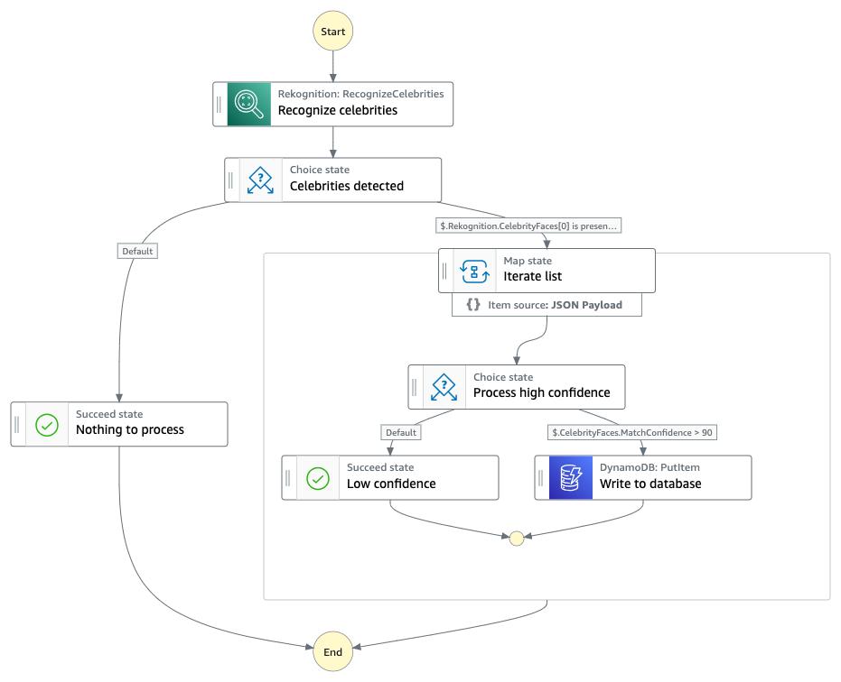

# Celebrity Identifier

This event-driven express workflow demonstrates the built-in capability of Amazon Rekognition to detect celebrity faces present in an image, triggered by an image upload to S3, while using native AWS integrations with no lambda code required. Once the image is scanned, multiple checks verify that celebrities were successfully identified and discovered with a high degree of confidence. Positive celebrity matches are then written to a DynamoDB table, including pertinent information passed from the original trigger.

Learn more about this workflow at Step Functions workflows collection: https://serverlessland.com/workflows/celebrity-identifier-sam

Important: this application uses various AWS services and there are costs associated with these services after the Free Tier usage - please see the [AWS Pricing page](https://aws.amazon.com/pricing/) for details. You are responsible for any AWS costs incurred. No warranty is implied in this example.

## Requirements

* [Create an AWS account](https://portal.aws.amazon.com/gp/aws/developer/registration/index.html) if you do not already have one and log in. The IAM user that you use must have sufficient permissions to make necessary AWS service calls and manage AWS resources.
* [AWS CLI](https://docs.aws.amazon.com/cli/latest/userguide/install-cliv2.html) installed and configured
* [Git Installed](https://git-scm.com/book/en/v2/Getting-Started-Installing-Git)
* [AWS Serverless Application Model](https://docs.aws.amazon.com/serverless-application-model/latest/developerguide/serverless-sam-cli-install.html) (AWS SAM) installed

## Deployment Instructions

1. Create a new directory, navigate to that directory in a terminal and clone the GitHub repository:
    ``` 
    git clone https://github.com/aws-samples/step-functions-workflows-collection
    ```
1. Change directory to the pattern directory:
    ```
    cd celebrity-identifier-sam
    ```
1. From the command line, use AWS SAM to deploy the AWS resources for the workflow as specified in the template.yaml file:
    ```
    sam deploy --guided
    ```
1. During the prompts:
    * Enter a stack name
    * Enter the desired AWS Region
    * Enter the unique name of the S3 bucket to be created for image upload
    * Allow SAM CLI to create IAM roles with the required permissions

    Once you have run `sam deploy --guided` mode and saved arguments to a configuration file (samconfig.toml), you can use `sam deploy` in the future to use these defaults.

1. Note the outputs from the SAM deployment process. These contain the resource names and/or ARNs which are used for testing.

## How it works

This express workflow executes when an image file is uploaded to the created S3 bucket, regardless of prefix path. Once the file is copied, the S3 EventBridge event notifications feature will send an event to the default bus. An EventBridge rule filters for **object created** events specific to the S3 bucket and then triggers the workflow.

Workflow execution steps:

1. The initial payload containing the S3 object location information is sent to the **Amazon Rekognition** service for analysis.
1. Rekognition will scan the image file and output 2 arrays containing information for celebrity and non-celebrity faces detected.
1. The workflow will then check, via a **choice state**, to see if any celebrities were detected. If not, then the workflow ends in a success and is complete.
1. If there are celebrity faces detected, the array of celebrity faces is sent to a **map state** where each array object will be processed.
1. Each object in the array contains information specific to a celebrity face, including the match confidence level. As the **map state** iterates through the array, each object will be checked against a confidence score greater than 90% through a **choice state**. If less, then that object of the array is no longer processed.
1. Objects that meet the confidence criteria will be written to an on-demand capacity mode **DynamoDB table**, including the celebrity name, Rekognition ID, time the image upload triggered, and S3 path information.




## Testing

Before uploading an image file to the S3 bucket created as part of this project, verify it meets the [Rekognition requirements](https://docs.aws.amazon.com/rekognition/latest/dg/limits.html)

For testing purposes, feel free to grab an image of the current Amazon CEO from the [Amazon Officers and Directors](https://ir.aboutamazon.com/officers-and-directors/default.aspx) page.

After uploading the image, navigate to the DynamoDB console and Explore items for the project generated table, \<stackname\>-CelebrityTable-\<alphanumeric characters\>

There you will see an entry similar to the following:

| Name       | ObjectLocation                     | CelebID | Time                 |
|------------|------------------------------------|---------|----------------------|
| Andy Jassy | S3://\<bucket-name\>/Andy-Jassy.jpeg | 3a3b6a  | 2023-07-17T17:01:41Z |
|            |                                    |         |                      |

If the expected entry is not in the DynamoDB table, logs for the workflow have been enabled and can be found in the Step Functions console for the **CelebrityIdentifier** state machine or in the CloudWatch Logs log group: **/aws/vendedlogs/CelebrityIdentifier-Logs**
Verify that celebrities were detected and the MatchConfidence value met the threshold at the **Celebrities detected** and **Process high confidence** choices respectively.

## Cleanup
 
1. Delete the stack
    ```bash
    aws cloudformation delete-stack --stack-name STACK_NAME
    ```
1. Confirm the stack has been deleted
    ```bash
    aws cloudformation list-stacks --query "StackSummaries[?contains(StackName,'STACK_NAME')].StackStatus"
    ```
----
Copyright 2023 Amazon.com, Inc. or its affiliates. All Rights Reserved.

SPDX-License-Identifier: MIT-0
