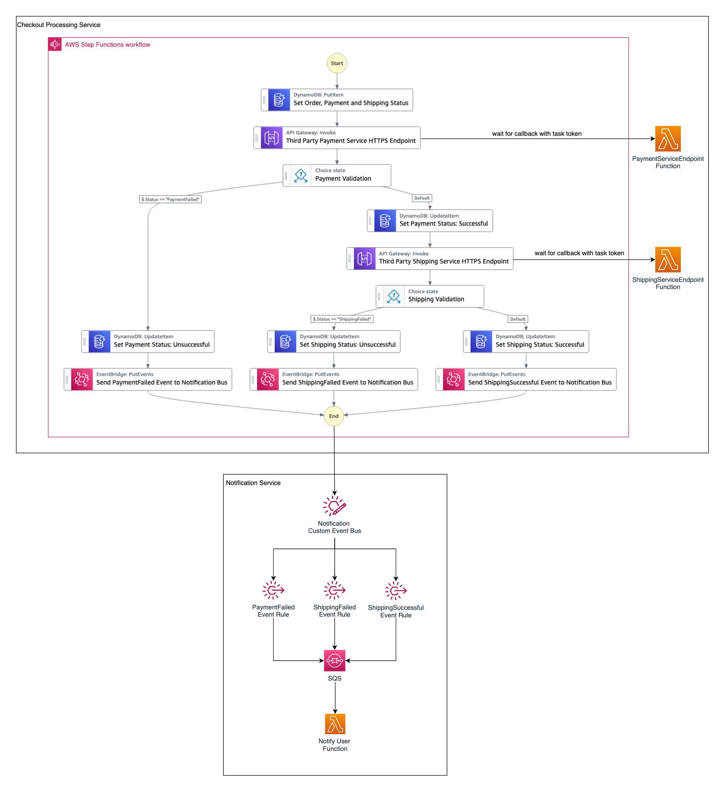

# Checkout Processing Workflow

This workflow demonstrates how [AWS Step Functions](https://aws.amazon.com/step-functions/) workflows can integrate with events in an [event-driven architecture](https://aws.amazon.com/what-is/eda/).
The example implements a checkout processing workflow that simulates a series of steps that an order must go through before notifying the result to the user.


Here, the checkout process workflow includes a payment validation step and a shipping validation step that are orchestrated using AWS Step Functions.
Based on the success or failure of these validations, the checkout process workflow will emit an event to the Notification service via [Amazon EventBridge](https://aws.amazon.com/eventbridge/) that will notify the user whether the order has been confirmed or not.

Learn more about this workflow at Step Functions workflows collection: << Add the live URL here >>

Important: this application uses various AWS services and there are costs associated with these services after the Free Tier usage - please see the [AWS Pricing page](https://aws.amazon.com/pricing/) for details. You are responsible for any AWS costs incurred. No warranty is implied in this example.

## Requirements

* [Create an AWS account](https://portal.aws.amazon.com/gp/aws/developer/registration/index.html) if you do not already have one and log in. The IAM user that you use must have sufficient permissions to make necessary AWS service calls and manage AWS resources.
* [AWS CLI](https://docs.aws.amazon.com/cli/latest/userguide/install-cliv2.html) installed and configured
* [Git Installed](https://git-scm.com/book/en/v2/Getting-Started-Installing-Git)
* [AWS Serverless Application Model](https://docs.aws.amazon.com/serverless-application-model/latest/developerguide/serverless-sam-cli-install.html) (AWS SAM) installed

## Deployment Instructions

1. Create a new directory, navigate to that directory in a terminal and clone the GitHub repository:
    ``` 
    git clone https://github.com/aws-samples/step-functions-workflows-collection
    ```
1. Change directory to the pattern directory:
    ```
    cd checkout-processing-workflow
    ```
1. From the command line, use AWS SAM to deploy the AWS resources for the workflow as specified in the template.yaml file:
    ```
    sam deploy --guided
    ```
1. During the prompts:
    * Enter a stack name
    * Enter the desired AWS Region
    * Allow SAM CLI to create IAM roles with the required permissions.

    Once you have run `sam deploy --guided` mode once and saved arguments to a configuration file (samconfig.toml), you can use `sam deploy` in future to use these defaults.

## How it works
This example implements a checkout processing workflow that incorporates a payment validation step and a shipping validation step. Depending on the success or failure of these validations, the workflow will send an event to a custom [Amazon EventBridge](https://aws.amazon.com/eventbridge/) event bus that contains event rules to route the events to the Notification Service. The Notification Service will process the events and notify the users via email on the outcome of their order. 

You can think of this as a microservice based approach using event driven architecture where the Checkout Processing Service is responsible for the validating the order while the Notification Service is responsible for notifying the user. Both services communicate via events. If you are interested in microservices, this [link](https://aws.amazon.com/microservices/) provides further information.


The infrastructure code deploys the following sample state machine.





The workflow execution begins when a user checks out the cart. Here, the following states are performed in the workflow:

1. Insert the order details into an [Amazon DynamoDB](https://aws.amazon.com/dynamodb/) table. Set the Order Status, Payment Status and Shipping Status to Pending in the table.

2. Here, the user will be prompted to make payment for the order on a third party payment platform. We do this by invoking the payment endpoint using [Amazon API Gateway](https://aws.amazon.com/api-gateway/). We simulate the payment processing in the PaymentServiceEndpoint Function using [AWS Lambda](https://aws.amazon.com/lambda/). You can manually configure the function to return payment success or payment failure. 

    To integrate with an external system such as the payment system, we make use of [the callback task integration pattern](https://docs.aws.amazon.com/step-functions/latest/dg/connect-to-resource.html#connect-wait-token) that enables Step Functions workflows to send a token to an external system. The workflow is paused at this state and waits for a callback. When the payment service completes its task, it will call back to the API Gateway endpoint with the CartId and the status of the payment that are then passed on to the Payment Validation State.

3. The Payment Validation State is a [choice state](https://docs.aws.amazon.com/step-functions/latest/dg/amazon-states-language-choice-state.html) which looks at the "Status" variable that was returned from previous state. If "Status" variable returns PaymentFailed, the state will transition to the "Set Payment Status: Unsuccessful" state while if "Status" variable returns PaymentSuccuessful, the state will default to transitioning to the "Set Payment Status: Successful" state.

4. At the "Set Payment Status: Unsuccessful" state, we will update the payment status in the DynamoDB table to "Unsucessful" and transition to the next state where a "PaymentFailed" event will be sent to the Notificaiton custom event bus. 

5. On the other hand, at the "Set Payment Status: Successful" state, we will update the payment status in the DynamoDB table to "Successful" and transition to the next state where we will invoke the third party shipping service to check for shipping availability. The subsequent states follows the same logic as the above steps. Basically the order will change its state depending on the success or failure of the validations. The idea is for the workflow to publish these state changes as events to the Notification custom event bus where these events will be processed by the Notification service.

In the Notification Service, the Notification event bus contains event rules to route these events to an [Amazon Simple Queue Service](https://aws.amazon.com/sqs/) (SQS) queue. Lambda will poll the SQS queue and invoke the NotifyUserFunction lambda function to process these events and notify the user via SES.

## Testing

To test this workflow, you will need to specify your email within the workflow so that you can receive the notification email.

Perform the following steps to add in your emails:

1. This is the json event that we are going to use to start the workflow execution:
    ```
    {
        "CartId": "835235",
        "Email": "add_your_email@email.com",
        "Address": "1 George Street, Singapore",
        "Orange": "1",
        "Banana": "1",
        "Lemon": "0",
        "total_cost": "1.27"
    }
    ```

    It simulates the order details when a user checkouts the cart. You can find this in the folder events/ExecuteWorkflowEvent.json. In the "Email" field, please replace the value with an email that you are using. This is the email that will receive the notification email.


2. Next, navigate to the Lambda console. In the **[Name-of-template]-NotifyUserFunction** Lambda function, look for the 'SOURCE_EMAIL' variable (Line 28) and replace the value with an email that you are using. This is the email that will be seen sending the notification email. In the ideal world, this would be the business email. You can use the same email for sending and receiving the notification emails.

3. Once you have replaced the email, please also verify them in the SES console. You can refer to the [SES Documentation](https://docs.aws.amazon.com/ses/latest/dg/creating-identities.html#verify-email-addresses-procedure) to do so. 

Let's test by executing the workflow with the json event that you have seen above. The result in the workflow should look something like this where all validations are successful:


You should also receive an order-confirmed notification email that states: "Hello, your order is confirmed. Please refer to shipping email for more details."

To test out the other branches within the workflow, you can modify the 'Status' variable in the lambda code found in **[Name-of-template]-PaymentServiceEndpoint** and **[Name-of-template]-ShippingServiceEndpoint**.


## Cleanup
 
1. Delete the stack
    ```bash
    sam delete
    ```
1. Confirm the stack has been deleted
    ```bash
    aws cloudformation list-stacks
    ```
----
Copyright 2023 Amazon.com, Inc. or its affiliates. All Rights Reserved.

SPDX-License-Identifier: MIT-0
