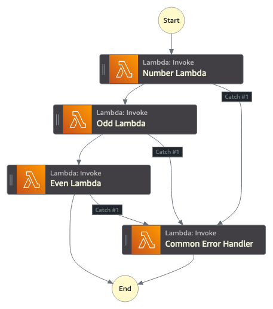

# Common Error Handling Patterns

These example Step Functions show how to use a common error reporting task within a Step Function. People often want to use a single common error reporting task within their Step Function so that they don't have to duplicate the functionality across many different states. The challenge with this approach is that while that common error reporting task can get the error message from whatever state failed, it doesn't actually get the name of the state that failed. This is a challenge if you have two dozen different Lambda functions, and you're not sure which one caused the error. These example workflows work around this problem in two different ways.

Neither of these examples do anything with the information about what task errored or the error itself, other than logging it.

Learn more about this workflow at Step Functions workflows collection: [https://serverlessland.com/workflows/common-error-handling](https://serverlessland.com/workflows/common-error-handling)
Important: this application uses various AWS services and there are costs associated with these services after the Free Tier usage - please see the [AWS Pricing page](https://aws.amazon.com/pricing/) for details. You are responsible for any AWS costs incurred. No warranty is implied in this example.

## Requirements

* [Create an AWS account](https://portal.aws.amazon.com/gp/aws/developer/registration/index.html) if you do not already have one and log in. The IAM user that you use must have sufficient permissions to make necessary AWS service calls and manage AWS resources.
* [AWS CLI](https://docs.aws.amazon.com/cli/latest/userguide/install-cliv2.html) installed and configured
* [Git Installed](https://git-scm.com/book/en/v2/Getting-Started-Installing-Git)
* [AWS Serverless Application Model](https://docs.aws.amazon.com/serverless-application-model/latest/developerguide/serverless-sam-cli-install.html) (AWS SAM) installed

## Deployment Instructions

1. Create a new directory, navigate to that directory in a terminal and clone the GitHub repository:
    ``` 
    git clone https://github.com/aws-samples/step-functions-workflows-collection
    ```
1. Change directory to the pattern directory:
    ```
    cd _workflow-model
    ```
1. From the command line, use AWS SAM to deploy the AWS resources for the workflow as specified in the template.yaml file:
    ```
    sam deploy --guided
    ```
1. During the prompts:
    * Enter a stack name
    * Enter the desired AWS Region
    * Allow SAM CLI to create IAM roles with the required permissions.

    Once you have run `sam deploy --guided` mode once and saved arguments to a configuration file (samconfig.toml), you can use `sam deploy` in future to use these defaults.

1. Note the outputs from the SAM deployment process. These contain the resource names and/or ARNs which are used for testing.

## How it works

Both workflows have the same functionality, they look at an input, check and see if it's a number, if the number is odd, and if the number is even. If any of these conditions aren't met, that task will fail. Each task has a catch condition that routes the failures to the same common error handling Lambda function. The two workflows differ in how they identify what state the error came from. 

The option 1 state machine relies on each task using a particular format for the ResultPath of each tasks catch configuration. So if I have a task named "Super Fun", I would name the ResultPath "SuperFunFailure". The common error handling function looks in the input object for attribute that ends in "Failure", to get the approximate name of the task as "SuperFun". The advantage of this approach is that the common error handling function is fairly simple. The disadvantage is that it requires every task state to have a specially named result path.

In the option 2 state machine the common error state use the Step Functions API to get the history of the current execution to know what state failed. This means that the common error function is little more complex, but has the advantage of working without requiring every task state to have a specific name on their result path.

Neither of these examples do anything with the information about what task errored or the error itself, other than logging it, but you can easily extend the Lambda function with additional functionality.

## Image


## Testing

To test the workflows start an execution of either of the state machine with input like this:

```json
{
    "Number": 4
}
```

depending on whether the number is even, odd, or not a number, the Step Function will fail in different places. Check the logs of the common error handling Lambda function to see the details of what task errored.

## Cleanup
 
1. Delete the stack
    ```bash
    aws cloudformation delete-stack --stack-name STACK_NAME
    ```
1. Confirm the stack has been deleted
    ```bash
    aws cloudformation list-stacks --query "StackSummaries[?contains(StackName,'STACK_NAME')].StackStatus"
    ```
----
Copyright 2022 Amazon.com, Inc. or its affiliates. All Rights Reserved.

SPDX-License-Identifier: MIT-0
