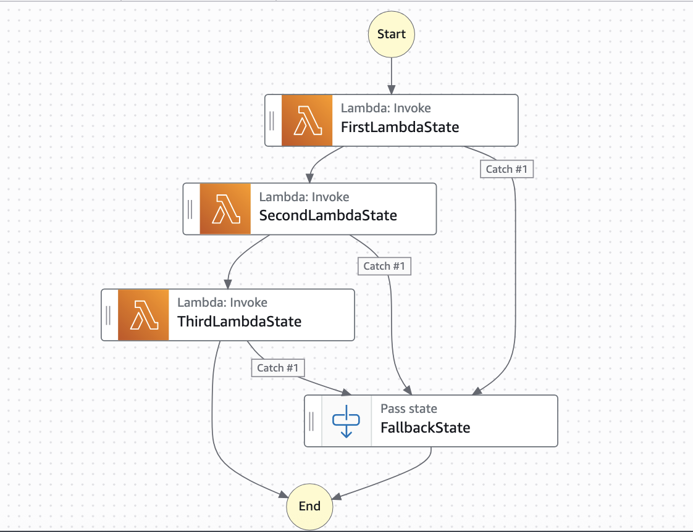

# Common Fallback State - JSONata

This example workflow illustrate practical solutions for fetching failed state name in JSONata StateMachine with common fallback state for multiple task states. AWS Step Functions users commonly seek to implement centralized error reporting within their workflows to avoid duplicating error handling logic across multiple states. While implementing a shared error reporting task is straightforward, a significant challenge arises: the error reporting task can access the error message from the failed state, but cannot inherently determine which specific state triggered the error. This limitation becomes particularly problematic in workflows containing numerous Lambda functions, as it complicates identifying the exact point of failure. Using JSONata as our query language, we demonstrate approach to overcome this limitation, enabling comprehensive error tracking while maintaining workflow efficiency. 

Learn more about this workflow at Step Functions workflows collection: [https://serverlessland.com/workflows/common-fallback-state-jsonata](https://serverlessland.com/workflows/common-fallback-state-jsonata)

Important: this application uses various AWS services and there are costs associated with these services after the Free Tier usage - please see the [AWS Pricing page](https://aws.amazon.com/pricing/) for details. You are responsible for any AWS costs incurred. No warranty is implied in this example.

## Requirements

* [Create an AWS account](https://portal.aws.amazon.com/gp/aws/developer/registration/index.html) if you do not already have one and log in. The IAM user that you use must have sufficient permissions to make necessary AWS service calls and manage AWS resources.
* [AWS CLI](https://docs.aws.amazon.com/cli/latest/userguide/install-cliv2.html) installed and configured
* [Git Installed](https://git-scm.com/book/en/v2/Getting-Started-Installing-Git)
* [AWS Serverless Application Model](https://docs.aws.amazon.com/serverless-application-model/latest/developerguide/serverless-sam-cli-install.html) (AWS SAM) installed

## Deployment Instructions

1. Create a new directory, navigate to that directory in a terminal and clone the GitHub repository:
    ``` 
    git clone https://github.com/aws-samples/step-functions-workflows-collection
    ```
1. Change directory to the pattern directory:
    ```
    cd step-functions-workflows-collection/common-fallback-state-jsonata
    ```
1. From the command line, use AWS SAM to deploy the AWS resources for the workflow as specified in the template.yaml file:
    ```
    sam deploy --guided
    ```
1. During the prompts:
    * Enter a stack name
    * Enter the desired AWS Region
    * Allow SAM CLI to create IAM roles with the required permissions.

    Once you have run `sam deploy --guided` mode once and saved arguments to a configuration file (samconfig.toml), you can use `sam deploy` in future to use these defaults.

1. Note the outputs from the SAM deployment process. These contain the resource names and/or ARNs which are used for testing.

## How it works

The workflow doesn't require any input. By default, the third lambda function in "ThirdLambdaState" task state is programmed to fail. Thus, the workflow execution fails at this task state and transitions into "FallbackState" with input as "FailedStateName": "ThirdLambdaState". 

The "ThirdLambdaFunction" is intentionally programmed to simulate the failure.

## Image



## Testing

To test the workflow, simply start an execution of the state machine. This workflow doesn't require any input payload. Observe the execution once it has completed.

## Cleanup
 
1. Delete the stack
    ```bash
    aws cloudformation delete-stack --stack-name STACK_NAME
    ```
1. Confirm the stack has been deleted
    ```bash
    aws cloudformation list-stacks --query "StackSummaries[?contains(StackName,'STACK_NAME')].StackStatus"
    ```
----
Copyright 2022 Amazon.com, Inc. or its affiliates. All Rights Reserved.

SPDX-License-Identifier: MIT-0
