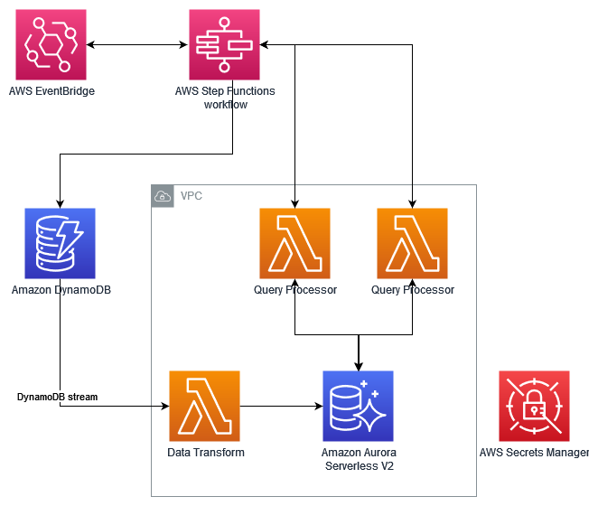
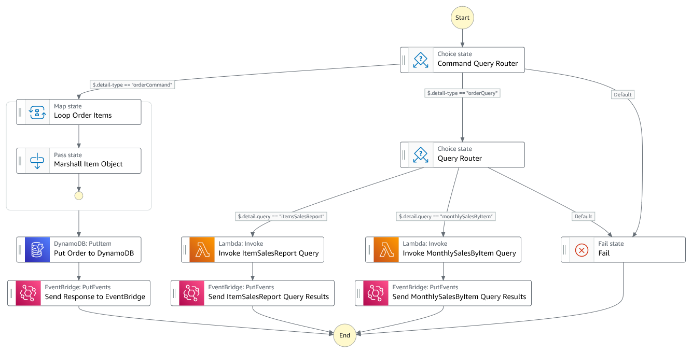
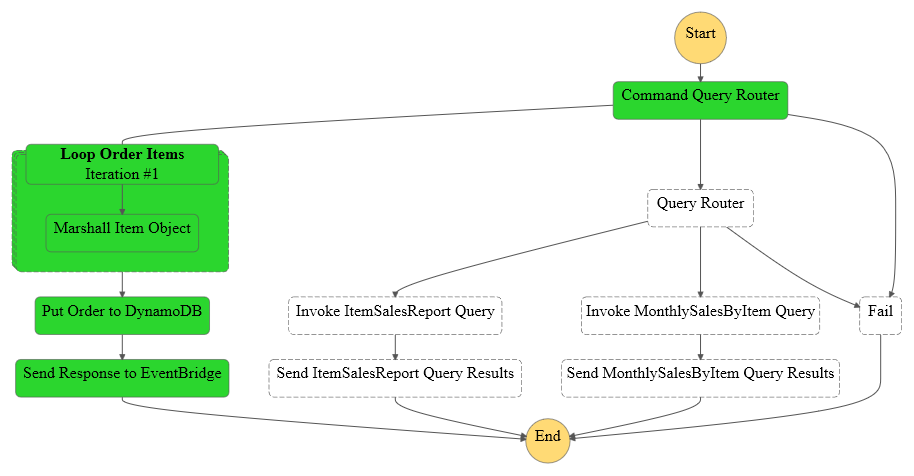
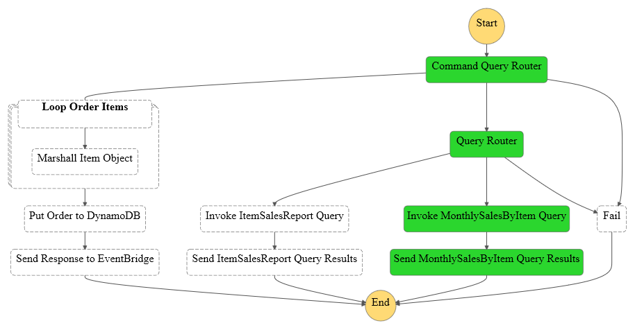
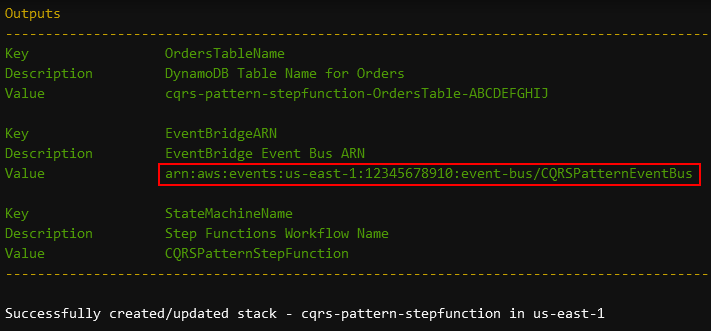
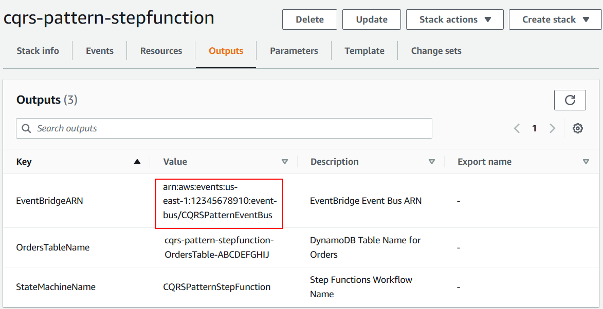
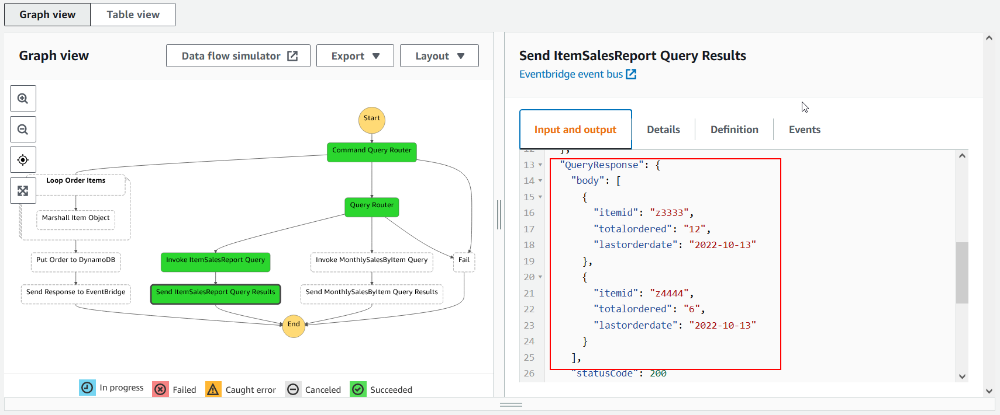

# CQRS Design Pattern

This workflow demonstrates how to implement [the command query responsibility segregation (CQRS) design pattern](https://docs.aws.amazon.com/prescriptive-guidance/latest/modernization-data-persistence/cqrs-pattern.html) using [AWS Step Functions](https://aws.amazon.com/step-functions/).

Workflow is triggered by [Amazon EventBridge](https://aws.amazon.com/eventbridge/) events. Based on event properties, a state routes events to respective handlers. An order creation command is handled directly in the workflow and persisted in the [Amazon DynamoDB](https://aws.amazon.com/dynamodb/) table. Created orders are captured by an [Amazon DynamoDB stream](https://docs.aws.amazon.com/amazondynamodb/latest/developerguide/Streams.html), transformed by an [AWS Lambda](https://aws.amazon.com/lambda/) function and stored in [Amazon Aurora Serverless v2](https://aws.amazon.com/rds/aurora/serverless/) MySQL-Compatible Edition database. Query events received are then routed to respective Lambda functions, which gets the data from Aurora Serverless v2 and sends the results to EventBridge.

Important: this application uses various AWS services and there are costs associated with these services after the Free Tier usage - please see the [AWS Pricing page](https://aws.amazon.com/pricing/) for details. You are responsible for any AWS costs incurred. No warranty is implied in this example.

## Requirements

* [Create an AWS account](https://portal.aws.amazon.com/gp/aws/developer/registration/index.html) if you do not already have one and log in. The IAM user that you use must have sufficient permissions to make necessary AWS service calls and manage AWS resources.
* [AWS Command Line Interface (AWS CLI)](https://docs.aws.amazon.com/cli/latest/userguide/install-cliv2.html) installed and configured
* [Git Installed](https://git-scm.com/book/en/v2/Getting-Started-Installing-Git)
* [AWS Serverless Application Model](https://docs.aws.amazon.com/serverless-application-model/latest/developerguide/serverless-sam-cli-install.html) (AWS SAM) installed

## Deployment Instructions

1. Create a new directory, navigate to that directory in a terminal and clone the GitHub repository:
    ``` 
    git clone https://github.com/aws-samples/step-functions-workflows-collection
    ```
1. Change directory to the pattern directory:
    ```
    cd cqrs
    ```
1. From the command line, use AWS SAM to deploy the AWS resources for the workflow as specified in the template.yaml file:
    ```
    sam build
    sam deploy --guided
    ```
1. During the prompts:
    * Enter a stack name
    * Enter the desired AWS Region
    * Allow SAM CLI to create IAM roles with the required permissions.

    Once you have run `sam deploy --guided` mode once and saved arguments to a configuration file (samconfig.toml), you can use `sam deploy` in future to use these defaults.

1. Note the outputs from the SAM deployment process. These contain the resource names and/or ARNs which are used for testing.

## How it works

The scenario includes a basic order creation and reporting application. Orders are received as events, including line items and persisted on a data store. Queries are also received as events and queried from the data source and results are emitted as events. For the purpose of CQRS pattern, queries have data access patterns different than the order structure.

A sample order data would look like below:

```json
{
  "lastUpdateDate": "2022-11-01T16:26:03Z",
  "status": "orderCreated"
  "orderId": "6002",
  "items" : [
    {
      "itemid": "z3333",
      "quantity": 6
    },
    {
      "itemid": "z4444",
      "quantity": 3
    }
  ]
}
```
As example queries has data access requirements using order items as primary entity and requires aggregation, data will be copied to a relational database for easier processing. After normalizing the order data, the resulting database schema on the relational database would look like below:


On the query side, there are two queries defined. *Item Sales Report* is just a simplified query that lists all the `itemid`’s and the total quantities ordered:

```sql
SELECT a.itemid, SUM(a.quantity) as totalordered, DATE_FORMAT(MAX(b.orderdate),'%Y-%m-%d') as lastorderdate
FROM orderitems a LEFT JOIN orders b ON a.orderid = b.orderid
GROUP BY a.itemid;

```

A second query includes the parameter of `itemid`, and gets all the item sales per month:

```sql
SELECT DATE_FORMAT(b.orderdate,'%M %Y') as monthyear, SUM(a.quantity) as monthlyordered
FROM orderitems a LEFT JOIN orders b ON a.orderid = b.orderid
WHERE itemid = <itemid parameter>
GROUP BY year(b.orderdate),month(b.orderdate)
ORDER BY b.orderdate DESC;

```
The overall architecture of the solution is explained below:



Order data is persisted on a DynamoDB table. For report queries, a relational database would provide more flexibility so Aurora Serverless v2 is chosen. In order to capture changes on DynamoDB table, DynamoDB Streams is used. A Lambda function, triggered by events on DynamoDB stream, performs the required transformation on the data and inserts it to Aurora Serverless v2. For simplicity only processing of INSERT events is implemented. 



Workflow is triggered by EventBridge events. Events are filtered by an [EventBridge rule](https://docs.aws.amazon.com/eventbridge/latest/userguide/eb-rules.html) and workflow is triggered when an event with `Source` property that has a value `orderPipeline` and `DetailType` property that has either `orderCommand` or `orderQuery` is received. 

The first state is a Choice state that routes the event based on `DetailType`. Commands are processed on a branch that loops over the order items with a Map sate for marshalling line items and persists in the orders table on DynamoDB using `PutItem` action. A confirmation event is then sent on EventBridge using a `PutEvents` action.



Queries are handled on a different branch. A second Choice state routes the event to corresponding Lambda functions based on the type of the query as specified on the event details. Lambda functions run the queries against Aurora Serverless v2 and the result set is then sent as an event to EventBridge using a `PutEvents` action.



The workflow is implemented as an [Express workflow](https://docs.aws.amazon.com/step-functions/latest/dg/concepts-standard-vs-express.html) type, as execution time for the requests are small. EventBridge triggers the workflow asynchronously, which guarantees at-least-once workflow execution and the workflow implementation ensures idempotency.

SAM template provisions all the required components, including the VPC needed by Aurora Serverless v2. Database credentials are stored in [AWS Secrets Manager](https://aws.amazon.com/secrets-manager/), and a [AWS CloudFormation Custom Resource](https://docs.aws.amazon.com/AWSCloudFormation/latest/UserGuide/template-custom-resources.html) is used to trigger a Lambda function that initializes Aurora Serverless v2 database creating required tables and procedures when template is deployed. 

## Image


## Testing

You need to send events to EventBridge to trigger the workflow. Easiest way of sending events would be using AWS CLI. Make sure you have installed the latest version of AWS CLI and configure it to use the same region that you have deployed the workflow.

You will need the ARN of EventBridge event bus created to send events. You can get this information from the output of the `sam deploy` command specified with *EventBridgeARN* key:



or from the CloudFormation stack outputs: 



You can find the AWS CLI commands to send example command and query below. To use those commands, you need to set an environment variable that holds EventBridge ARN. Use the command for your platform below and replace `<EventBridge Event Bus ARN>` with ARN of EventBridge you have obtained in the previous step:

***For Linux and MacOS:***

```bash
export AWS_CQRS_EVENTBRIDGE_ARN=<EventBridge Event Bus ARN>
```

***For Windows Command Prompt:***

```cmd
set AWS_CQRS_EVENTBRIDGE_ARN=<EventBridge Event Bus ARN>
```

After setting the EventBridge ARN, you can run the AWS CLI commands below to send the example events. For a Command query that will insert the Order to DynamoDB you can use the command below:

***For Linux and MacOS:***

```bash
aws events put-events --entries '[{"EventBusName" : "'"$AWS_CQRS_EVENTBRIDGE_ARN"'","Time" : "2022-10-13T19:00:00Z","DetailType": "orderCommand","Source": "orderPipeline","Detail": "{\"command\": \"createOrder\",\"orderId\": \"6102\",\"items\" : [{\"itemid\": \"z3333\",\"quantity\": 6},{\"itemid\": \"z4444\",\"quantity\": 3}]}"}]'
```

***For Windows Command Prompt:***

```cmd
aws events put-events --entries="[{\"EventBusName\" : \"%AWS_CQRS_EVENTBRIDGE_ARN%\",\"Time\" : \"2022-10-13T19:00:00Z\",\"DetailType\": \"orderCommand\",\"Source\": \"orderPipeline\",\"Detail\": \"{\\\"command\\\": \\\"createOrder\\\",\\\"orderId\\\": \\\"6102\\\",\\\"items\\\" : [{\\\"itemid\\\": \\\"z3333\\\",\\\"quantity\\\": 6},{\\\"itemid\\\": \\\"z4444\\\",\\\"quantity\\\": 3}]}\"}]"
```

To see the execution results, you can access to Step Functions console, click on the workflow name *CQRSPatternStepFunction* and on the Executions tab you should be able to see an execution. Click on the Name of the execution to see the details of the execution. You can also check the DynamoDB table to confirm the order details sent is inserted.

In order to send an event for Query, you can use the AWS CLI command below.

***For Linux and MacOS:***

```bash
aws events put-events --entries '[{"EventBusName" : "'"$AWS_CQRS_EVENTBRIDGE_ARN"'","Time" : "2022-11-14T19:00:00Z","DetailType": "orderQuery", "Source": "orderPipeline", "Detail": "{\"query\": \"itemsSalesReport\"}"}]'
```

***For Windows Command Prompt:***

```cmd
aws events put-events --entries="[{\"EventBusName\" : \"%AWS_CQRS_EVENTBRIDGE_ARN%\",\"Time\" : \"2022-11-14T19:00:00Z\",\"DetailType\": \"orderQuery\", \"Source\": \"orderPipeline\", \"Detail\": \"{\\\"query\\\": \\\"itemsSalesReport\\\"}\"}]"
```

You can see the execution details on to Step Functions console. To see the results of the Query, you can check the Input section of the *Send ItemSalesReport Query Results* step in the execution details.



You can find the sample events in the [events folder](./events/) of the solution as well.

## Cleanup
 
1. Delete the stack
    ```bash
    sam delete
    ```
1. Confirm the stack has been deleted
    ```bash
    aws cloudformation list-stacks --query "StackSummaries[?contains(StackName,'STACK_NAME')].StackStatus"
    ```

Please note that CloudFormation stack deletion may take some time due to cleanup of VPC connected Lambda functions. 

----
Copyright 2022 Amazon.com, Inc. or its affiliates. All Rights Reserved.

SPDX-License-Identifier: MIT-0