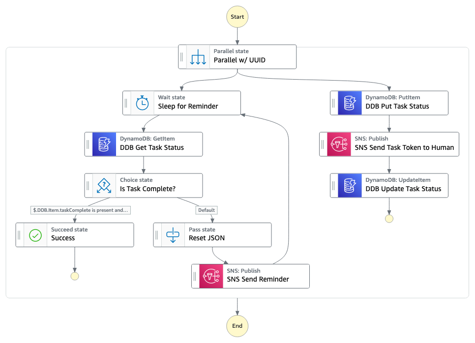

# Curbside Pick-Up App

This application will create a State Machine, an SNS topic, an SQS Queue, ApiGateway, Lambda, and a DynamoDB Table. The Frontend web app will submit order to State Machine via ApiGateway as proxy to Lambda. This will create the order in DynamoDB and place pick order in SQS for employee. After order is picked the TaskToken callback is sent with a success. The customer is sent a message via SNS that their order is ready for pickup. When the customer arrives they send a TaskToken back with success and their current parking location. Employees are alerted the customer has arrived via SNS message. The employee will send TaskToken success on completion of order delivery.

Important: this application uses various AWS services and there are costs associated with these services after the Free Tier usage - please see the [AWS Pricing page](https://aws.amazon.com/pricing/) for details. You are responsible for any AWS costs incurred. No warranty is implied in this example.

## Requirements

* [Create an AWS account](https://portal.aws.amazon.com/gp/aws/developer/registration/index.html) if you do not already have one and log in. The IAM user that you use must have sufficient permissions to make necessary AWS service calls and manage AWS resources.
* [AWS CLI](https://docs.aws.amazon.com/cli/latest/userguide/install-cliv2.html) installed and configured
* [Git Installed](https://git-scm.com/book/en/v2/Getting-Started-Installing-Git)
* [AWS Serverless Application Model](https://docs.aws.amazon.com/serverless-application-model/latest/developerguide/serverless-sam-cli-install.html) (AWS SAM) installed

## Deployment Instructions

1. Create a new directory, navigate to that directory in a terminal and clone the GitHub repository:
    ``` 
    git clone https://github.com/aws-samples/step-functions-workflows-collection
    ```
1. Change directory to the pattern directory:
    ```
    cd ./curbside-pickup
    ```
1. From the command line, use AWS SAM to deploy the AWS resources for the workflow as specified in the template.yaml file:
    ```
    sam build && sam deploy --guided
    ```
1. During the prompts:
    * Enter a stack name
    * Enter the desired AWS Region
    * Enter Email for SNS Notification delivery
    * Allow SAM CLI to create IAM roles with the required permissions.
    * APIProxy may not have authorization defined, Is this okay? Enter `YES`

    Once you have run `sam deploy --guided` mode once and saved arguments to a configuration file (samconfig.toml), you can use `sam deploy` in future to use these defaults.

1. Note the outputs from the SAM deployment process. These contain the resource names and/or ARNs which are used for testing.

## How it works

1. This App starts by submitting a JSON order payload (Frontend) to ApiGateway via Lambda proxy and starts a State Machine execution.
2. The State Machine creates the order in DynamoDB and then sends a pick order message to SQS with a Task Token callback.
3. A process pulls the pick order message from SQS (Lambda) and displays to employee (frontend). 
4. The employee will pick the order and send back Task Token `complete:true` to State Machine via ApiGateway Lambda proxy (Frontend).
5. The State Machine will then Update Order Status in DynamoDB and send the Customer a `ready-pickup` notification message via SNS with Task Token Callback.
6. The customer will click URL in message that will direct them to Frontend where they can enter their parking location and send back Task Token `complete:true, location:STRING` to State Machine via ApiGateway Lambda proxy
6. The State Machine will then update Status in DynamoDB and send store employees `customer-arrived` notification message via SNS with Task Token Callback.
7. Employee will check the frontend for order details and deliver order to customer location.
8. Employee will send back Task Token `complete:true` to State Machine via ApiGateway Lambda proxy (Frontend) when transaction is complete.
9. State Machine will update the Status of order to `complete`



## Testing

1. After deployment you will receive an email titled `AWS Notification - Subscription Confirmation`. Click on the link in the email to confirm your subscription. This will allow SNS to send you emails.
2. All interaction will happen through frontend React Application. Change directory to:
    ```
    cd ./curbside-pickup/frontend
    ```
3. Update React Environmental Variable file `.env.local` with ApiGateway URL Endpoint from sam deploy Outputs `ApiEndpointURL`. Example below:
    ```
    REACT_APP_BASE_API_URI="https://YOUR-URI.execute-api.us-west-2.amazonaws.com/Prod/"
    ```
4. Install package dependencies and start application
    ```
    npm i
    npm start
    ```
5. Create your first test order from React App at http://localhost:3000/
6. Navigate to the AWS Step Functions console and select the `CurbsidePickup` workflow then click on you first execution. If you don't see it, make sure you are in the correct Region. This is where you can see the State Machine move from task to task as you interact with the frontend app.
7. Navigate to http://localhost:3000/pick-order/ and select a record to act on. Submit desired Status change and observe State Machine Console changes.
8. The customer will now receive a message from SNS with a link `http://localhost:3000/arrival/?SOMTHING-HERE` that contains the order ID and Task Token. Navigate to the link and input Parking Location and Submit
9. The State Machine will send a notification to store employees that the customer has arrived via SNS.
10. Navigate to http://localhost:3000/deliver to select the record and complete the order by submitting back the Task Token.
11. Congratulations! You have completed the entire happy path.  Go ahead and repeat the process but try canceling an order or not being able to locate an item.

## Cleanup
 
1. Delete the stack
    ```bash
    sam delete
    ```
1. Confirm the stack has been deleted
    ```bash
    aws cloudformation list-stacks --query "StackSummaries[?contains(StackName,'STACK_NAME')].StackStatus"
    ```
----
Copyright 2022 Amazon.com, Inc. or its affiliates. All Rights Reserved.

SPDX-License-Identifier: MIT-0
