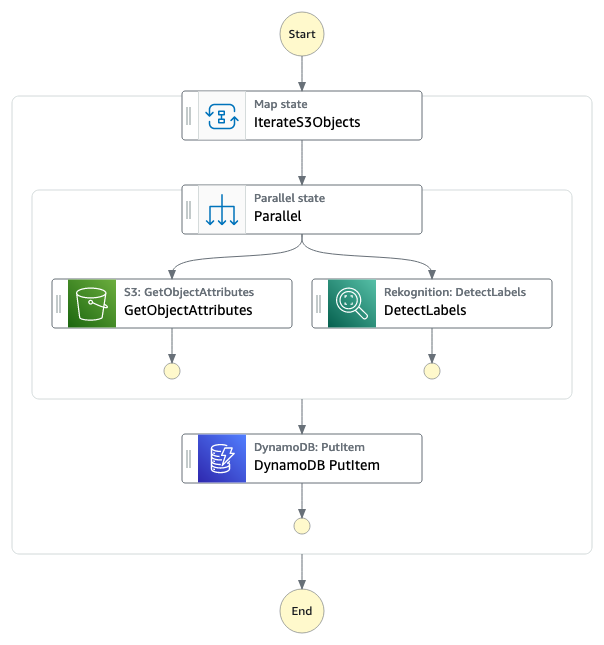

# Data Processing & Storage Pattern

## What's here?
Choose your own path: [CDK](https://aws.amazon.com/cdk/) or [SAM](https://aws.amazon.com/serverless/sam/) 

1. shared/ - shared assets, such as images and scripts used by both CDK and SAM framework options
1. cdk/ - uses AWS CDK to build and deploy the infrastructure using Python
1. sam/ - uses AWS SAM to build and deploy the infrastructure

See README's in CDK or SAM directories for specific requirements and deployment steps

## What does this workflow do?

1. Iterates over a list of objects in S3 provided as input using the [Map state](https://docs.aws.amazon.com/step-functions/latest/dg/amazon-states-language-map-state.html).  
2. Retrieves object metadata and uses [Rekognition](https://docs.aws.amazon.com/rekognition/latest/dg/what-is.html) to obtain image labels in parallel using the [Parallel state](https://docs.aws.amazon.com/step-functions/latest/dg/amazon-states-language-parallel-state.html)
3. Data from previous parallel states is merged and stored as one DynamoDB entry

## Want more?

Check out more workflows on [ServerlessLand](https://serverlessland.com/workflows)

----
Copyright 2022 Amazon.com, Inc. or its affiliates. All Rights Reserved.

SPDX-License-Identifier: MIT-0