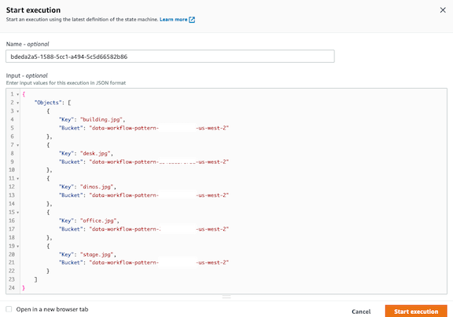

# Data Processing & Storage Pattern CDK

## Requirements

* [Create an AWS account](https://portal.aws.amazon.com/gp/aws/developer/registration/index.html) if you do not already have one and log in. The IAM user that you use must have sufficient permissions to make necessary AWS service calls and manage AWS resources.
* [AWS CLI](https://docs.aws.amazon.com/cli/latest/userguide/install-cliv2.html) installed and configured
* [Git](https://git-scm.com/book/en/v2/Getting-Started-Installing-Git) installed
* [AWS Cloud Development Kit](https://docs.aws.amazon.com/cdk/v2/guide/getting_started.html) (CDK >= 2.2.0) installed
* [Python 3](https://www.python.org/downloads/) installed

## Deployment Instructions

1. Create a new directory, navigate to that directory in a terminal and clone the GitHub repository:
    ``` 
    git clone https://github.com/aws-samples/step-functions-workflows-collection
    ```
1. Change directory to the pattern directory:
    ```
    cd step-functions-workflows-collection/data-processing/cdk
    ```
1. From the command line, deploy the stack with CDK and accept changes.  If you would like to see CloudFormation output before deploying, you can run 'cdk synth'
    ```
    cdk deploy
    ```
   While the stack is deploying, you can check out the "How it works" section or grab some coffee or tea

1. Navigate to the shared directory and run the following Python script to load test images into S3.  This will obtain the S3 bucket name, create a new input JSON file with the correct bucket name for our objects and upload images under shared/images to the S3 bucket. 
   
   ```
   cd ../shared/
   ```

   ```
   python scripts/uploadImagesToS3.py
   ```

   You can upload your own test images, but will need to modify the statemachine input JSON in the shared/output folder in order for them to be processed.  This is covered in the Testing section

## How it works

1. Iterates over a list of objects in S3 provided as input using the [Map state](https://docs.aws.amazon.com/step-functions/latest/dg/amazon-states-language-map-state.html)
2. Retrieves object metadata and uses [Rekognition](https://docs.aws.amazon.com/rekognition/latest/dg/what-is.html) to obtain image labels in parallel using the [Parallel state](https://docs.aws.amazon.com/step-functions/latest/dg/amazon-states-language-parallel-state.html)
3. Data from previous parallel states is merged and stored as one DynamoDB entry


## Testing

1. After completion of the Deployment Instructions, navigate to Step Functions in the AWS console and select the workflow that starts with ProcessingImageDataPatternStateMachine.  If you don't see it, make sure you are in the correct region
2. Select 'Start Execution' and copy the contents of shared/output/data-workflow-pattern-*.json and replace the existing comment in the input text area with it, then Start Execution.  *If you uploaded your own custom images, you will need to modify the input accordingly*



3. Observe the State Machine workflow execution.  It may take several seconds for the workflow to complete
4. Navigate to DynamoDB in the AWS console, select Tables, then select the images-data-workflow-pattern-sl table and click "Explore table items" and then perform a scan by clicking the Run button.  You should have several records with metadata and labels from the Rekognition service
5. Navigate back to your state machine execution within the AWS console.  View the input and output of each state to see what data is passed and/or altered from one state to the next  
6. Select Edit state machine button, then the Workflow Studio button to view the state machine graphically.  Click on each state to understand the configuration, input and output processing.  View further documentation on [input and output processing](https://docs.aws.amazon.com/step-functions/latest/dg/concepts-input-output-filtering.html).  
   

## Cleanup
 
To delete the resources created by this template, use the following command below.  For the prompts that occur after the second command, enter *y* to accept deletion for both prompts.

You can find your bucket name in the output from the sam deploy command run earlier or by navigating to S3 in th console and finding a bucket name that starts with *data-workflow-pattern-*

```
cd ../cdk
```

```
cdk destroy
```

The second command deletes all existing objects in the bucket.  This ensures the CDK is able to successfully delete the bucket when issued the delete command.  

----
Copyright 2022 Amazon.com, Inc. or its affiliates. All Rights Reserved.

SPDX-License-Identifier: MIT-0