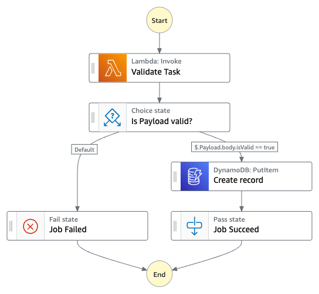

# Database Record Creation Workflow

This application creates an Express Workflow which validate a JSON record  before storing it into a DynamoDB table. The record can be validated with various rules which are described in a JSON file.

 - Field is mandatory
 - Field is not empty

Important: this application uses various AWS services and there are costs associated with these services after the Free Tier usage - please see the [AWS Pricing page](https://aws.amazon.com/pricing/) for details. You are responsible for any AWS costs incurred. No warranty is implied in this example.

## Requirements

* [Create an AWS account](https://portal.aws.amazon.com/gp/aws/developer/registration/index.html) if you do not already have one and log in. The IAM user that you use must have sufficient permissions to make necessary AWS service calls and manage AWS resources.
* [AWS CLI](https://docs.aws.amazon.com/cli/latest/userguide/install-cliv2.html) installed and configured
* [Git Installed](https://git-scm.com/book/en/v2/Getting-Started-Installing-Git)
* [AWS Cloud Development Kit](https://docs.aws.amazon.com/cdk/v2/guide/getting_started.html) (AWS CDK) installed

## Deployment Instructions

1. Create a new directory, navigate to that directory in a terminal and clone the GitHub repository:
    ``` 
    git clone https://github.com/aws-samples/step-functions-workflows-collection
    ```
1. Change directory to the pattern directory:
    ```
    cd database-record-creation
    ```
1. From the command line, use AWS CDK to deploy the AWS resources for the workflow as specified in the template.yaml file:
    ```
    cdk deploy
    ```

1. Note the outputs from the CDK deployment process. These contain the resource names and/or ARNs which are used for testing.

## How it works

When the Express Workflow is invoked, an AWS Lambda function is triggered, which validates the current JSON payload to ensure it is compliant with the schema and with the validation rules. The schema validation rules are stored inside `businessRules.js` in the following format:

```json
exports.fields = [
    {
        name: 'id',
        required: true
    },
    {
        name: 'firstname',
        required: true
    },
    {
        name: 'email',
        required: false
    }
]
```

If the payload is `invalid`, the Express Workflow is terminated with an error. If the payload is `valid`, a subsequent task will save the payload as a new record inside Amazon DynamoDB. Then the Express Workflow is terminated with success.

## Image



## Testing

In order to test the workflow, you can follow these steps:

 1. Login inside your AWS Account Console
 1. In the search bar, search for "Step Functions"
 1. Identify the Step Function created with this template, the name should be `[your AWS account]-validateRecord-workflow`
 1. Click on "Start execution" and provide various JSON payloads to test both failure and success

 **Invalid JSON example**

```json
{
    "id" : "123ABC",
    "firstname" : ""
}
```

 **Valid JSON example**

```json
{
    "id" : "123ABC",
    "firstname" : "john",
    "email" : "john@email.com"
}
```

## Cleanup
 
1. Delete the stack
    ```bash
    cdk destroy
    ```
1. Confirm the stack has been deleted
    ```bash
    aws cloudformation list-stacks --query "StackSummaries[?contains(StackName,'STACK_NAME')].StackStatus"
    ```
----
Copyright 2022 Amazon.com, Inc. or its affiliates. All Rights Reserved.

SPDX-License-Identifier: MIT-0
