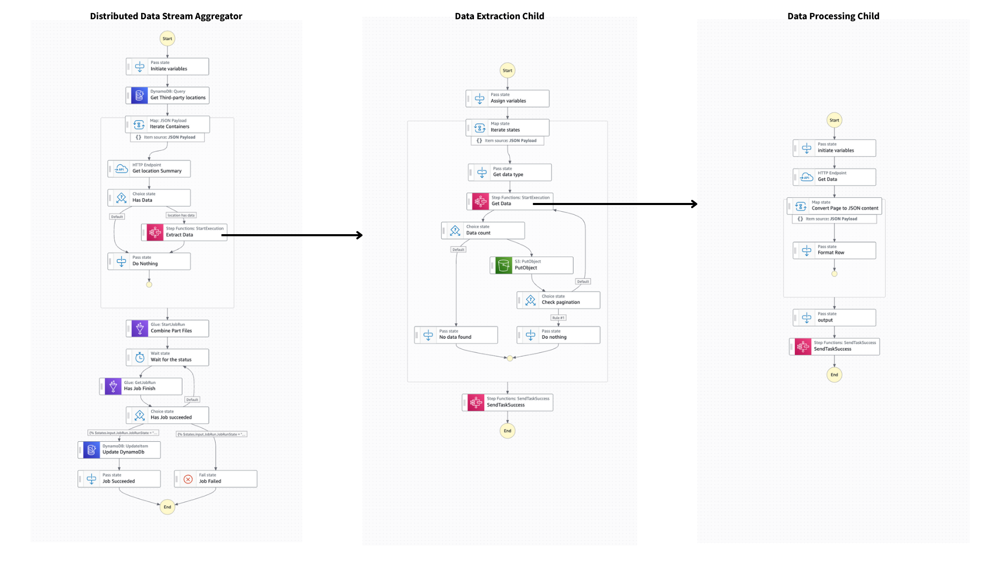

# Distributed Data Stream Aggregator

This workflow demonstrates how to aggregate data from multiple third-party locations using a distributed processing pattern with AWS Step Functions. The workflow orchestrates data extraction, transformation, and consolidation at scale using Step Functions, Amazon DynamoDB, Amazon S3, and AWS Glue.

**Key Features:** This approach is unique as it implements a **no-Lambda, low-code solution** that leverages native AWS service integrations and JSONata expressions within Step Functions. The only custom code required is a minimal Glue job script for data consolidation, making it a cost-effective and maintainable solution with fewer dependencies and no Lambda cold start overhead.


Important: this application uses various AWS services and there are costs associated with these services after the Free Tier usage - please see the [AWS Pricing page](https://aws.amazon.com/pricing/) for details. You are responsible for any AWS costs incurred. No warranty is implied in this example.

## Requirements

* [Create an AWS account](https://portal.aws.amazon.com/gp/aws/developer/registration/index.html) if you do not already have one and log in. The IAM user that you use must have sufficient permissions to make necessary AWS service calls and manage AWS resources.
* [AWS CLI](https://docs.aws.amazon.com/cli/latest/userguide/install-cliv2.html) installed and configured
* [Git Installed](https://git-scm.com/book/en/v2/Getting-Started-Installing-Git)

## Deployment Instructions

1. Create a new directory, navigate to that directory in a terminal and clone the GitHub repository:
    ``` 
    git clone https://github.com/aws-samples/step-functions-workflows-collection
    ```
2. Change directory to the pattern directory:
    ```
    cd distributed-data-stream-aggregator
    ```
3. Create required DynamoDB tables:
    ```bash
    # Create locations table
    aws dynamodb create-table \
        --table-name locations \
        --attribute-definitions \
            AttributeName=task_id,AttributeType=S \
        --key-schema \
            AttributeName=task_id,KeyType=HASH \
        --billing-mode PAY_PER_REQUEST

    # Create task table  
    aws dynamodb create-table \
        --table-name processing-tasks \
        --attribute-definitions \
            AttributeName=task_id,AttributeType=S \
            AttributeName=created_at,AttributeType=S \
        --key-schema \
            AttributeName=task_id,KeyType=HASH \
            AttributeName=created_at,KeyType=RANGE \
        --billing-mode PAY_PER_REQUEST
    ```

4. Create S3 buckets for data processing:
    ```bash
    # Create source bucket for temporary files
    aws s3 mb s3://your-data-processing-bucket

    # Create destination bucket for final output  
    aws s3 mb s3://your-output-bucket
    ```

5. Upload the Glue job script to S3:
    ```bash
    # Upload the Glue script to your bucket
    aws s3 cp app.py s3://your-data-processing-bucket/scripts/app.py
    ```

6. Create AWS Glue job for data consolidation:
    ```bash
    # Create Glue job
    aws glue create-job \
        --name data-aggregation-job \
        --role arn:aws:iam::YOUR_ACCOUNT:role/GlueServiceRole \
        --command Name=glueetl,ScriptLocation=s3://your-data-processing-bucket/scripts/app.py
    ```

7. Create HTTP connections for third-party API access:
    This workflow uses EventBridge connections to securely authenticate with third-party APIs. 
    Configure the connection based on your API's authentication requirements.
    
    See the [AWS EventBridge Connections documentation](https://docs.aws.amazon.com/eventbridge/latest/userguide/eb-connections.html) 
    for supported authentication methods (API Key, OAuth, Basic Auth, IAM Role).
    
    Example for API Key authentication:
    
    ```bash
    aws events create-connection \
        --name api-connection \
        --authorization-type API_KEY \
        --auth-parameters "ApiKeyAuthParameters={ApiKeyName=Authorization,ApiKeyValue=Bearer YOUR_TOKEN}"
    ```

8. Deploy the state machines by updating the placeholder values in each ASL file:
   - Replace `'s3-bucket-name'` with your source bucket name
   - Replace `'api_endpoint'` with your API URL
   - Replace `'ConnectionArn'` with your EventBridge connection ARN
   - Replace `'data-aggregation-job'` with your Glue job name
   - Replace `'processing-tasks'` with your task table name
   - Replace `'Data Extraction Child'` and `'Data Processing Child'` with the respective state machine ARNs

9. Create the state machines:
    ```bash
    # Create Distributed Data Stream Aggregator state machine
    aws stepfunctions create-state-machine \
        --name DistributedDataStreamAggregator \
        --definition file://statemachine/statemachine.asl.json \
        --role-arn arn:aws:iam::YOUR_ACCOUNT:role/StepFunctionsExecutionRole

    # Create Data Extraction Child state machine  
    aws stepfunctions create-state-machine \
        --name DataExtractionChild \
        --definition file://statemachine/data-extraction-child.asl.json \
        --role-arn arn:aws:iam::YOUR_ACCOUNT:role/StepFunctionsExecutionRole

    # Create Data Processing Child state machine (Express)
    aws stepfunctions create-state-machine \
        --name DataProcessingChildExpress \
        --definition file://statemachine/data-processing-child.asl.json \
        --role-arn arn:aws:iam::YOUR_ACCOUNT:role/StepFunctionsExecutionRole \
        --type EXPRESS
    ```

## How it works

This distributed data stream aggregator implements a three-tier processing architecture:

### Distributed Data Stream Aggregator Workflow (Parent State Machine)
The main workflow accepts a unique task ID and orchestrates the entire data aggregation process. It queries DynamoDB to retrieve various client locations based on the task ID, then uses distributed map iteration to process multiple locations in parallel. Finally, it triggers an AWS Glue job to combine all partial data files and updates the task status in DynamoDB.

### Data Extraction Workflow (Standard Execution)  
This workflow handles data extraction from third-party locations. It pings locations via HTTP endpoints to verify data availability, processes different types of data (failed, rejected) using inline map iteration, and calls the express child workflow with pagination parameters. Extracted data is stored as JSON files in S3 organized by task ID.

### Data Processing Workflow (Express Execution)
The express workflow handles the actual API calls to third-party endpoints. It receives location details, data type, and pagination parameters, makes HTTP calls with query parameters, formats the retrieved data into standardized JSON format, and returns results with count and pagination metadata.

### Data Consolidation
An AWS Glue job combines all small JSON files from the temporary S3 directory into a single consolidated file, which is uploaded to the destination S3 bucket. The workflow monitors job status and updates the DynamoDB task table upon completion.

## Image



## Testing

1. Populate the locations table with test data:
    ```bash
    aws dynamodb put-item \
        --table-name locations \
        --item '{"task_id": {"S": "example-task-123"}, "location_id": {"S": "location-001"}, "api_url": {"S": "https://api.example.com"}}'
    ```

2. Execute the state machine with the example input:
    ```bash
    aws stepfunctions start-execution \
        --state-machine-arn arn:aws:states:REGION:ACCOUNT:stateMachine:DistributedDataStreamAggregator \
        --name test-execution-$(date +%s) \
        --input '{"task_id": "data-aggregation-20241215-batch-001", "task_sort_key": "2024-12-15T14:30:00.000Z"}'
    ```

3. Monitor the execution in the AWS Step Functions console or via CLI:
    ```bash
    aws stepfunctions describe-execution \
        --execution-arn EXECUTION_ARN
    ```

4. Verify the results by checking the destination S3 bucket for the aggregated CSV file and the task table for updated status.

## Cleanup
 
1. Delete the state machines:
    ```bash
    aws stepfunctions delete-state-machine --state-machine-arn arn:aws:states:REGION:ACCOUNT:stateMachine:DistributedDataStreamAggregator
    aws stepfunctions delete-state-machine --state-machine-arn arn:aws:states:REGION:ACCOUNT:stateMachine:DataExtractionChild
    aws stepfunctions delete-state-machine --state-machine-arn arn:aws:states:REGION:ACCOUNT:stateMachine:DataProcessingChildExpress
    ```

2. Delete DynamoDB tables:
    ```bash
    aws dynamodb delete-table --table-name locations
    aws dynamodb delete-table --table-name processing-tasks
    ```

3. Delete S3 buckets (ensure they are empty first):
    ```bash
    aws s3 rb s3://your-data-processing-bucket --force
    aws s3 rb s3://your-output-bucket --force
    ```

4. Delete Glue job:
    ```bash
    aws glue delete-job --job-name data-aggregation-job
    ```

5. Delete EventBridge connection:
    ```bash
    aws events delete-connection --name api-connection
    ```

----
Copyright 2025 Amazon.com, Inc. or its affiliates. All Rights Reserved.

SPDX-License-Identifier: MIT-0
