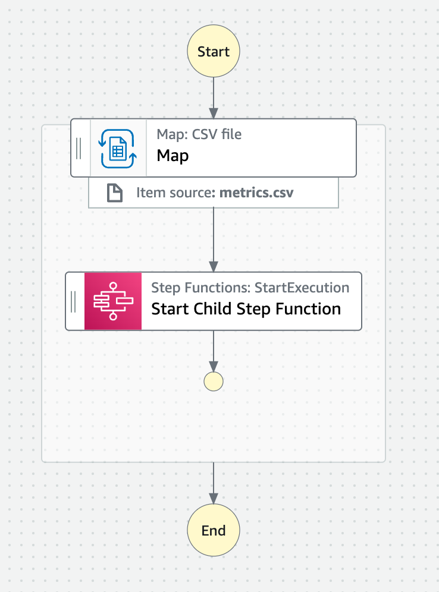

# Step function distributed map workflow with CSV file

This workflow is an example application of a step function using distributed map. This distributed map iterates over an CSV file that is stored in an S3 bucket.

For processing each item of the file the Step Function will call async another child state machine.

Learn more about this workflow at Step Functions workflows collection: https://serverlessland.com/workflows/distributed-map-csv-iterator

Important: this application uses various AWS services and there are costs associated with these services after the Free Tier usage - please see the [AWS Pricing page](https://aws.amazon.com/pricing/) for details. You are responsible for any AWS costs incurred. No warranty is implied in this example.

## Requirements

- [Create an AWS account](https://portal.aws.amazon.com/gp/aws/developer/registration/index.html) if you do not already have one and log in. The IAM user that you use must have sufficient permissions to make necessary AWS service calls and manage AWS resources.
- [AWS CLI](https://docs.aws.amazon.com/cli/latest/userguide/install-cliv2.html) installed and configured
- [Git Installed](https://git-scm.com/book/en/v2/Getting-Started-Installing-Git)
- [AWS Serverless Application Model](https://docs.aws.amazon.com/serverless-application-model/latest/developerguide/serverless-sam-cli-install.html) (AWS SAM) installed

## Deployment Instructions

1. Create a new directory, navigate to that directory in a terminal and clone the GitHub repository:
   ```
   git clone https://github.com/aws-samples/step-functions-workflows-collection
   ```
1. Change directory to the pattern directory:
   ```
   cd distributed-map-csv-iterator
   ```
1. From the command line, use AWS SAM to deploy the AWS resources for the workflow as specified in the template.yaml file:
   ```
   sam deploy --guided
   ```
1. During the prompts:

   - Enter a stack name
   - Enter the desired AWS Region
   - Allow SAM CLI to create IAM roles with the required permissions.

   Once you have run `sam deploy --guided` mode once and saved arguments to a configuration file (samconfig.toml), you can use `sam deploy` in future to use these defaults.

1. Note the outputs from the SAM deployment process. These contain the resource names and/or ARNs which are used for testing.

## How it works

The state machine will take as an input a CSV file that contains a header and multiple items. For each item, it will invoke a child state machine that will process the item. This call is async as the parent state machine is not waiting for the child to complete it execution.



The child state machine is from the type Express. And it will add the item to a DynamoDB table. But you can do more complex things in this state machine.

## Testing

1. You need to upload a CSV file, called `metrics.csv` to the S3 bucket that was created when deploying this stack. The file needs to have the following format:

```
Content,VideoTitle,VideoPublishTime,Views
1wNb_RMvI9E,QUE ES AWS LAMBDA? INTRODUCCION EN ESPAÑOL A SERVERLESS EN AWS,"May 3, 2021",24993
xIy0KVMOHHw,Introducción a AWS Amplify,"Jun 15, 2021",13587
Z_GAa9WToMM,INTRODUCCION A AWS SAM,"May 17, 2021",9631
Zvdf_P5pJis,Introducción a AWS Step Functions,"Aug 23, 2021",5657
```

After that you can start an execution on the parent state machine. You can check the database created if it added all the items in the file, and see if the child state machine executed successfully as many times as items were in the file.

## Cleanup

1. Delete the stack
   ```bash
   aws cloudformation delete-stack --stack-name STACK_NAME
   ```
1. Confirm the stack has been deleted
   ```bash
   aws cloudformation list-stacks --query "StackSummaries[?contains(StackName,'STACK_NAME')].StackStatus"
   ```

---

Copyright 2022 Amazon.com, Inc. or its affiliates. All Rights Reserved.

SPDX-License-Identifier: MIT-0
