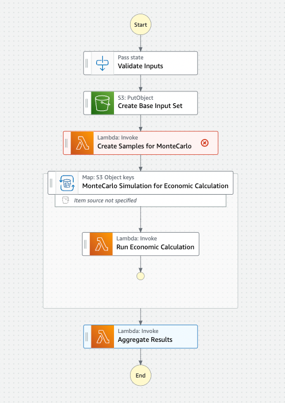
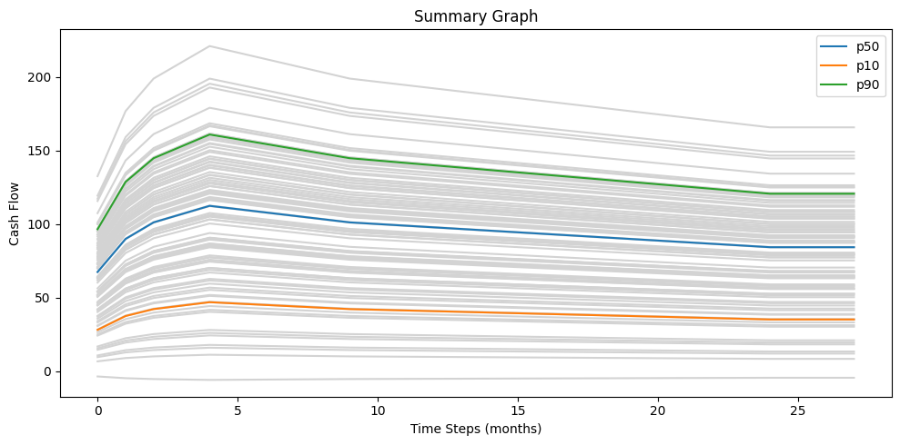

# Step function distributed map workflow for montecarlo simulation

This workflow is an application of a step function distributed map, implementing a Monte Carlo simulation with parallel calculations. 

Monte Carlo simulation is a mathematical technique that predicts possible outcomes of an uncertain event. This technique provides multiple possible outcomes and the probability of each from a large pool of random data samples. Monte Carlo simulation predictions are used in many industries including finance, energy, engineering, and online gaming. To find out more about Monte Carlo Simulation visit [What is the Monte Carlo Simulation?](https://aws.amazon.com/what-is/monte-carlo-simulation/). 

The state machine performs random sampling of input parameters to generate inputs in S3. The distributed map uses the input samples to run calculations in parallel. For each input sample the Step Function will call a child state machine to run calculation. The results are stored in S3 and pre-signed URLs are returned in execution outputs. 

Learn more about this workflow at Step Functions workflows collection: https://serverlessland.com/workflows/distributed-map-montecarlo

Important: this application uses various AWS services and there are costs associated with these services after the Free Tier usage - please see the [AWS Pricing page](https://aws.amazon.com/pricing/) for details. You are responsible for any AWS costs incurred. No warranty is implied in this example.

## Requirements

- [Create an AWS account](https://portal.aws.amazon.com/gp/aws/developer/registration/index.html) if you do not already have one and log in. The IAM user that you use must have sufficient permissions to make necessary AWS service calls and manage AWS resources.
- [AWS CLI](https://docs.aws.amazon.com/cli/latest/userguide/install-cliv2.html) installed and configured
- [Git Installed](https://git-scm.com/book/en/v2/Getting-Started-Installing-Git)
- [AWS Serverless Application Model](https://docs.aws.amazon.com/serverless-application-model/latest/developerguide/serverless-sam-cli-install.html) (AWS SAM) installed

## Deployment Instructions

1. Create a new directory, navigate to that directory in a terminal and clone the GitHub repository:
   ```
   git clone https://github.com/aws-samples/step-functions-workflows-collection
   ```
1. Change directory to the workflow directory:
   ```
   cd distributed-map-montecarlo-financial
   ```
1. From the command line, use AWS SAM to build and deploy the AWS resources for the workflow as specified in the template.yaml file:
   ```
   sam build
   sam deploy --guided
   ```
1. During the prompts:

   - Enter a stack name
   - Enter the desired AWS Region
   - Allow SAM CLI to create IAM roles with the required permissions.

   Once you have run `sam deploy --guided` mode once and saved arguments to a configuration file (samconfig.toml), you can use `sam deploy` in future to use these defaults.

1. Note the outputs from the SAM deployment process. These contain the resource names and/or ARNs which are used for testing.

## How it works

The state machine takes JSON input for monthly production values, unit price, mean and standard deviation for price changes, and number of samples to generate random samples for simulation. 



See below example input:

```
{
  "monthly_production": [60, 80, 90, 95, 100, 98, 96, 94, 92, 90, 89, 88, 87, 86, 85, 84, 83, 82, 81, 80, 79, 78, 77, 76, 75],
  "unit_price": 100,
  "number_of_samples": 1000
  "mean_price_change": 2,
  "standard_deviation": 5,
}
```

This example input above provides 24 values (2 years worth of monthly production data), and number of samples for the Monte Carlo simulation as 1000.

With with this example input, the first step of the state machine generates 1000 random input samples for calculation, stored in S3 bucket `input/` path as individual CSV files.

The second step is a distributed map state, and it processes all the CSV files in the `input/` path in the S3 bucket. 
The child state machine is from the type `Express`. For each input sample it invokes a lambda function to calculate the revenue figures, and writes the results to the `output/` path in the S3 bucket. 

The last step of the state machine is another lambda function that aggregates the results in a combined CSV files. It calculates percentiles such as p10, p50, p90, and plot them on a line graph.

The execution output contains a pre-signed URL for the line graph, and another for the aggregate CSV file. You can paste these URLs into the address bar of your browser to view the results. Below is an example line graph.




## Cleanup

1. Delete the stack
   ```bash
   sam delete --stack-name STACK_NAME
   ```
1. Confirm the stack has been deleted
   ```bash
   aws cloudformation list-stacks --query "StackSummaries[?contains(StackName,'STACK_NAME')].StackStatus"
   ```

---

Copyright 2023 Amazon.com, Inc. or its affiliates. All Rights Reserved.

SPDX-License-Identifier: MIT-0
