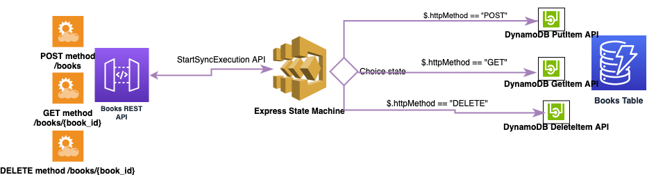

# Dynamic REST API #

API Gateway integrates with Express workflows via asynchronous and synchronous patterns. 

Asynchronous Express Workflows return confirmation that the workflow was started, but do not wait for the workflow to complete. To get the result, you must poll the service's CloudWatch Logs. 

Synchronous Express Workflows start a workflow and wait until it completes, then return the result. It can be used for orchestrating microservices or removing error handling, retries and parallel tasks executions from application codes. Synchronous Express workflows can be invoked from Amazon API Gateway, AWS Lambda, or by using the StartSyncExecution API call.

The StepFunctionsRestApi only supports integration with Synchronous Express state machine. The StepFunctionsRestApi construct makes this easy by setting up input, output and error mapping.\
This workflow set up an AWS Rest Api that is dynamically integrated with an Express state machine. Whenever following endpoints are invoked with POST, GET and DELETE HTTP methods, “StartSyncExecution” API of state machine is called and an execution starts. Inside state machine, a Choice state is defined which make decision based on the input HTTP Method and executes one of DynamoDB API call tasks. 

The Rest API defines following methods and resources corresponding to an online Book store for adding, getting or deleting books. Book store database in set up on a DynamoDB table with “book_id” as sort key:

ANY at root level /\
POST method for /books resource\
GET method for /books/{book_id} resource\
DELETE method for /books/{book_id} resource

Following DynamoDB APIs are called during state machine execution upon invoking following API endpoints:

HTTP POST request with “book_id” and “author” in request body to https://{{URL-ENDPOINT}}/books => DynamoDB PutItem api\
\
HTTP GET request with query string “book_id” to https://{{URL-ENDPOINT}}/books/ => DynamoDB GetItem api\
\
HTTP DELETE with “book_id” as a URL path to https://{{URL-ENDPOINT}}/books/  => DynamoDB DeleteItem api
\





Following VTL code snippet has been added to the request template mapping for adding HTTP method to the input that the Step function receives:\
#set($inputRoot='"httpMethod" :"'+ $context.httpMethod+'"')\

On success, an HTTP code 200 is returned with the execution output as the Response Body.\
If the execution fails, an HTTP 500 response is returned with the error and cause from the execution output as the Response Body. If the request is invalid (ex. bad execution input) HTTP code 400 is returned.

*Note: In DynamoDB GetItem api call, if there is no matching item, GetItem does not return any data and there will be no Item element in the response, so following VTL code snippet must be added to the integration response template mapping, to override HTTP response code 200 to 404 in case “book_id” does not found in Books table:*

```
#set($inputRoot = $input.path('$'))
#set($inputBookId = $input.params('book_id'))
#set($integration_output = $input.path('$.output'))
#if($input.path('$.status').toString().equals("FAILED"))
#set($context.responseOverride.status = 500)
{
"error": "$input.path('$.error')",
"cause": "$input.path('$.cause')"
}
#elseif(!$integration_output.contains("Item"))
#set($context.responseOverride.status = 404)
{ "Book ID "$inputBookId" not found in Books database" }
#else
$input.path('$.output')
#end
```


**Important to know: Unless you specify conditions, the DynamoDB “DeleteItem” is an idempotent operation; running it multiple times on the same item or attribute does not result in an error response. In order to avoid idempotence during DeleteItem api call, following condition has been added to corresponding state machine task:**\
`condition_expression="attribute_exists(book_id)"`


#### Deployment: ####

In “dynamic-rest-api” folder run the following two commands to activate the app's Python virtual environment and install the AWS CDK core dependencies:

source .venv/bin/activate\
python -m pip install -r requirements.txt

Note: All AWS CDK v2 deployments use dedicated AWS resources to hold data during deployment, so your AWS account and region must be bootstrapped to create these resources before you can deploy. If you haven't already bootstrapped, issue following command:

cdk bootstrap aws://ACCOUNT-NUMBER/REGION


#### Deploying the stack ####
For deploying the stack, you can first run “cdk synth” to Synthesize an AWS CloudFormation template for the app:

cdk synth\
cdk deploy


#### Destroying the app's resources ####

Use following command to destroy the app, please note DynamoDB table and Cloudwatch Log groups will not be deleted because the default “removal_policy” is “RETAIN”.\
cdk destroy


#### Testing ####

- - - -
Send an HTTP POST request to the books REST API URL endpoint generated by template to store an item in Books DynamoDB table:\
`curl -X POST -d '{ "book_id" : "testbook1", "author" : "Mike" }' 'https://{{BooksAPI-URL}}/books \
--header 'Content-Type: application/json'`

Send an HTTP DELETE request to the Books Rest Api endpoint URL adding “book_id” as a path parameter:\
`curl -X DELETE 'https://{{BooksAPI-URL}}/books/testbook1'`
- - - -