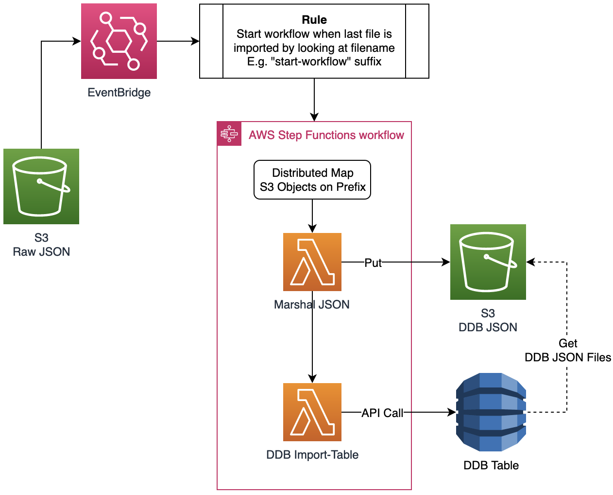
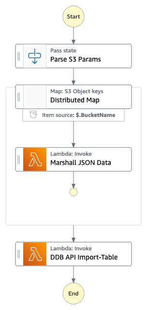

# Distributed Map - DynamoDB Import JSON

Currently the fastest (and least expensive) way to get data into DynamoDB is to use the [ImportTable API](https://aws.amazon.com/blogs/database/amazon-dynamodb-can-now-import-amazon-s3-data-into-a-new-table/) call. The problem is that it only accepts CSV, DynamoDB JSON, or ION formats. What if you have a different data format? You would have to build an entire orchestrated process to transform and handle errors. This workflow uses the newly released Distributed Map feature to fix this gap by automating the transformation of JSON to DynamoDB JSON and importing into DynamoDB. The best part is that this workflow can be easily adapted to convert any type of data needed.  This workflow will provision a S3 bucket to load files into, an EvenBridge rule that triggers the workflow and Lambda functions to transform data and start the ImportTable process to DynamoDB.

Important: this application uses various AWS services and there are costs associated with these services after the Free Tier usage - please see the [AWS Pricing page](https://aws.amazon.com/pricing/) for details. You are responsible for any AWS costs incurred. No warranty is implied in this example.

## Requirements

* [Create an AWS account](https://portal.aws.amazon.com/gp/aws/developer/registration/index.html) if you do not already have one and log in. The IAM user that you use must have sufficient permissions to make necessary AWS service calls and manage AWS resources.
* [AWS CLI](https://docs.aws.amazon.com/cli/latest/userguide/install-cliv2.html) installed and configured
* [Git Installed](https://git-scm.com/book/en/v2/Getting-Started-Installing-Git)
* [AWS Serverless Application Model](https://docs.aws.amazon.com/serverless-application-model/latest/developerguide/serverless-sam-cli-install.html) (AWS SAM) installed

## Deployment Instructions

1. Create a new directory, navigate to that directory in a terminal and clone the GitHub repository:
    ``` 
    git clone https://github.com/aws-samples/step-functions-workflows-collection
    ```
1. Change directory to the pattern directory:
    ```
    cd ./dynamodb-import-json
    ```
1. From the command line, use AWS SAM to deploy the AWS resources for the workflow as specified in the template.yaml file:
    ```
    cd ./functions
    npm install
    cd ..
    sam build && sam deploy --guided
    ```
1. During the prompts:
    * Enter a stack name
    * Enter the desired AWS Region
    * Allow SAM CLI to create IAM roles with the required permissions.

    Once you have run `sam deploy --guided` mode once and saved arguments to a configuration file (samconfig).toml), you can use `sam deploy` in future to use these defaults.

1. Note the outputs from the SAM deployment process. These contain the resource names and/or ARNs which are used for testing.

## How it works

1. There is an Event Bridge rule that triggers on the created S3 bucket to start the Step Functions workflow.
2. The workflow parses the event to get S3 location & prefix and passes parameters onto the Distributed Map task.
3. The Map reads the S3 location and distributes each file to a Lambda.
4. The Marshall JSON Lambda transforms JSON to DynamoDB JSON and places converted files into S3 bucket.
5. Once all files have been converted, an array is passed to the next task with all the file locations.
6. The DDB Import-Table Lambda builds the table parameters and starts the ImportTable process into DynamoDB.
7. DynamoDB uses the converted files from S3 for import during table creation.





## Testing

1. After deployment you will see the output location of the S3 bucket printed in the console. Copy this value.
2. Navigate to the `example-data` folder and view the contents. You will see four json files. The ones with prefix of `json-data` contain the table data and the `start-workflow.json` contains the DynamoDB table parameters and is the file that will trigger the EventBridge rule to start the Step Functions workflow.
3. Next copy all the files over to the S3 bucket inside a designated folder
```bash
aws s3 cp example-data s3://{S3 Output Location}/{Folder Name} --recursive
```
4. Navigate to the AWS Step Functions console and select the `ImportJSONtoDynamoDb` workflow. If you don't see it, make sure you are in the correct Region.
5. Observe the workflow use distributed map against S3 files for transformation and send completed data to next task where it starts the ImportTable process.
6. Navigate to DynamoDB console and view the new table created named `dist-map-marshall-json`
7. *Optional* take a look at EventBridge to see the rule and the S3 bucket location to view the converted files. 

## Cleanup
 
1. Delete the stack
    ```bash
    sam delete
    ```
1. Confirm the stack has been deleted
    ```bash
    aws cloudformation list-stacks --query "StackSummaries[?contains(StackName,'STACK_NAME')].StackStatus"
    ```
----
Copyright 2022 Amazon.com, Inc. or its affiliates. All Rights Reserved.

SPDX-License-Identifier: MIT-0
