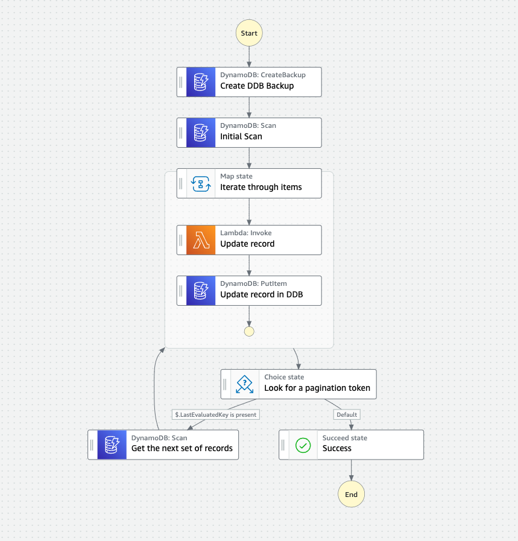
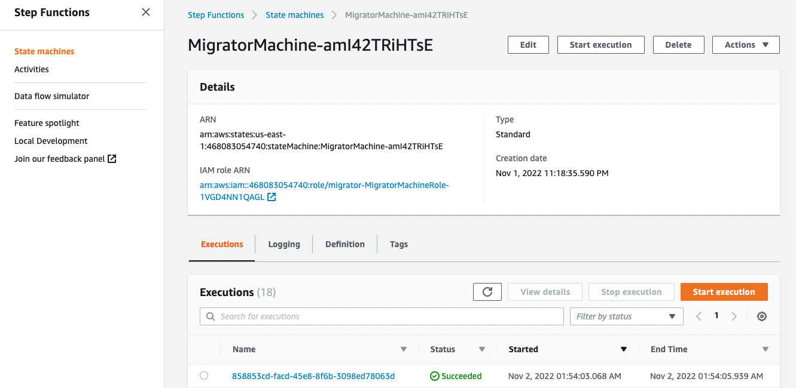
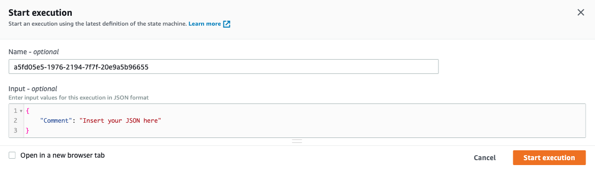

# Amazon DynamoDB migration workflow

This workflow scans an Amazon DynamoDB table and migrates each record as needed

Learn more about this workflow at Step Functions workflows collection: https://serverlessland.com/workflows/dynamodb-migrations

Important: this application uses various AWS services and there are costs associated with these services after the Free Tier usage - please see the [AWS Pricing page](https://aws.amazon.com/pricing/) for details. You are responsible for any AWS costs incurred. No warranty is implied in this example.

## Requirements

* [Create an AWS account](https://portal.aws.amazon.com/gp/aws/developer/registration/index.html) if you do not already have one and log in. The IAM user that you use must have sufficient permissions to make necessary AWS service calls and manage AWS resources.
* [AWS CLI](https://docs.aws.amazon.com/cli/latest/userguide/install-cliv2.html) installed and configured
* [Git Installed](https://git-scm.com/book/en/v2/Getting-Started-Installing-Git)
* [AWS Serverless Application Model](https://docs.aws.amazon.com/serverless-application-model/latest/developerguide/serverless-sam-cli-install.html) (AWS SAM) installed

## Deployment Instructions

1. Create a new directory, navigate to that directory in a terminal and clone the GitHub repository:
    ``` 
    git clone https://github.com/aws-samples/step-functions-workflows-collection
    ```
1. Change directory to the pattern directory:
    ```
    cd dynamodb-migrations
    ```
1. From the command line, use AWS SAM to deploy the AWS resources for the workflow as specified in the template.yaml file:
    ```
    sam deploy --guided
    ```
1. During the prompts:
    * Enter a stack name
    * Enter the DynamoDB table name
    * Enter the DynamoDB Arn
    * Enter the desired AWS Region
    * Allow SAM CLI to create IAM roles with the required permissions.

    Once you have run `sam deploy --guided` mode once and saved arguments to a configuration file (samconfig.toml), you can use `sam deploy` in future to use these defaults.

1. Note the outputs from the SAM deployment process. These contain the resource names and/or ARNs which are used for testing.

## How it works

This workflow first creates a backup of the database. Then it iterates through each record in the database. The workflow manages the pagination to ensure the entire database is handled. Currently it pulls records in groups of 50. The migration logic is handled in the `src/app.py` Lambda function. Update this function to make any migrations you need.

## Image
Provide an exported .png of the workflow in the `/resources` directory from [Workflow studio](https://docs.aws.amazon.com/step-functions/latest/dg/workflow-studio.html) and add here.


## Testing

1. Update the Lambda function at src/app.py to update the records during the migration
1. Deploy the application as listed above.
1. Open the work flow in the AmWS Step Functions console. Choose **Start execution** 
1. Leave the event as is and choose **Start execution** again 

## Cleanup
 
1. Delete the stack
    ```bash
    sam delete --stack-name STACK_NAME
    ```
1. Confirm the stack has been deleted
    ```bash
    aws cloudformation list-stacks --query "StackSummaries[?contains(StackName,'STACK_NAME')].StackStatus"
    ```
----
Copyright 2022 Amazon.com, Inc. or its affiliates. All Rights Reserved.

SPDX-License-Identifier: MIT-0