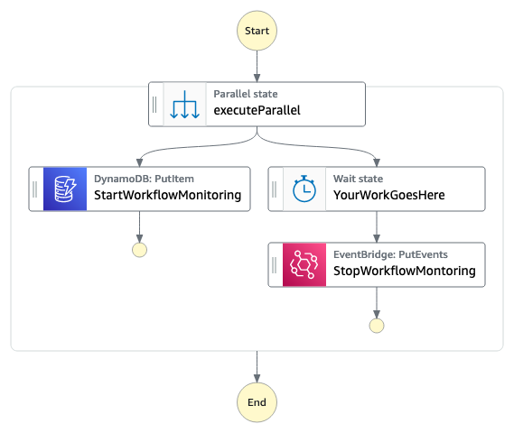
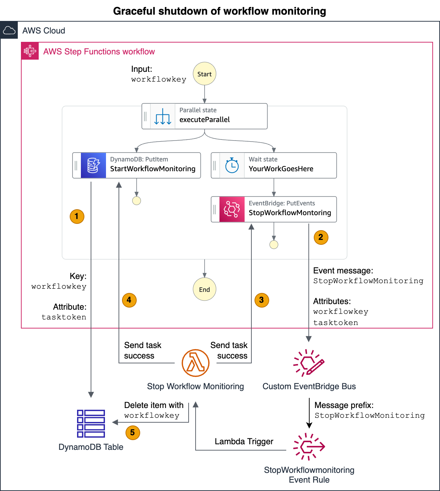
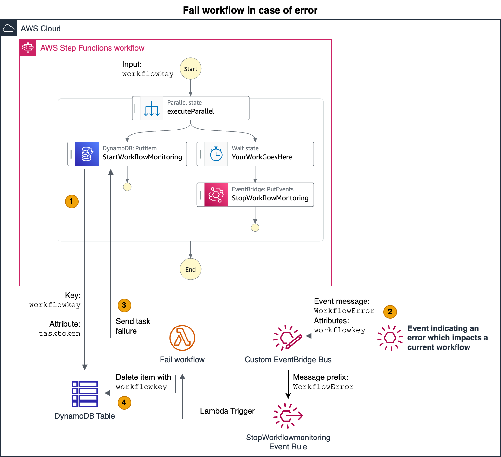
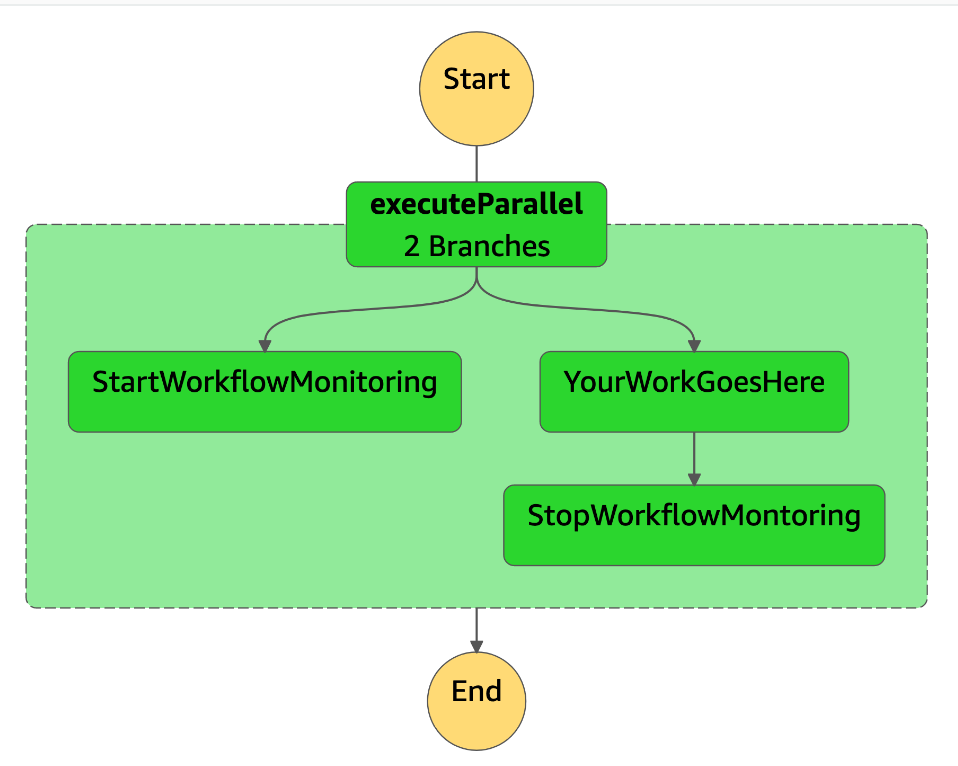
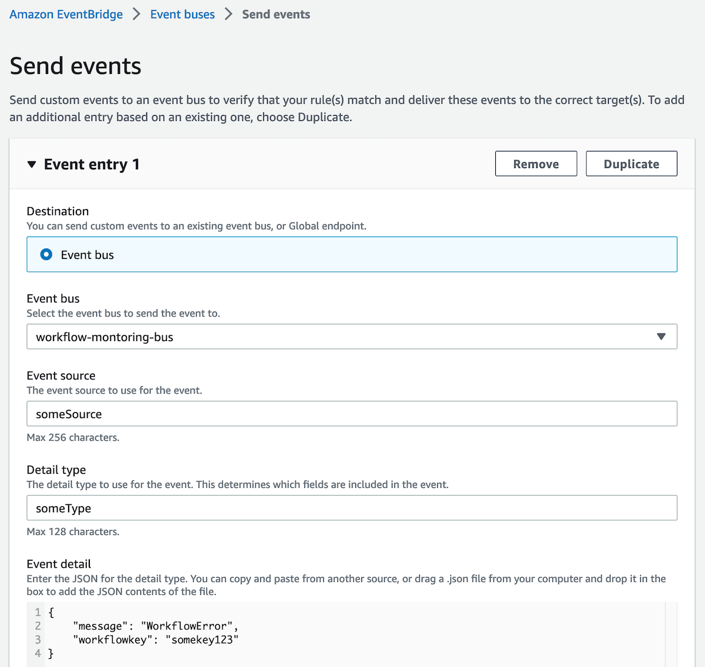
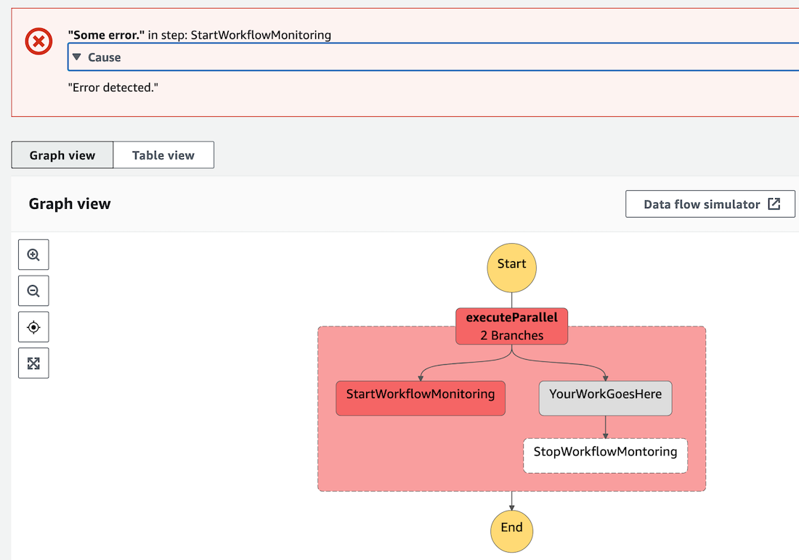

# Event-driven Workflow Monitor

This example demonstrates how [AWS Step Functions](https://aws.amazon.com/step-functions/) workflows can integrate with events in an [event-driven architecture](https://aws.amazon.com/what-is/eda/). The example implements a workflow monitor task to react to events sent to [Amazon EventBridge](https://aws.amazon.com/eventbridge/). For that, the monitor task stores workflow metadata in a [DynamoDB](https://aws.amazon.com/dynamodb/) table. Events sent to EventBridge trigger [Lambda functions](https://docs.aws.amazon.com/lambda/latest/dg/welcome.html), which send [fail or success commands back to the workflow monitor task](https://docs.aws.amazon.com/step-functions/latest/dg/callback-task-sample-sqs.html).

Important: this application uses various AWS services and there are costs associated with these services after the Free Tier usage - please see the [AWS Pricing page](https://aws.amazon.com/pricing/) for details. You are responsible for any AWS costs incurred. No warranty is implied in this example.

## Requirements

* [Create an AWS account](https://portal.aws.amazon.com/gp/aws/developer/registration/index.html) if you do not already have one and log in. The IAM user that you use must have sufficient permissions to make necessary AWS service calls and manage AWS resources.
* [AWS CLI](https://docs.aws.amazon.com/cli/latest/userguide/install-cliv2.html) installed and configured
* [Git installed](https://git-scm.com)
* [AWS Cloud Development Kit](https://docs.aws.amazon.com/cdk/v2/guide/getting_started.html) (AWS CDK) installed

## Deployment Instructions

1. Create a new directory, navigate to that directory in a terminal and clone the GitHub repository:
    ``` 
    git clone https://github.com/aws-samples/step-functions-workflows-collection
    ```
1. Change directory to the pattern cdk directory:
    ```
    cd event-driven-workflow-monitor/cdk
    ```
1. Install node modules
    ```
    npm install
    ```
1. From the command line, use AWS CDK to deploy the AWS resources and the example workflow:
    ```
    cdk deploy
    ```

## How it works

This example implements a so-called workflow monitor task which succeeds or fails depending on events send to a custom [Amazon EventBridge](https://aws.amazon.com/eventbridge/) event bus. The infrastructure code deploys the following sample state machine.



At the start of a workflow execution, a workflow monitor task is started and runs in parallel to other tasks. This workflow monitor task waits for callbacks triggered by events sent to Amazon EventBridge. For example, an error occurring somewhere in the system - outside of the workflow - might emit an error event and trigger the failure of the workflow monitor task.

Events are associated with workflows using a unique identifier. In this example we use the term ```workflowkey``` to refer to such an unique identifier. For example, if your event-driven architecture is processing orders, an *Order ID* might be used as ```workflowkey```. Step Functions workflows might handle one part of the order processing while independent services within the event-driven architecture handle other parts of the order processing. In such scenarios the *Order ID* can be the globally unique identifier and it can be used to associate events with workflows.

The code of this example deploys a Step Functions workflow, a DynamoDB table, an EventBridge event bus & rules, and Lambda functions. The ```workflowkey```, which is required to associate events with workflows, is stored in a DynamoDB table by the monitor task at the beginning of a workflow execution. Lambda functions react to EventBridge events and send task success or failure commands to the workflow monitor task. We use a wait task in our sample workflow. You can replace this task with arbitrary Step Functions tasks. Just note that the ```StopWorkflowMonitoring``` task requires the ```workflowkey``` as input.

We distinguish between two scenarios in this example:
* **Graceful completion of the workflow monitor task** just before the workflow execution completes. The completion of the workflow monitor task is triggered from within the workflow itself by a [PutEvent](https://docs.aws.amazon.com/step-functions/latest/dg/connect-eventbridge.html) task.
* **Failure of the workflow monitor task** triggered by an external event. In our example, we fail the entire workflow in case of a failing monitor task. But you can [implement arbitrary application logic within the workflow to handle failing monitor tasks](https://docs.aws.amazon.com/step-functions/latest/dg/concepts-error-handling.html). 

If you are interested in further details about the integration of event-driven architectures with workflows, [this research paper](https://doi.org/10.1016/j.is.2014.04.002) provides further information.

#### Architecture for graceful workflow completion
The following architecture summarizes the interaction of components in five steps.


#### Architecture for failure of the workflow monitor task
The following architecture summarizes the interaction of components in four steps.



## Testing

You can test the workflow monitor by starting a workflow. As parameter, pass ```workflowkey``` as key and a value, like ```somekey123```. The example workflow triggers a graceful shutdown of the workflow monitor after the wait task waited for 1000 seconds. You can reduce the wait task duration to shorten test cycles. The following screenshot shows the successful completion of the workflow.


You can also simulate external events triggering a workflow failure. Start a workflow and pass ```workflowkey``` as key and a value, like ```somekey123```. Next, open Event Bridge and manually send an event as shown in the following screenshot.


This event will trigger a Lambda function and send a task failure command to the workflow. You can increase the wait task duration if you need more time to send a test event. The following screenshot shows the failing workflow.



## Cleanup
 
1. Delete the stack.
    ```
    cdk destroy
    ```
1. Confirm the stack has been deleted. You can view deployed stacks using the following command.
    ```
    aws cloudformation list-stacks"
    ```
----
Copyright 2023 Amazon.com, Inc. or its affiliates. All Rights Reserved.

SPDX-License-Identifier: MIT-0
