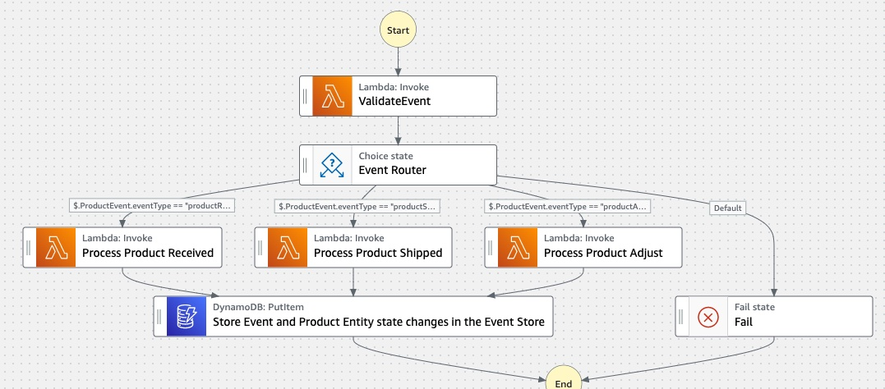

# Event Sourcing Pattern
This workflow demonstrates how to implement the event sourcing design pattern using AWS Step Functions. 

The example implementation demonstrates a mock product inventory workflow. All product inventory events are sent to a Step Function workflow which executes series of task and persists the state of a business entity (Product) as a sequence of state-changing events. Each task contains mock logic that processes a specific product event (ex: productReceived, ProductShipped etc.). It then passes on the updated product state to the next processing task. The updated product state changes along with input event is stored in the Product Inventory Event log.

This project contains source code and supporting files for a serverless application that you can deploy with the SAM CLI. It includes the following files and folders:

- functions - Code for the application's Lambda functions to process different product inventory events.
- statemachines - Definition for the state machine that orchestrates product inventory workflow.
- template.yaml - A template that defines the application's AWS resources.

The application uses several AWS resources, including Step Functions state machines, Lambda functions and DynamoDB. These resources are defined in the `template.yaml` file in this project. You can update the template to add AWS resources through the same deployment process that updates your application code.

Important: this application uses various AWS services and there are costs associated with these services after the Free Tier usage - please see the [AWS Pricing page](https://aws.amazon.com/pricing/) for details. You are responsible for any AWS costs incurred. No warranty is implied in this example.


## Requirements

* [Create an AWS account](https://portal.aws.amazon.com/gp/aws/developer/registration/index.html) if you do not already have one and log in. The IAM user that you use must have sufficient permissions to make necessary AWS service calls and manage AWS resources.
* [AWS CLI](https://docs.aws.amazon.com/cli/latest/userguide/install-cliv2.html) installed and configured
* [Git Installed](https://git-scm.com/book/en/v2/Getting-Started-Installing-Git)
* [AWS Serverless Application Model](https://docs.aws.amazon.com/serverless-application-model/latest/developerguide/serverless-sam-cli-install.html) (AWS SAM) installed

## Deployment Instructions

1. Create a new directory, navigate to that directory in a terminal and clone the GitHub repository:
    ```
    git clone https://github.com/aws-samples/step-functions-workflows-collection
    ```
1. Change directory to the pattern directory:
    ```
    cd event-sourcing
    ```
1. From the command line, use AWS SAM to deploy the AWS resources for the workflow as specified in the template.yaml file:
    ```
    sam deploy --guided
    ```
1. During the prompts:
    * Enter a stack name
    * Enter the desired AWS Region
    * Allow SAM CLI to create IAM roles with the required permissions.

    Once you have run `sam deploy --guided` mode once and saved arguments to a configuration file (samconfig.toml), you can use `sam deploy` in future to use these defaults.

1. Note the outputs from the SAM deployment process. These contain the resource names and/or ARNs which are used for testing.


The deploy command will package and deploy your application to AWS, with a series of prompts:

* **Stack Name**: The name of the stack to deploy to CloudFormation. This should be unique to your account and region, and a good starting point would be something matching your project name.
* **AWS Region**: The AWS region you want to deploy your app to.
* **Confirm changes before deploy**: If set to yes, any change sets will be shown to you before execution for manual review. If set to no, the AWS SAM CLI will automatically deploy application changes.
* **Allow SAM CLI IAM role creation**: Many AWS SAM templates, including this example, create AWS IAM roles required for the AWS Lambda function(s) included to access AWS services. By default, these are scoped down to minimum required permissions. To deploy an AWS CloudFormation stack which creates or modifies IAM roles, the `CAPABILITY_IAM` value for `capabilities` must be provided. If permission isn't provided through this prompt, to deploy this example you must explicitly pass `--capabilities CAPABILITY_IAM` to the `sam deploy` command.
* **Save arguments to samconfig.toml**: If set to yes, your choices will be saved to a configuration file inside the project, so that in the future you can just re-run `sam deploy` without parameters to deploy changes to your application.

## Use the SAM CLI to build locally

Build the Lambda functions in your application with the `sam build` command.

```
event-sourcing$ sam build
```

The SAM CLI installs dependencies defined in `functions/*/requirements.txt`, creates a deployment package, and saves it in the `.aws-sam/build` folder.


## How it works and Testing 

1. After deployment, navigate to AWS Step Functions console and select the "EventSourcingPatternStateMachine" workflow.
2. Select 'Start Execution' and use any sample JSON data provided under "events" folder to test "Product Received", "Product Shipped", "Product Adjusted" events
3. Based on the type of iput event, workflow routes the processing to respective Lambda function which processes the event using mock logic.
4. Each lambda function outputs updated product state changes along with input event to the next step, which persists the data in event log (DynamoDB table => ESPProductEventStoreTable)
5. Observe the State Machine workflow execution.



## Cleanup
 
To delete the resources created by this template, use the following command:

```bash
sam delete
```

----
Copyright 2022 Amazon.com, Inc. or its affiliates. All Rights Reserved.

SPDX-License-Identifier: MIT-0