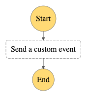

# Event Bridge Custom Event

This workflow demonstrates how to use Step Functions to send a custom event to an EventBridge bus.  The bus contains a rule matching the emitted event. The targets (SNS and SQS) will subsequently process the emitted event.

Important: this application uses various AWS services and there are costs associated with these services after the Free Tier usage - please see the [AWS Pricing page](https://aws.amazon.com/pricing/) for details. You are responsible for any AWS costs incurred. No warranty is implied in this example.

## Requirements

* [Create an AWS account](https://portal.aws.amazon.com/gp/aws/developer/registration/index.html) if you do not already have one and log in. The IAM user that you use must have sufficient permissions to make necessary AWS service calls and manage AWS resources.
* [AWS CLI](https://docs.aws.amazon.com/cli/latest/userguide/install-cliv2.html) installed and configured
* [Git Installed](https://git-scm.com/book/en/v2/Getting-Started-Installing-Git)
* [AWS Serverless Application Model](https://docs.aws.amazon.com/serverless-application-model/latest/developerguide/serverless-sam-cli-install.html) (AWS SAM) installed

## Deployment Instructions

1. Create a new directory, navigate to that directory in a terminal and clone the GitHub repository:
    ``` 
    git clone https://github.com/aws-samples/step-functions-workflows-collection
    ```
1. Change directory to the pattern directory:
    ```
    cd eventbridge-custom-sam
    ```
1. From the command line, use AWS SAM to deploy the AWS resources for the workflow as specified in the template.yaml file:
    ```
    sam deploy --guided
    ```
1. During the prompts:
    * Enter a stack name
    * Enter the desired AWS Region
    * Allow SAM CLI to create IAM roles with the required permissions.

    Once you have run `sam deploy --guided` mode once and saved arguments to a configuration file (samconfig.toml), you can use `sam deploy` in future to use these defaults.

1. Note the outputs from the SAM deployment process. These contain the resource names and/or ARNs which are used for testing.

## How it works

1. A new EventBridge bus is created with a single rule forwarding events to a lambda function, an SNS Topic, and a SQS Queue.
1. Manually trigger the Step Function to place a test event on a custom event bus.
1. Each target will receive a copy of the event and process it.

## Image



## Testing

1.  Deploy the State Machine via SAM. 
1.  Trigger the State Machine via the console or CLI.  No input is necessary.
1.  A successful test results in a visible SQS Item, a successful Lambda Execution, and a successfully published SNS message.  

## Cleanup
 
1. Delete the stack
    ```bash
    sam delete 
    ```
    Answer the prompts as follows:
    ```bash
    Are you sure you want to delete the stack tfc-eb-custom-sam in the region us-east-1 ? [y/N]: y
    Are you sure you want to delete the folder tfc-eb-custom-sam in S3 which contains the artifacts? [y/N]: y
    ```
1.  Manually delete the KMS key created by the stack.  You may set the key waiting period to 7 days.
    

----
Copyright 2022 Amazon.com, Inc. or its affiliates. All Rights Reserved.

SPDX-License-Identifier: MIT-0
