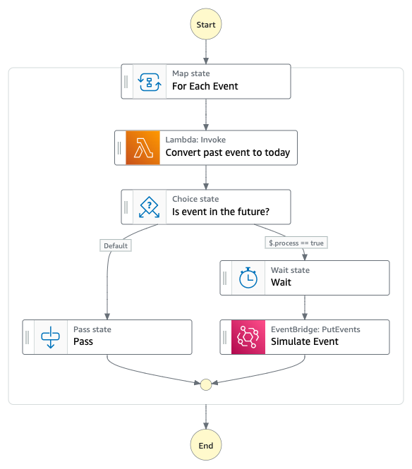

# EventBridge Replayer

This workflow allows you to replay EventBridge events in the same time that they happened. It takes an array (40 max) of EventBridge events, and uses Step Functions wait task to replay them at the same time they occured. 

For example if you pass an event that was raised yesterday at 13:00:00, this event would be raised today at 13:00:00.

Learn more about this workflow at Step Functions workflows collection: [https://serverlessland.com/workflows/eventbridge-replay-events](https://serverlessland.com/workflows/eventbridge-replay-events)

Important: this application uses various AWS services and there are costs associated with these services after the Free Tier usage - please see the [AWS Pricing page](https://aws.amazon.com/pricing/) for details. You are responsible for any AWS costs incurred. No warranty is implied in this example.

## Requirements

* [Create an AWS account](https://portal.aws.amazon.com/gp/aws/developer/registration/index.html) if you do not already have one and log in. The IAM user that you use must have sufficient permissions to make necessary AWS service calls and manage AWS resources.
* [AWS CLI](https://docs.aws.amazon.com/cli/latest/userguide/install-cliv2.html) installed and configured
* [Git Installed](https://git-scm.com/book/en/v2/Getting-Started-Installing-Git)
* [AWS Serverless Application Model](https://docs.aws.amazon.com/serverless-application-model/latest/developerguide/serverless-sam-cli-install.html) (AWS SAM) installed

## Deployment Instructions

1. Create a new directory, navigate to that directory in a terminal and clone the GitHub repository:
    ``` 
    git clone https://github.com/aws-samples/step-functions-workflows-collection
    ```
1. Change directory to the pattern directory:
    ```
    cd eventbridge-replay-events
    ```
1. From the command line, use AWS SAM to deploy the AWS resources for the workflow as specified in the template.yaml file:
    ```
    sam deploy --guided
    ```
1. During the prompts:
    * Enter a stack name
    * Enter the event bus you wish to send the events too
    * Enter the desired AWS Region
    * Allow SAM CLI to create IAM roles with the required permissions.

    Once you have run `sam deploy --guided` mode once and saved arguments to a configuration file (samconfig.toml), you can use `sam deploy` in future to use these defaults.

1. Note the outputs from the SAM deployment process. These contain the resource names and/or ARNs which are used for testing.

## How it works

1. Trigger the workflow with an array of EventBridge events. See /example-data/events.json for example.

2. State machine loops over the events and will conver the date of the event to today.

3. Checks are made to see if the time of the event has already passed, if it has the State Machine will stop. If not it will continue to wait then raise the event.

4. **Wait** is used to wait until the time comes to raise the event. Once the time has come, the event will be raised onto the given event bus.

## Image



## Testing

1. Deploy the statemachine
2. Trigger state machine using your EventBridge events. See `/example-data/events.json` as an example.

```sh
 # Runs your new state machine with two example events that will be run at 01:00:00 and 12:00:00 (today)

 aws stepfunctions start-execution --state-machine-arn {STATE_MACHINE_ARN} --input '[{"version":"0","id":"bfde51cc-d2c3-3dfc-0a7d-2a401648bd2c","detail-type":"UserCreated","source":"myapp.users","time":"2022-07-06T01:00:00Z","region":"us-east-1","resources":[],"detail":{"id":"b0f04be0-fd28-11ec-929b-fd818923bcef"}},{"version":"0","id":"bfde51cc-d2c3-3dfc-0a7d-2a401648bd2d","detail-type":"UserCreated","source":"myapp.users","time":"2022-07-06T12:00:00Z","region":"us-east-1","resources":[],"detail":{"id":"b0f04be0-fd28-11ec-929b-fd818923bcef"}}]'
```

## Cleanup
 
1. Delete the stack
    ```bash
    sam delete
    ```

----
Copyright 2022 Amazon.com, Inc. or its affiliates. All Rights Reserved.

SPDX-License-Identifier: MIT-0
