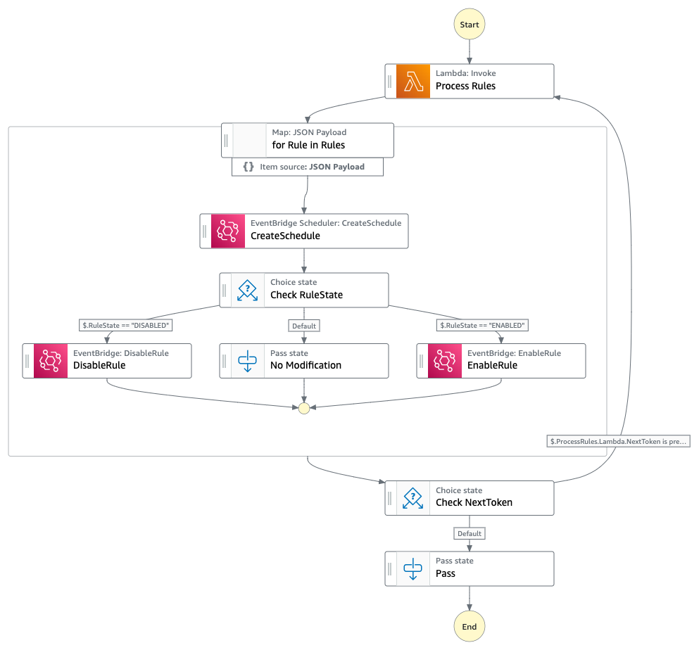

# EventBridge Rules To Schedules Migration

  

This Step Function workflow automates the migration of [EventBridge Rules](https://docs.aws.amazon.com/eventbridge/latest/userguide/eb-create-rule-schedule.html) (Rules that are based on a schedule) to [EventBridge Scheduler](https://docs.aws.amazon.com/eventbridge/latest/userguide/scheduler.html).

  

It processes rules using Lambda ("Process Rules") and maps over each rule to create corresponding schedules using the AWS SDK [CreateSchedule](https://docs.aws.amazon.com/scheduler/latest/APIReference/API_CreateSchedule.html). It can enable, disable, or preserve rule states based on input. It can also enable or disable the new schedule state.

  

This workflow can transfer up to **260000 scheduled rules** in single state machine run before reaching the [execution history limit](https://docs.aws.amazon.com/step-functions/latest/dg/limits-overview.html#service-limits-state-machine-executions). It has a max concurrency of **50** Schedules creation (which is CreateSchedule API [request rate limit](https://docs.aws.amazon.com/scheduler/latest/UserGuide/scheduler-quotas.html)). It also handles pagination with **NextToken**.

  

Important: this application uses various AWS services and there are costs associated with these services after the Free Tier usage - please see the [AWS Pricing page](https://aws.amazon.com/pricing/) for details. You are responsible for any AWS costs incurred. No warranty is implied in this example.

  

## Requirements

  

* [Create an AWS account](https://portal.aws.amazon.com/gp/aws/developer/registration/index.html) if you do not already have one and log in. The IAM user that you use must have sufficient permissions to make necessary AWS service calls and manage AWS resources.
* [AWS CLI](https://docs.aws.amazon.com/cli/latest/userguide/install-cliv2.html) installed and configured
* [Git Installed](https://git-scm.com/book/en/v2/Getting-Started-Installing-Git)
* [AWS Serverless Application Model](https://docs.aws.amazon.com/serverless-application-model/latest/developerguide/serverless-sam-cli-install.html) (AWS SAM) installed

  

  

## Deployment Instructions

1. Create a new directory, navigate to that directory in a terminal and clone the GitHub repository:

```
git clone https://github.com/aws-samples/step-functions-workflows-collection
```

2. Change directory to the pattern directory:

```
cd eventbridge-rules-to-schedules
```

3. From the command line, use AWS SAM to deploy the AWS resources for the workflow as specified in the template.yaml file:

```
sam deploy --guided
```

4. During the prompts:

* Enter a stack name
* Enter the desired AWS Region
* Allow SAM CLI to create IAM roles with the required permissions.
  
Once you have run `sam deploy --guided` mode once and saved arguments to a configuration file (samconfig.toml), you can use `sam deploy` in future to use these defaults.


5. Note the outputs from the SAM deployment process. These contain the resource names and/or ARNs which are used for testing.


## How it works


The step function workflow takes JSON input and uses Lambda function to convert each target under the rule to EventBridge Schedule.

### Request Syntax:
```
{  
    "ScheduleRoleArn": "string",
    "RuleState": "ENABLED"|"DISABLED"|"PRESERVED",  
    "ScheduleState": "ENABLED"|"DISABLED",  
    "ScheduleGroup": "string",  
    "Rules": [
        {  
            "RuleName": "string",
            "ScheduleRoleArn": "string", 
            "ScheduleName": "string",  
            "ScheduleGroup": "string",  
            "RuleState": "ENABLED"|"DISABLED"|"PRESERVED",  
            "ScheduleState": "ENABLED"|"DISABLED"
        }  
    ],  
    "RulesS3Uri": "string"  
}
```
#### Parameters:

- **ScheduleRoleArn** *(string)* – **[REQUIRED]**: Conditional

    The Amazon Resource Name (ARN) of the IAM role to be used for the schedule.
    
    **Note:** This parameter is required if `Rules` or `RulesS3Uri` does not mention `ScheduleRoleArn` for at least one of the rules. If all dictionaries in `Rules` contain `ScheduleRoleArn`, then `ScheduleRoleArn` at the root level is not required. If any dictionaries in `Rules` or `RulesS3Uri` does not have it, then it becomes required at the root level. Make sure that that role has permissions to invoke the target. Check the sample role permissions [here](https://docs.aws.amazon.com/scheduler/latest/UserGuide/managing-targets-templated.html#managing-targets-templated-sqs)

- **RuleState** *(string)* – The state of the rule.
    
    Default: DISABLED.

    Allowed Values:
    - ENABLED - Enable the rule.
    - DISABLED - Disable the rule.
    - PRESERVED - Do not modify the current state of the rule.

- **ScheduleState** *(string)* – The state of the schedule.
    
    Default: ENABLED.
    
    Allowed Values:
	- ENABLED - Enable the schedule.
	- DISABLED - Disable the schedule.
  
- **ScheduleGroup** *(string)* – The existing schedule group name where the new schedule will be placed.
    
    Default: "default" group

- **Rules** *(list)* – A list of dictionaries representing individual rules. A maximum of 50 objects are allowed. If you need to process more than 50 rules then use `RulesS3Uri`.
	- *(dict)* –
    
        Each dictionary should include the following parameters:
 
	    - **RuleName** *(string)* – **[REQUIRED]**
			
            The name of the rule.

	    - **ScheduleRoleArn** *(string)* – **[REQUIRED]**: Conditional
		    
            The Amazon Resource Name (ARN) of the IAM role to be used for the schedule. Required if `ScheduleRoleArn` is not mentioned in the root level

	    - **ScheduleName** *(string)* – The custom name of the schedule.

	    - **ScheduleGroup** *(string)* – The existing schedule group name where the new schedule will be placed.
        
            **Note:** If this key is not present then `ScheduleGroup` at the root level is considered. If `ScheduleGroup` at the root level is not present then "default" group is used.
			
            Default: "default" group
		- **RuleState** *(string)* – The state of the rule.
			
            Default: DISABLED.

			Allowed Values:
			- ENABLED - Enable the rule.
			- DISABLED - Disable the rule.
			- PRESERVED - Do not modify the current state of the rule.
			
			**Note:** If this key is not present then `RuleState` at the root level is considered. If `RuleState` at the root level is not present then default value (DISABLED) is used.
			
		- **ScheduleState** *(string)* – The state of the schedule.
			
            Default: ENABLED.
			
            Allowed Values:
			- ENABLED - Enable the schedule.
			- DISABLED - Disable the schedule.

			**Note:** If this key is not present then `ScheduleState` at the root level is considered. If `ScheduleState` at the root level is not present then default value (ENABLED) is used.
      
- **RulesS3Uri** (string) –
	The Amazon S3 URI pointing to the JSON file containing rules array. If provided, the JSON file should contain a list of dictionaries representing individual rules, similar to the `Rules` parameter. A maximum of 260000 objects are allowed. For example:
	
```
[
	{
			"RuleName": "",
			"ScheduleRoleArn": "",
			"ScheduleName": "",
			"ScheduleGroup": "",
			"RuleState": "",
			"ScheduleState": ""
	},
	...
]
```
  
#### Notes

- If neither `Rules` nor `RulesS3Uri` is mentioned, all rules in the default bus of EventBridge are selected.
- Either `Rules` or `RulesS3Uri` can be used but not both.
  

## Image

  



  

  

## Testing


#### Example 1

- Transfer all the Rules in default bus to Schedules default group.

```
{
    "ScheduleRoleArn": "arn:aws:iam::<ACCOUNT-ID>:role/Scheduler_Test_Role"
}
```

#### Example 2

- Transfer all the Rules in default bus to Schedules default group.
- Do not modify state of the Rule.

```
{
    "ScheduleRoleArn": "arn:aws:iam::<ACCOUNT-ID>:role/Scheduler_Test_Role",
    "RuleState": "PRESERVED"
}
```

#### Example 3

- Transfer all the Rules in default bus to Schedules default group.
- Do not modify state of the Rule.
- Disable Schedule State.

```
{
    "ScheduleRoleArn": "arn:aws:iam::<ACCOUNT-ID>:role/Scheduler_Test_Role",
    "RuleState": "PRESERVED",
    "ScheduleState": "DISABLED"
}
```

#### Example 4

- Transfer all the Rules in default bus to Schedules.
- Transfer to an existing custom group "MyGroup" of Schedules.

```
{
    "ScheduleRoleArn": "arn:aws:iam::<ACCOUNT-ID>:role/Scheduler_Test_Role",
    "ScheduleGroup": "MyGroup"
}
```

#### Example 5

* Transfer specific Rules (<50) to Schedules.
* Example existing rules are “LambdaRule” and "SQSRule".

```
{
    "Rules": [
        {
            "RuleName": "LambdaRule",
            "ScheduleRoleArn": "arn:aws:iam::<ACCOUNT-ID>:role/Scheduler_Lambda_Role"
        },
        {
            "RuleName": "SQSRule",
            "ScheduleRoleArn": "arn:aws:iam::<ACCOUNT-ID>:role/Scheduler_SQS_Role"
        }
    ]
}
```

#### Example 6

* Transfer specific Rules (<50) to Schedules.
* Example existing rules are “LambdaRule” and “SQSRule”.
* Mention custom schedule names for both the rules.

```
{
    "Rules": [
        {
            "RuleName": "LambdaRule",
            "ScheduleRoleArn": "arn:aws:iam::<ACCOUNT-ID>:role/Scheduler_Test_Role",
            "ScheduleName": "MyLambdaSchedule"
        },
        {
            "RuleName": "SQSRule",
            "ScheduleRoleArn": "arn:aws:iam::<ACCOUNT-ID>:role/Scheduler_Test_Role",
            "ScheduleName": "NewSQSSchedule"
        }
    ]
}
```

#### Example 7

* Transfer specific Rules (<50) to Schedules.
* Example existing rules are “LambdaRule” and “SQSRule”.
* Use same ScheduleRoleArn for both the schedules.

```
{
    "ScheduleRoleArn": "arn:aws:iam::<ACCOUNT-ID>:role/Scheduler_Test_Role",
    "Rules": [
        {
            "RuleName": "LambdaRule"
        },
        {
            "RuleName": "SQSRule"
        }
    ]
}
```

#### Example 8

* Transfer specific Rules (<50) to Schedules.
* Example existing rules are “LambdaRule”, “SQSRule”, “SNSRule”.
* Use same ScheduleRoleArn for “LambdaRule“ and ”SQSRule“.
* Use different ScheduleRoleArn for “SNSRule”

```
{
    "ScheduleRoleArn": "arn:aws:iam::<ACCOUNT-ID>:role/Scheduler_Test_Role",
    "Rules": [
        {
            "RuleName": "LambdaRule"
        },
        {
            "RuleName": "SQSRule"
        },
        {
            "RuleName": "SNSRule",
            "ScheduleRoleArn": "arn:aws:iam::<ACCOUNT-ID>:role/MySNSRole"
        }
    ]
}
```

#### Example 9

* Transfer specific Rules (>50 and <260000) to Schedules.

```
{
    "ScheduleRoleArn": "arn:aws:iam::<ACCOUNT-ID>:role/Scheduler_Test_Role",
    "RulesS3Uri": "s3://<BUCKET>/<KEY>.json"
}
```

Sample JSON file on S3:

```
[
    {
        "RuleName": "LambdaRule"
    },
    {
        "RuleName": "SQSRule"
    }
]
```


## Notes and Limitations

- Only Rules with [`ScheduleExpression`](https://docs.aws.amazon.com/eventbridge/latest/APIReference/API_PutRule.html) are supported.
- Rules target with [`InputPath`](https://docs.aws.amazon.com/eventbridge/latest/APIReference/API_PutTargets.html) and [`InputTransformer`](https://docs.aws.amazon.com/eventbridge/latest/APIReference/API_PutTargets.html) are not supported.
- EventBridge Rule Targets that can be migrated to EventBridge Scheduler are as follows:
    - Lambda function
    - Kinesis stream
    - Kinesis firehose
    - EBS CreateSnapshot
    - EC2 StopInstances
    - EC2 TerminateInstances
    - EC2 RebootInstances
    - ECS Task
    - SQS and SQS FIFO
    - SNS
    - Step Functions
    - SageMaker Pipeline
    - CodeBuild Project
    - CodePipeline
    - Systems Manager Automation
    - Systems Manager Run Command
    - Inspector assessment template
    - Batch job queue
    - Glue Workflow
    - Event Bus
        - Handles Event bus in the same region and same account
        - Handles Event bus in the same region and different account
        - Does not handle event bus in different region
    - Redshift Cluster
        - Same region only
    - Redshift Serverless Workgroup
        - Same region only
- Unsupported EventBridge Rule Targets:
    - API Destinations
    - API Gateway
    - CloudWatch Group
    - Systems Manager OpsItem
    - Incident Manager Response Plan
- For each target under a rule, a new schedule will be created. This means that if you have multiple targets associated with a single rule, each target will have its own separate schedule.
- If a rule has only one target, the schedule name will be the same as the rule name. In this scenario, where there's a one-to-one relationship between the rule and its target, the schedule will directly adopt the rule's name unless specified using `ScheduleName` in `Rules` or `RulesS3Uri`.
- When a rule has multiple targets, the schedule name will be formed by combining the rule name with an index number. The index number corresponds to the position of the target within the rule's list of targets. For example: EventBridge Rule 'MyLambdaRule' has 3 targets. Hence, corresponding schedules are as follows: MyLambdaRule-0, MyLambdaRule-1, MyLambdaRule-2.
- `ScheduleRoleArn` - Make sure that the role has permissions to invoke the target. Check the sample permissions [here](https://docs.aws.amazon.com/scheduler/latest/UserGuide/managing-targets-templated.html#managing-targets-templated-sqs)


  

## Cleanup

  

1. Delete the stack

  

```bash
aws  cloudformation  delete-stack  --stack-name  STACK_NAME
```

  

1. Confirm the stack has been deleted

  

```bash
aws  cloudformation  list-stacks  --query  "StackSummaries[?contains(StackName,'STACK_NAME')].StackStatus"
```

  

----

  

Copyright 2023 Amazon.com, Inc. or its affiliates. All Rights Reserved.

  

  

SPDX-License-Identifier: MIT-0