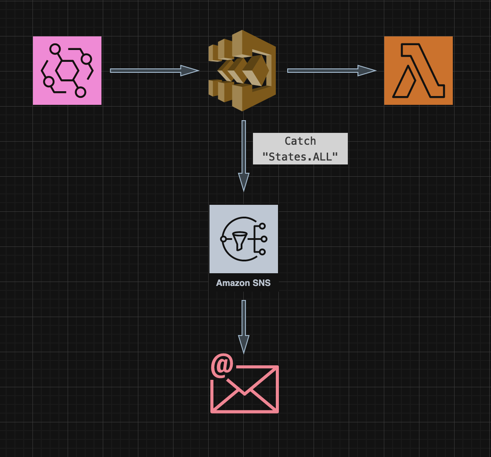
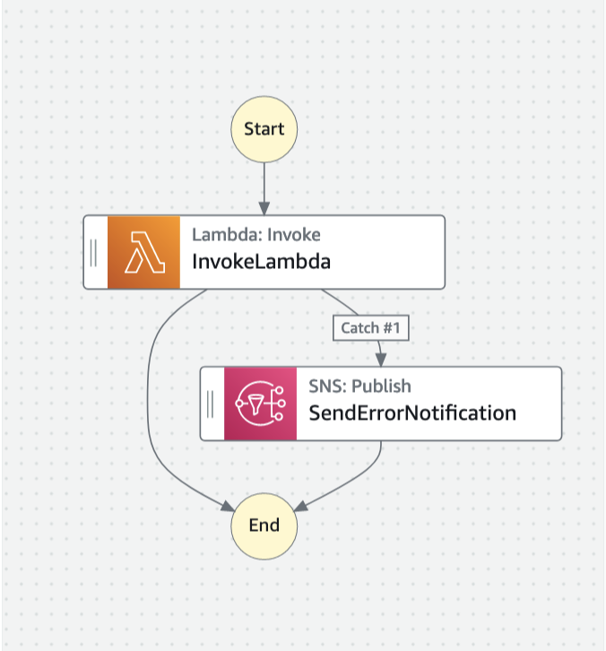

# Email Notification on StepFunction Execution Error

This workflow aims to promptly send an email notification in the event of an error occur during the execution of the state machine. Operating on an EventBridge schedule, the workflow involves a Lambda task that encounters “ImportModule” error, triggering an email notification through an SNS topic. The workflow setup is as follows:



Learn more about this workflow at Step Functions workflows collection: << Add the live URL here >>

Important: this application uses various AWS services and there are costs associated with these services after the Free Tier usage - please see the [AWS Pricing page](https://aws.amazon.com/pricing/) for details. You are responsible for any AWS costs incurred. No warranty is implied in this example.

## Requirements

* [Create an AWS account](https://portal.aws.amazon.com/gp/aws/developer/registration/index.html) if you do not already have one and log in. The IAM user that you use must have sufficient permissions to make necessary AWS service calls and manage AWS resources.
* [AWS CLI](https://docs.aws.amazon.com/cli/latest/userguide/install-cliv2.html) installed and configured
* [Git Installed](https://git-scm.com/book/en/v2/Getting-Started-Installing-Git)
* [AWS Serverless Application Model](https://docs.aws.amazon.com/serverless-application-model/latest/developerguide/serverless-sam-cli-install.html) (AWS SAM) installed

## Deployment Instructions

1. Create a new directory, navigate to that directory in a terminal and clone the GitHub repository:
    ``` 
    git clone https://github.com/aws-samples/step-functions-workflows-collection
    ```
1. Change directory to the pattern directory:
    ```
    cd step-functions-workflows-collection/_workflow-model
    ```
1. From the command line, use AWS SAM to deploy the AWS resources for the workflow as specified in the template.yaml file:
    ```
    sam deploy --guided
    ```
1. During the prompts:
    * Enter a stack name
    * Enter the desired AWS Region
    * Allow SAM CLI to create IAM roles with the required permissions.

    Once you have run `sam deploy --guided` mode once and saved arguments to a configuration file (samconfig.toml), you can use `sam deploy` in future to use these defaults.

1. Note the outputs from the SAM deployment process. These contain the resource names and/or ARNs which are used for testing.

## How it works

The workflow is designed to trigger a Step Function via an EventBridge schedule. This schedule activates the state machine every 10 minutes. 

During resource deployment, it will ask for the email as a parameter where we want to receive the error notificaton. Thereafter, you will receive an email to confirm subscription with the SNS topic.

The template deploys a state machine with Lambda task state conatining a sample code snippet which throws ImportModule error due to presence of "import pandas" .

State machine executes every 10 minutes and it catches the error by sending an email alert through the SNS topic. The email notification comprehensively outlines the encountered error and provides the Step Function's execution ARN for reference


## Image


## Testing

To test the workflow, start an execution of the deployed state machine with any input and confirm if you are receiving an email alert with the details of error, cause and failed execution ARN.

## Cleanup
 
1. Delete the stack
    ```bash
    aws cloudformation delete-stack --stack-name STACK_NAME
    ```
1. Confirm the stack has been deleted
    ```bash
    aws cloudformation list-stacks --query "StackSummaries[?contains(StackName,'STACK_NAME')].StackStatus"
    ```
----
Copyright 2022 Amazon.com, Inc. or its affiliates. All Rights Reserved.

SPDX-License-Identifier: MIT-0
