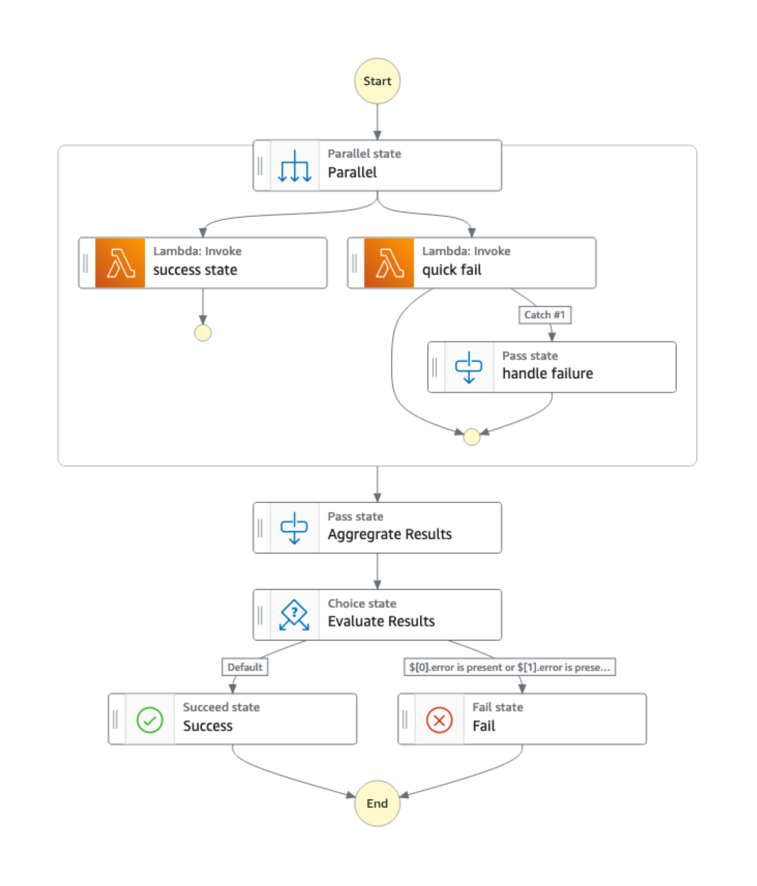
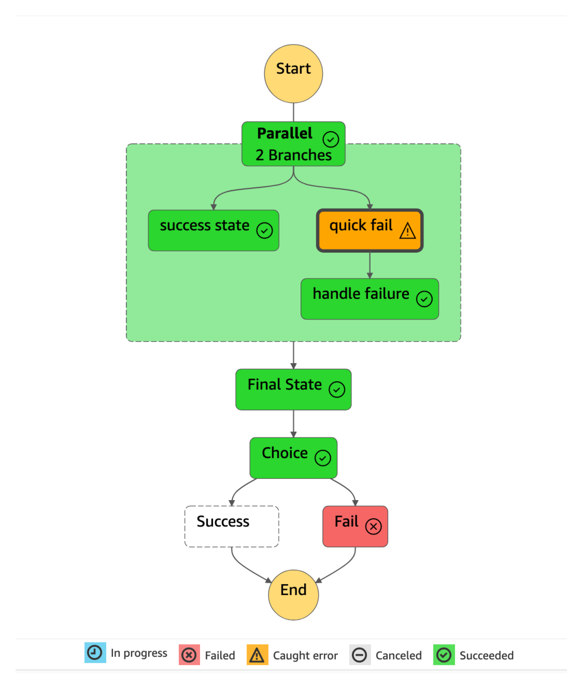

# Explicit failure for errors caught when running concurrent tasks in parallel state

This AWS Step Functions example demonstrates an explicit failed execution where the error is handled when running concurrent tasks using Parallel state. When you run concurrent tasks in step functions, either as a Parallel state or a Map state, you might want to wait until all tasks complete, regardless of whether they would succeed or fail. By default, Map or Parallel state will wait for all to succeed before ending or proceeding to the next state, however they will be terminated if a single iteration or branch has failed, and all other in-flight executions will be stopped. 

One solution is to [instrument each branch with a Fallback state](https://dev.to/aws-builders/parallel-task-error-handling-in-step-functions-4f1c) to catch and handle the error. This means that all the branches in the Parallel state complete regardless of whether they succeed or fail, resulting in a successful execution of the state machine (assuming that the subsequent states succeed) 

However, this solution creates challenges for teams who have set up [Amazon CloudWatch](https://aws.amazon.com/cloudwatch/) alarms to notify them whenever a state machine execution has failed or rely on the Execution History from the AWS Step Function console to monitor for failed executions. As the execution did not fail, these teams are not informed when branches within the Parallel state fails. Here, the objective is to mark the execution as a failure whenever a branch encounters an error while also ensuring that all branches within the Parallel state completes. To meet the objective, we designed this AWS Step Functions worflow using a combination of [Pass state](https://docs.aws.amazon.com/step-functions/latest/dg/amazon-states-language-pass-state.html), [Choice state](https://docs.aws.amazon.com/step-functions/latest/dg/amazon-states-language-choice-state.html), [Succeed state](https://docs.aws.amazon.com/step-functions/latest/dg/amazon-states-language-succeed-state.html) and [Fail state](https://docs.aws.amazon.com/step-functions/latest/dg/amazon-states-language-fail-state.html).

Learn more about this workflow at Step Functions workflows collection: [https://serverlessland.com/workflows/explicit-failure-with-parallel-states](https://serverlessland.com/workflows/explicit-failure-with-parallel-states)

Important: this application uses various AWS services and there are costs associated with these services after the Free Tier usage - please see the [AWS Pricing page](https://aws.amazon.com/pricing/) for details. You are responsible for any AWS costs incurred. No warranty is implied in this example.

## Requirement

* [Create an AWS account](https://portal.aws.amazon.com/gp/aws/developer/registration/index.html) if you do not already have one and log in. The IAM user that you use must have sufficient permissions to make necessary AWS service calls and manage AWS resources.
* [AWS CLI](https://docs.aws.amazon.com/cli/latest/userguide/install-cliv2.html) installed and configured
* [Git Installed](https://git-scm.com/book/en/v2/Getting-Started-Installing-Git)
* [AWS Serverless Application Model](https://docs.aws.amazon.com/serverless-application-model/latest/developerguide/serverless-sam-cli-install.html) (AWS SAM) installed

## Deployment Instructions

1. Create a new directory, navigate to that directory in a terminal and clone the GitHub repository:
    ``` 
    git clone https://github.com/aws-samples/step-functions-workflows-collection
    ```
1. Change directory to the pattern directory:
    ```
    cd explicit-failure-with-parallel-states
    ```
1. From the command line, use AWS SAM to deploy the AWS resources for the workflow as specified in the template.yaml file:
    ```
    sam deploy --guided
    ```
1. During the prompts:
    * Enter a stack name
    * Enter the desired AWS Region
    * Allow SAM CLI to create IAM roles with the required permissions.

    Once you have run `sam deploy --guided` mode once and saved arguments to a configuration file (samconfig.toml), you can use `sam deploy` in future to use these defaults.

1. Note the outputs from the SAM deployment process. These contain the resource names and/or ARNs which are used for testing.

## How it works
The infrastructure code deploys the following sample state machine.



The workflow starts with the two concurrent [AWS Lambda](https://aws.amazon.com/lambda/) tasks running in a Parallel state. The 'success state' Lambda task is simulated to execute successfully while the 'quick fail' Lambda tasks fails by throwing an error which is caught by the 'handle failure' [Fallback state](https://docs.aws.amazon.com/step-functions/latest/dg/concepts-error-handling.html#error-handling-fallback-states). As the error is caught appropriately, the Parallel state completes successfully and transitions to the 'Aggregrate Results' state. Up till now, we only satisfy part of the objective which is to ensure that all branches within the parallel state completes regardless of whether they succeed or fail. We are still left with marking the execution as a failure. Let's see how we can accomplish it.

In the 'Aggregrate Results' Pass state, the outputs from the concurrent tasks within the Parallel state are aggregrated as an array of JSON elements. It will look something like this:

```
[
  {
    "statusCode": 200,
    "body": "\"Success from Lambda!\""
  },
  {
    "Comment": "Insert your JSON here",
    "error": {
      "Error": "Exception",
      "Cause": "{\"errorMessage\": \"Throwing explicit error\", \"errorType\": \"Exception\", \"requestId\": \"708e227d-16f0-4f09-9d7b-2dbb98022c14\", \"stackTrace\": [\"  File \\\"/var/task/ErrorFunction.py\\\", line 6, in lambda_handler\\n    raise Exception(\\\"Throwing explicit error\\\")\\n\"]}"
    }
  }
]
```
From the array, we can tell that the 'success state' Lambda task succeed with a status code of 200 while the 'quick fail' Lambda task fails with an error exception. Notice the JSON element from the failed Lambda task, there is an `error` key that describes the type of error. Whenever a task fails, the `error` key will be present. 

Next, the 'Aggregrate Results' state will then transition to the 'Evaluate Results' Choice state. The array of JSON elements are passed as inputs to the Choice state. Here, the Choice state implements rules that checks for the presence of the `error` key. The idea here is to have some form of error identifiers that can be used to monitor for failed branches. If the rule evaluates that the `error` key is present, then the Choice state transitions to the Fail state. The Fail state marks the entire execution as Failed which will also be shown in the Executions section on the console. If no `error` keys are present, then the Choice state transitions to the Succeed state which stops the execution successfully and output Succeeded on the console.

With this AWS Step Functions workflow, teams can continue to rely on their existing mechanism for notifications while only needing to make minimal changes to their workflows.


## Testing

To test this workflow, simply start the execution of the workflow from the AWS Step Function. You can use the default inputs to execute the workflow.

You should see something like this:


From the image shown above, we are able to mark the execution as a failure whenever a branch encounters an error while also ensuring that all branches within the Parallel state completes.

## Cleanup
 
1. Delete the stack
    ```
    sam delete
    ```
1. Confirm the stack has been deleted
    ```
    aws cloudformation list-stacks
    ```
----
Copyright 2023 Amazon.com, Inc. or its affiliates. All Rights Reserved.

SPDX-License-Identifier: MIT-0
