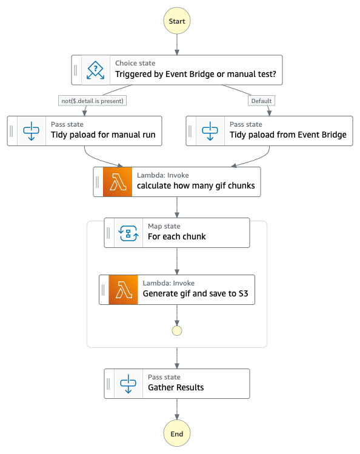

# gif-generator



## What does this workflow do?

This application creates a Step Functions workflow that runs when a new movie file is uploaded to an S3 bucket. The Workflow runs multiple Lambda functions concurrently, each invocation is responsible for generating it's own .gif clip. A 1 hour movie takes about 4 seconds to generate 120 gifs.
the first Lambda function uses ffmpeg to work out how long the video is and how many chunks (gifs) will be needed for the whole video. The chunks are loaded into a MAP state. The next Lambda uses ffmpeg to build the .gifs.
Use the timeline scrubber application (link in resources section) to view the gif animation.

## Before you start

Deploy this <a target=_blank href='https://serverlessrepo.aws.amazon.com/#!/applications/us-east-1/145266761615/ffmpeg-lambda-layer'>fmpeg Lambda layer</a>.</strong>

## Deploying this workflow

```
cd /gif-generator 
sam build && sam deploy -g
```

## Running the Application
Upload a .mov or a .mp4 into the deployed S3 source bucket.
This triggers the workflow to start generating .gif images.
.gif images are saved into the S3 destination bucket.

## The front end
1. Either deploy the VUE application from the *frontend* folder or go to [s12d.com/gif](https://s12d.com/gif)
3. Enter the source file location e.g. `https://gif-source-bucket.s3.amazonaws.com/demo.mov`
4. Enter the destination bucket.
5. Scrub through the timeline to see the generated .gifs

Check out more workflows on [ServerlessLand](https://serverlessland.com/workflows)

----
Copyright 2022 Amazon.com, Inc. or its affiliates. All Rights Reserved.

SPDX-License-Identifier: MIT-0

