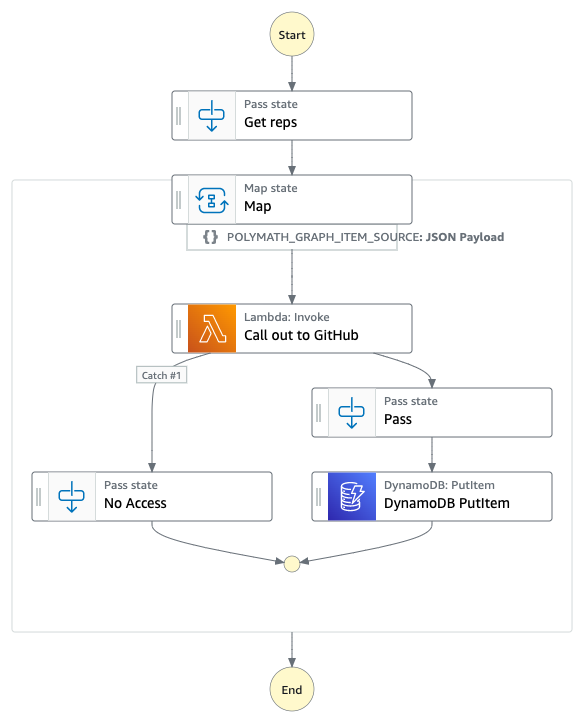

# GithubRepoCounter

* Create a GitHub Personal Access Token and add include when propted by the template deployment process with `sam deploy -g`.
* Add comma seperated list of repositories to the initial "get reps" state.
* The workflow is triggered at 14:24 every day by a rule on Amazon EventBridge Scheduler.
* results are saved to a DynamoDB table

```yaml
"Repos": [
          "aws-samples/step-functions-workflows-collection"
        ]
```

