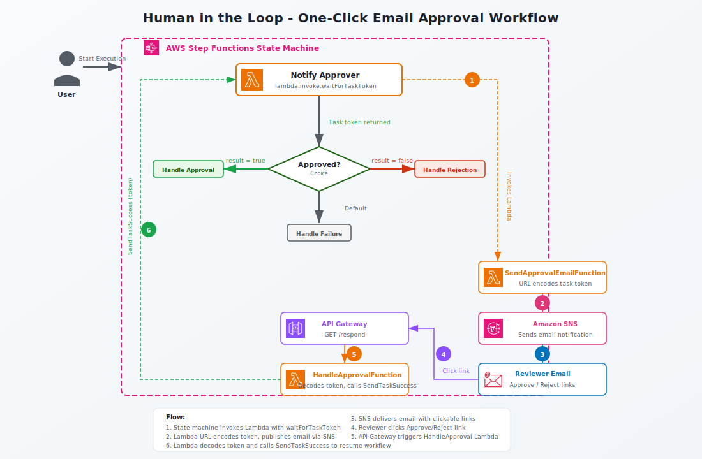

# Human in the Loop (CDK)

This pattern allows you to integrate a human review or approval process into your workflows with **one-click email approval**. An AWS Lambda function sends an approval request via Amazon SNS email containing clickable approve/reject links. The task token is URL-encoded to ensure special characters don't break the Amazon API Gateway callback URL. The workflow pauses until the reviewer clicks a link, which triggers an API Gateway endpoint to resume the AWS Step Functions execution.

Learn more about this workflow at Step Functions workflows collection: [Human in the Loop](https://serverlessland.com/workflows/human-in-the-loop)

Important: this application uses various AWS services and there are costs associated with these services after the Free Tier usage - please see the [AWS Pricing page](https://aws.amazon.com/pricing/) for details. You are responsible for any AWS costs incurred. No warranty is implied in this example.

## Requirements

* [Create an AWS account](https://portal.aws.amazon.com/gp/aws/developer/registration/index.html) if you do not already have one and log in. The IAM user that you use must have sufficient permissions to make necessary AWS service calls and manage AWS resources.
* [AWS CLI](https://docs.aws.amazon.com/cli/latest/userguide/install-cliv2.html) installed and configured
* [Git Installed](https://git-scm.com/book/en/v2/Getting-Started-Installing-Git)
* [AWS CDK](https://docs.aws.amazon.com/cdk/v2/guide/getting_started.html) installed
* Python 3.13 or later
* Node.js 24.x or later (for CDK CLI)

## Deployment Instructions

1. Create a new directory, navigate to that directory in a terminal and clone the GitHub repository:
    ``` 
    git clone https://github.com/aws-samples/step-functions-workflows-collection
    ```
1. Change directory to the pattern directory:
    ```
    cd human-in-the-loop-cdk
    ```
1. Create a Python virtual environment and install dependencies:
    ```bash
    python3 -m venv .venv
    source .venv/bin/activate
    pip install -r requirements.txt
    ```
1. Bootstrap CDK (if not already done for this account/region):
    ```bash
    cdk bootstrap aws://<ACCOUNT_NUMBER>/<REGION>
    ```
1. Deploy the stack:
    ```bash
    cdk deploy --parameters ModeratorEmailAddress=your-email@example.com
    ```
1. Note the outputs from the CDK deployment: the link to the state machine in the Step Functions console and the API Gateway endpoint URL.

## How it works



1. Data that should be reviewed by a human is passed to the workflow. The state machine invokes an AWS Lambda function using the `.waitForTaskToken` integration pattern. The Lambda function URL-encodes the task token and constructs approve/reject links pointing to an Amazon API Gateway endpoint.
2. The Lambda function publishes an email via [Amazon Simple Notification Service (SNS)](https://aws.amazon.com/sns/) containing the clickable approve/reject links.
3. The reviewer clicks one of the links in the email. This triggers a GET request to Amazon API Gateway.
4. API Gateway invokes a second Lambda function that decodes the task token and calls `SendTaskSuccess` (approve) or `SendTaskFailure` (reject) on the Step Functions execution.
5. The workflow resumes and routes to the appropriate processing Lambda based on the approval outcome.

## Testing

1. After deployment you receive an email titled `AWS Notification - Subscription Confirmation`. Click on the link in the email to confirm your subscription. This will allow SNS to send you emails.
2. Navigate to the AWS Step Functions console and select the `human-in-the-loop-cdk` workflow.
3. Select `Start Execution` and use any valid JSON data as input.
4. Select `Start Execution` and wait until you receive the approval request email from SNS.
5. Click the **Approve** or **Reject** link in the email.
6. You will see a confirmation page in your browser indicating the workflow was approved or rejected.
7. Observe the execution in the Step Functions console — the workflow transitions to `Handle approval` or `Handle rejection` based on your response.

## Cleanup
 
To delete the resources created by this template, use the following command:

```bash
cdk destroy
```

----
Copyright 2026 Amazon.com, Inc. or its affiliates. All Rights Reserved.

SPDX-License-Identifier: MIT-0
