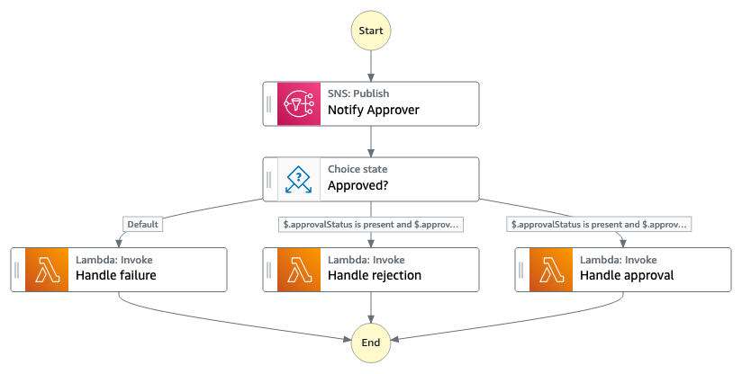

# Human in the Loop

This pattern allows you to integrate an human review or approval process into your workflows. Each task sends a message to a SNS topic which sends a notification to a human reviewer or approver by email for example. The workflow then waits until the approver completes their review. Depending on the review outcome a different Lambda function can be invoked.

For more Step Functions workflows check [ServerlessLand Workflows](https://serverlessland.com/workflows)

**Important:** this application uses various AWS services and there are costs associated with these services after the Free Tier usage - please see the [AWS Pricing page](https://aws.amazon.com/pricing/) for details. You are responsible for any AWS costs incurred. No warranty is implied in this example.

## Requirements

* [Create an AWS account](https://portal.aws.amazon.com/gp/aws/developer/registration/index.html) if you do not already have one and log in. The IAM user that you use must have sufficient permissions to make necessary AWS service calls and manage AWS resources.
* [AWS CLI](https://docs.aws.amazon.com/cli/latest/userguide/install-cliv2.html) installed and configured
* [Git Installed](https://git-scm.com/book/en/v2/Getting-Started-Installing-Git)
* [Terraform](https://learn.hashicorp.com/tutorials/terraform/install-cli?in=terraform/aws-get-started) installed

## How it works



1. Data that should be reviewed by a human is passed to the workflow. A message is send to a [Amazon Simple Notification Service (SNS)](https://aws.amazon.com/sns/) topic which sends out a notification via Email. The notification contains a [task token](https://docs.aws.amazon.com/step-functions/latest/dg/connect-to-resource.html#connect-wait-token) which is automatically generated by AWS Step Functions.
2. After approving or denying, the reviewer calls the `SendTaskSuccess` API and passes the task token as well as the review result. 
3. The result is evaluated by Step Functions and the corresponding AWS Lambda function is invoked.  
4. The default region is `us-east-1`, it can also be changed using the variable `region`. 

**Note:** Variables can be supplied in different options, check the [Terraform documentation](https://developer.hashicorp.com/terraform/language/values/variables) for more details.

## Deployment Instructions

1. Create a new directory, navigate to that directory in a terminal and clone the GitHub repository:
    ``` 
    git clone https://github.com/aws-samples/step-functions-workflows-collection
    ```
1. Change directory to the pattern directory:
    ```
    cd step-functions-workflows-collection/human-in-the-loop-tf
    ```
1. From the command line, initialize Terraform to download and install the providers defined in the configuration:
    ```
    terraform init
    ```
1. From the command line, apply the configuration in the main.tf file:
    ```
    terraform apply
    ```
1. During the prompts:
    * Enter an email address that should receive the notifications from the workflow.
    * Enter yes
1. Note the outputs from the deployment process. These contain the resource names and/or ARNs which are used for testing.

## Testing

1. After deployment you receive an email titled `AWS Notification - Subscription Confirmation`. Click on the link in the email to confirm your subscription. This will allow SNS to send you emails.
2. Navigate to the [AWS Step Functions Console](https://us-east-1.console.aws.amazon.com/states/home) and select the `human-in-the-loop` workflow.
3. Select `Start Execution` and wait until you receive the email from SNS.
4. Copy the task token from the email.
5. Use the AWS CLI to complete the task by calling the `SendTaskSuccess` API. Replace the task token with the value you copied earlier. 
    ```
    aws stepfunctions send-task-success --task-token <YOUR-TASK-TOKEN> --task-output '{"result":true}'
    ```
   Make sure to use that the cli uses the same region as the one you used to deploy your state machine.
6. Observe the task in the Step Functions console. Because response states that the approval was granted, the task transitioned to the `Process Approval` step.
7. If you trigger a new execution and replace `{"result":true}` with `{"result":false}` in step 6, the workflow transitions to `Process Rejection` respectively. 

## Cleanup
1. Change directory to the pattern directory:
    ```
    cd step-functions-workflows-collection/human-in-the-loop-tf
    ```
1. Delete all created resources
    ```bash
    terraform destroy
    ```
1. During the prompts:
    * Enter an email address that should receive the notifications from the workflow.
    * Enter yes
1. Confirm all created resources has been deleted
    ```bash
    terraform show
    ```
**Note:** If you destroy an unconfirmed subscription, Terraform will remove the subscription from its state but the subscription will still exist in AWS. For more information check the [Terraform documentation](https://registry.terraform.io/providers/hashicorp/aws/latest/docs/resources/sns_topic_subscription)

----
Copyright 2022 Amazon.com, Inc. or its affiliates. All Rights Reserved.

SPDX-License-Identifier: MIT-0
