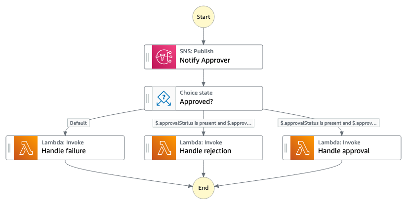

# Human in the Loop

This pattern allows you to integrate a human review or approval process into your workflows with **one-click email approval**. A Lambda function sends an approval request via SNS email containing clickable approve/reject links. The task token is URL-encoded to ensure special characters don't break the API Gateway callback URL. The workflow pauses until the reviewer clicks a link, which triggers an API Gateway endpoint to resume the Step Functions execution.

Learn more about this workflow at Step Functions workflows collection: [Human in the Loop](https://serverlessland.com/workflows/human-in-the-loop)

Important: this application uses various AWS services and there are costs associated with these services after the Free Tier usage - please see the [AWS Pricing page](https://aws.amazon.com/pricing/) for details. You are responsible for any AWS costs incurred. No warranty is implied in this example.

## Requirements

* [Create an AWS account](https://portal.aws.amazon.com/gp/aws/developer/registration/index.html) if you do not already have one and log in. The IAM user that you use must have sufficient permissions to make necessary AWS service calls and manage AWS resources.
* [AWS CLI](https://docs.aws.amazon.com/cli/latest/userguide/install-cliv2.html) installed and configured
* [Git Installed](https://git-scm.com/book/en/v2/Getting-Started-Installing-Git)
* [AWS Serverless Application Model](https://docs.aws.amazon.com/serverless-application-model/latest/developerguide/serverless-sam-cli-install.html) (AWS SAM) installed
* Python 3.13 or later

## Deployment Instructions

1. Create a new directory, navigate to that directory in a terminal and clone the GitHub repository:
    ``` 
    git clone https://github.com/aws-samples/step-functions-workflows-collection
    ```
1. Change directory to the pattern directory:
    ```
    cd human-in-the-loop
    ```
1. From the command line, use AWS SAM to deploy the AWS resources for the workflow as specified in the template.yaml file:
    ```
    sam deploy --guided
    ```
1. During the prompts:
    * Enter a stack name
    * Enter the desired AWS Region
    * Allow SAM CLI to create IAM roles with the required permissions.
    * Enter an email address that should receive the notifications from the workflow.

    Once you have run `sam deploy --guided` mode once and saved arguments to a configuration file (samconfig.toml), you can use `sam deploy` in future to use these defaults.

1. Note the outputs from the SAM deployment process. These contain the resource names and/or ARNs which are used for testing.

## How it works



1. Data that should be reviewed by a human is passed to the workflow. The state machine invokes a Lambda function using the `.waitForTaskToken` integration pattern. The Lambda function URL-encodes the task token and constructs approve/reject links pointing to an API Gateway endpoint.
2. The Lambda function publishes an email via [Amazon Simple Notification Service (SNS)](https://aws.amazon.com/sns/) containing the clickable approve/reject links.
3. The reviewer clicks one of the links in the email. This triggers a GET request to API Gateway.
4. API Gateway invokes a second Lambda function that decodes the task token and calls `SendTaskSuccess` (approve) or `SendTaskFailure` (reject) on the Step Functions execution.
5. The workflow resumes and routes to the appropriate processing Lambda based on the approval outcome.


## Testing

1. After deployment you receive an email titled `AWS Notification - Subscription Confirmation`. Click on the link in the email to confirm your subscription. This will allow SNS to send you emails.
2. Navigate to the AWS Step Functions console and select the `human-in-the-loop` workflow.
3. Select `Start Execution` and use any valid JSON data as input.
4. Select `Start Execution` and wait until you receive the approval request email from SNS.
5. Click the **Approve** or **Reject** link in the email.
6. You will see a confirmation page in your browser indicating the workflow was approved or rejected.
7. Observe the execution in the Step Functions console — the workflow transitions to `Handle approval` or `Handle rejection` based on your response.

### Testing via CLI (alternative)

You can also test the API Gateway endpoint directly:

```bash
# Get the API endpoint from stack outputs
export API_ENDPOINT=$(aws cloudformation describe-stacks \
  --stack-name <your-stack-name> \
  --query "Stacks[0].Outputs[?OutputKey=='ApiEndpoint'].OutputValue" \
  --output text)

# Approve (replace <ENCODED_TASK_TOKEN> with the URL-encoded token from the email link)
curl "$API_ENDPOINT?taskToken=<ENCODED_TASK_TOKEN>&decision=approve"
```

## Cleanup
 
To delete the resources created by this template, use the following command:

```bash
sam delete
```

----
Copyright Amazon.com, Inc. or its affiliates. All Rights Reserved.

SPDX-License-Identifier: MIT-0
