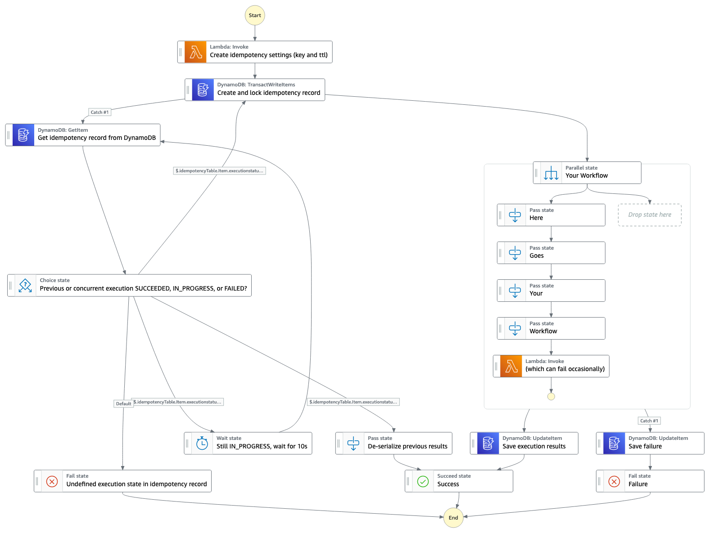

# Idempotent Workflows

This workflow shows how idempotency can be implemented with StepFunctions. Idempotent workflows always return the same result
when given the same input. In this example, the actual workflow steps are skipped if the workflow has already been executed
with the same payload previously and the previous results are retrieved from DynamoDB and returned as the workflow result instead.
The workflow also implements the concurrency controller pattern which prohibits multiple instances of the workflow to
run concurrently.

Learn more about this workflow at Step Functions workflows collection: https://serverlessland.com/workflows/idempotent-workflow-sam

Important: this application uses various AWS services and there are costs associated with these services after the Free Tier usage - please see the [AWS Pricing page](https://aws.amazon.com/pricing/) for details. You are responsible for any AWS costs incurred. No warranty is implied in this example.

**Important**: The workflow uses DynamoDB to store the results of the actual workflow steps. Therefore, the maximum
size of the results must not exceed ~399 KB (400 KB is maximum but the workflow stores some metadata too).

## Requirements

* [Create an AWS account](https://portal.aws.amazon.com/gp/aws/developer/registration/index.html) if you do not already have one and log in. The IAM user that you use must have sufficient permissions to make necessary AWS service calls and manage AWS resources.
* [AWS CLI](https://docs.aws.amazon.com/cli/latest/userguide/install-cliv2.html) installed and configured
* [Git](https://git-scm.com/book/en/v2/Getting-Started-Installing-Git) installed
* [AWS Serverless Application Model](https://docs.aws.amazon.com/serverless-application-model/latest/developerguide/serverless-sam-cli-install.html) (AWS SAM) installed
* [Docker](https://docs.docker.com/get-docker/) installed

## Deployment Instructions

1. Create a new directory, navigate to that directory in a terminal and clone the GitHub repository:
    ``` 
    git clone https://github.com/aws-samples/step-functions-workflows-collection
    ```
2. Change directory to the pattern directory:
    ```
    cd idempotent-workflow-sam
    ```
3. From the command line, use AWS SAM to build and package the Lambda functions:
    ```
    sam build --use-container
    ```
3. From the command line, use AWS SAM to deploy the AWS resources for the workflow as specified in the template.yaml file:
    ```
    sam deploy --guided
    ```
4. During the prompts:
   * Enter a stack name
   * Enter the desired AWS Region
   * Allow SAM CLI to create IAM roles with the required permissions.

   Once you have run `sam deploy --guided` mode once and saved arguments to a configuration file (samconfig.toml), you can use `sam deploy` in future to use these defaults.

5. Note the outputs from the SAM deployment process. These contain the resource names and/or ARNs which are used for testing.

## How it works

The workflow tracks the workflow execution and status in a DynamoDB table. When the workflow starts,
an idempotency key is calculated based on the input event (customizable) and stored in the database as a semaphore
together with a status of `IN_PROGRESS`.

If storing the key was successful, the workflow runs the actual workflow
steps and records the result in the database with a status of `SUCCESS` (or `FAILED` in case of an error).

If acquiring the semaphore was not successful (i.e. the workflow successfully executed previously or another execution is
running concurrently and thus the status is `IN_PROGRESS`) the workflow retrieves the idempotency record from the database.
When the status is `SUCCESS` and there is a result the result is returned as output of the workflow. If the status is `IN_PROGRESS`
the workflow continues to query the database every 10 seconds until the status changes to either `SUCCESS` and it
continues as described above, or `FAILED`, in which case the workflow tries to acquire the semaphore again.

## Image


## Testing

Start the workflow with some test event, e.g.
```json
{
   "top": "level",
   "nested": {
      "key1": "value1",
      "key2": "value2"
   }
} 
```

The workflow should successfully acquire the lock and execute the right side of the workflow (the parallel state). In
this example, as the last step within the parallel state, a Lambda function is invoked which randomly fails to demonstrate
failure handling. If the Lambda did not fail, the entire workflow should succeed and the result should be the following.
```json
{
  "step1": {
    "result": "Output of step 1"
  },
  "step2": {
    "result": "Output of step 2"
  },
  "step3": {
    "result": "Output of step 3"
  },
  "step4": {
    "result": "Output of step 4"
  },
  "randomFailureFunc": "All good"
}
```

In the DynamoDB table which has been deployed you should find an item with a long hash value as id, an `executionstatus` of
`SUCCESS` and above JSON serialized as string into `executionresult`. The table also holds some info about the execution
which created the item such as execution id and start time. It furthermore uses the `ttl` attribute to auto-expire items
after 24 hours by default.

Now try running the workflow again with the same input as before. This time acquiring the semaphore should fail and the
left side of the workflow should run, which takes the previous result out of the database.

In case the Lambda function failed, the error should have been recorded in the database and the workflow completed with the
"Failure" state. If you try to run the workflow again with the same input it should again successfully acquire the semaphore
and run the right side of the workflow.

You may have to run the workflow a couple of times until the failure lambda succeeds or fails, respectively.

By default the workflow uses the entire input event to calculate the idempotency key. You can customize on which values
the key should be calculated by passing in a JMESPath expression as part of the event. For example
```json
{
   "top": "level",
   "nested": {
      "key1": "value1",
      "key2": "value2"
   },
   "idempotencyKeyJmespath": "[nested.key1, nested.key2]"
} 
```
uses the values of the two nested attributes to calculate the key.


## Cleanup

From the pattern directory, run

1. Delete the stack
    ```bash
    aws cloudformation delete-stack --stack-name STACK_NAME
    ```
1. Confirm the stack has been deleted
    ```bash
    aws cloudformation list-stacks --query "StackSummaries[?contains(StackName,'STACK_NAME')].StackStatus"
    ```

----
Copyright 2022 Amazon.com, Inc. or its affiliates. All Rights Reserved.

SPDX-License-Identifier: MIT-0
