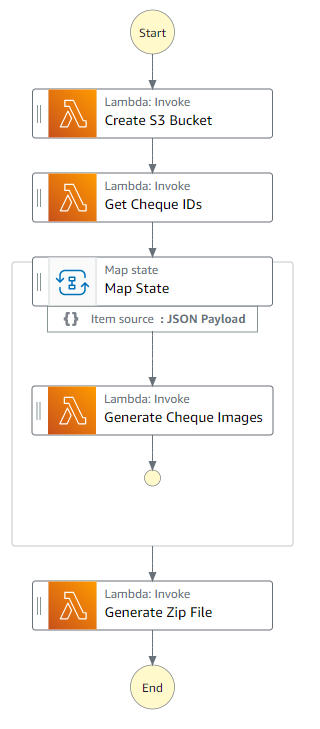

# Image Processing App

This is a sample project that leverages AWS Cloud Development Kit (CDK) to deploy a serverless workflow using AWS Step Functions.
The application makes external web service calls to retrieve cheque IDs and corresponding images. It then merges the front and back images for each chequeID and stores them in a designated storage bucket. Finally, the application creates a zip file containing all the cheque images for easy archiving and sharing.

Application automates the process of retrieving, merging and archiving cheque images from external web services making it more efficient and convenient for users.

Important: this application uses various AWS services and there are costs associated with these services after the Free Tier usage - please see the [AWS Pricing page](https://aws.amazon.com/pricing/) for details. You are responsible for any AWS costs incurred. No warranty is implied in this example.

## Requirements

- [Create an AWS account](https://portal.aws.amazon.com/gp/aws/developer/registration/index.html) if you do not already have one and log in. The IAM user that you use must have sufficient permissions to make necessary AWS service calls and manage AWS resources.
- [AWS CLI](https://docs.aws.amazon.com/cli/latest/userguide/install-cliv2.html) installed and configured
- [Git Installed](https://git-scm.com/book/en/v2/Getting-Started-Installing-Git)
- [AWS Cloud Development Kit](https://docs.aws.amazon.com/cdk/v2/guide/home.html) (AWS CDK) installed

## Deployment Instructions

1. Create a new directory, navigate to that directory in a terminal and clone the GitHub repository:
   ```
   git clone https://github.com/aws-samples/image-processing-app [To be created upon approval]
   ```
1. Change directory to the pattern directory:
   ```
   cd image-processing-app
   ```
1. From the command line, use npm to install dependencies and run the build process.

   ```
   npm install
   ```

1. From the command line, run the following cdk commands to synthesize an AWS CloudFormation template and deploy the app

   ```
   cdk bootstrap
   cdk synth
   cdk deploy
   ```

## How it works

The CDK App deploys the following artifacts:
A Dynamo DB Table to maintain the authenticity of the caller with the state execution ID
An S3 Bucket to store the images.
Lambda functions for following operations:

- To pull the Cheque IDs
- To pull the Front & Back Image of the ChequeID and Merge them into a consolidated jpeg.
- To create a Zip file for all the images stored in the bucket.

## Image



## Testing

1. Deploy the State Machine via CDK.

1. For testing purposes, Upload test images [cheque-front-image.jpg and cheque-back-image.jpg] to any Amazon S3 bucket in your AWS Account.

1. After uploading the image, generate a pre-signed URL for both the images and navigate to AWS Lambda function "sfn-GetCheque-Images" to update the pre-signed URL's.

   - const frontchqimage = "front_image_url_here";
   - const backchqimage = "back_image_url_here";

1. Select Start Execution and observe the execution of the workflow.

1. Workflow will now create the S3 bucket and start creating the files. The merged images will be created for all the ChequeID's that will be determined in "Get Cheque IDs" task.
   Map state asynchronously makes web service calls to pull the images for each chequeID, combines the images and stores them in the S3 Bucket.

1. Finally a Zip file will be created in the final step of the execution for all the images from the bucket.

## Cleanup

1. To delete the resources created by this template:

Delete the stack

cdk destroy

```bash
cdk destroy
```

---

Copyright 2023 Amazon.com, Inc. or its affiliates. All Rights Reserved.

SPDX-License-Identifier: MIT-0
