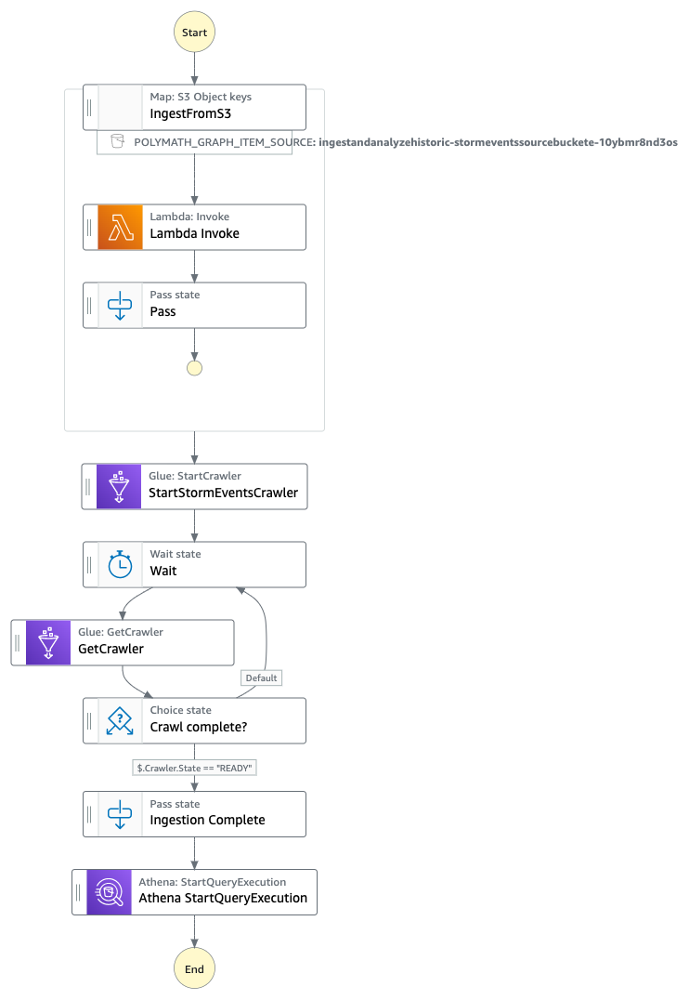
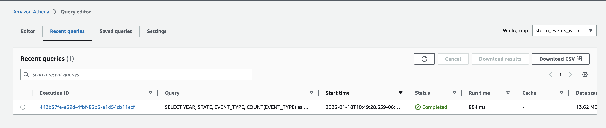
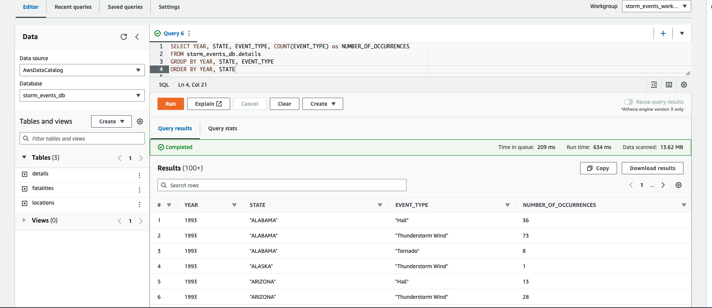

# Distributed Map - Ingest & Analyze Historical Storm Data
Storm Data is an official publication of the National Oceanic and Atmospheric Administration (NOAA) which documents the occurrence of storms and other significant weather phenomena having sufficient intensity to cause loss of life, injuries, 
significant property damage, and/or disruption to commerce. The workflow uses the distributed map function of Step function to decompress the zipped files at scale and drop them into an S3 bucket with a certain hierarchy. 
Using AWS's purpose-built services for analytics, we can read & analyze the storm data at scale that have occurred historically in the US. 

The application queries the [storm dataset](https://www1.ncdc.noaa.gov/pub/data/swdi/stormevents/csvfiles/) to find the number of occurrences of various storm event types across the US over the years.

_Note: There are three different file types for storm data: details, locations, and fatalities. Each file type contains different information relevant to the storm events_

## Requirements

- [AWS Cloud Development Kit (AWS CDK) v2](https://docs.aws.amazon.com/cdk/v2/guide/getting_started.html)
- Python > 3.10.6
- [AWS CLI](https://docs.aws.amazon.com/cli/latest/userguide/cli-chap-getting-started.html)


## Deployment Instructions

Create a new directory, navigate to that directory in a terminal and clone the GitHub repository:
```
    git clone https://github.com/aws-samples/step-functions-workflows-collection
```

Change directory to the workflow directory
```
    cd ingest-and-analyze-historical-storm-events
```

<br>

This project is set up like a standard Python project.  The initialization
process also creates a virtualenv within this project, stored under the `.venv`
directory.  To create the virtualenv it assumes that there is a `python3`
(or `python` for Windows) executable in your path with access to the `venv`
package. If for any reason the automatic creation of the virtualenv fails,
you can create the virtualenv manually.

To manually create a virtualenv on MacOS and Linux:

```
$ python3 -m venv .venv
```

After the init process completes, and the virtualenv is created, you can use the following
step to activate your virtualenv.

```
$ source .venv/bin/activate
```

If you are a Windows platform, you would activate the virtualenv like this:

```
% .venv\Scripts\activate.bat
```

Once the virtualenv is activated, you can install the required dependencies.

```
$ pip install -r requirements.txt
```

At this point you can now synthesize the CloudFormation template for this code.

```
$ cdk synth
```

Deploy this stack to your default AWS account/region

```
$ cdk deploy
```

To add additional dependencies, for example other CDK libraries, just add
them to your `setup.py` file and rerun the `pip install -r requirements.txt`
command.

### Useful commands
 * `cdk ls`          list all stacks in the app
 * `cdk diff`        compare deployed stack with current state
 * `cdk docs`        open CDK documentation

### Important resources created by this stack

- AWS Step function
- Amazon S3
- AWS Glue Crawler
- Amazon Athena workgroup 

## Pre-run instructions

- Upload the zip files to a folder in the S3 bucket created by the stack
    - The zipped storm data files can be obtained direclty from the [NOAA website](https://www1.ncdc.noaa.gov/pub/data/swdi/stormevents/csvfiles/)
    - For the purpose of the example, we have few sample files that we can use for the demo
        ```
        $ cd sample_files
        $ aws s3 cp . s3://{output_bucket_name}/raw_source/ --recursive
        ``` 

## How it works

1. The workflow starts by iterating over all files in the S3 bucket under `raw_source/` folder
2. For each zipped file, lambda function decompresses it and places the .csv to the appropriate file type prefix under the `formatted/` folder
3. AWS Glue crawler then kicks off to populate the AWS Glue Data Catalog with tables
4. Once the crawl process is complete (using `wait`), an Athena query gets kicked off to find the number of occurrences of various storm event types across the US over the years



## Testing: How to run the workflow

- Navigate to the Step function that was created by the stack
- To run this Step function, the payload is irrelevant as it directly iterates over the `raw_source/` folder in the S3 bucket {output_bucket_name}
    - To kick off the step function, you can use the below payload
        ```
        {
            "key1" : "v1"
        }
        ```
- Once the step function execution is complete, output of the workflow will contain the S3 URI to the results of Athena query and the Athena query execution id itself. Below is a sample output from the step function<br><br>
    ```
    {
      "QueryExecution": {
        "EngineVersion": {
          "EffectiveEngineVersion": "Athena engine version 2",
          "SelectedEngineVersion": "AUTO"
        },
        "Query": "SELECT YEAR, STATE, EVENT_TYPE, COUNT(EVENT_TYPE) as NUMBER_OF_OCCURRENCES FROM storm_events_db.details GROUP BY YEAR, STATE, EVENT_TYPE ORDER BY YEAR, STATE",
        "QueryExecutionContext": {
          "Catalog": "awsdatacatalog",
          "Database": "storm_events_db"
        },
        "QueryExecutionId": "XXXXXXX-XXXX-XXXX-b76d-c22bcd092985",
        "ResultConfiguration": {
          "OutputLocation": "s3://{output_bucket_name}/athena_results/XXXXXXX-XXXX-XXXX-b76d-c22bcd092985.csv"
        },
        "StatementType": "DML",
        "Statistics": {
          "DataScannedInBytes": 64886,
          "EngineExecutionTimeInMillis": 610,
          "QueryPlanningTimeInMillis": 112,
          "QueryQueueTimeInMillis": 141,
          "ServiceProcessingTimeInMillis": 22,
          "TotalExecutionTimeInMillis": 773
        },
        "Status": {
          "CompletionDateTime": 1674054596798,
          "State": "SUCCEEDED",
          "SubmissionDateTime": 1674054596025
        },
        "WorkGroup": "storm_events_workgroup"
      }
    }
    ```
     <br><br>
    


_Note: You can [build/modify the SQL query in the code](https://github.com/revanthreddy/step-functions-workflows-collection/blob/main/ingest-and-analyze-historical-storm-events/ingest_and_analyze_historical_storm_events/ingestion.py#L18) and re-deploying the stack_

## Cleanup


```
$ cdk destroy
```
_Note: The S3 bucket will not be deleted as there are files in the bucket_


----
Copyright 2022 Amazon.com, Inc. or its affiliates. All Rights Reserved.

SPDX-License-Identifier: MIT-0

