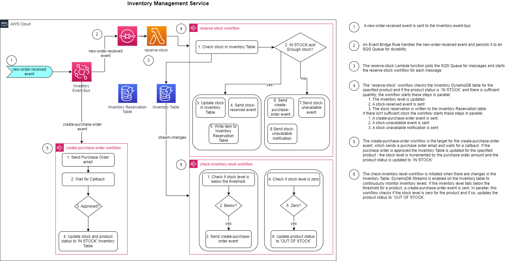
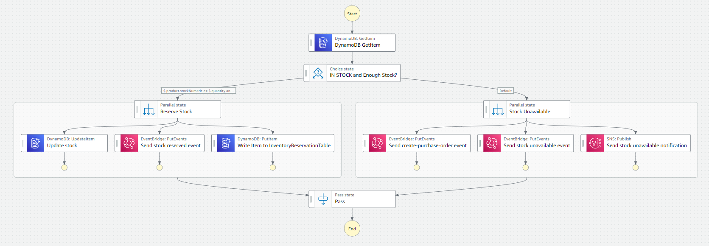
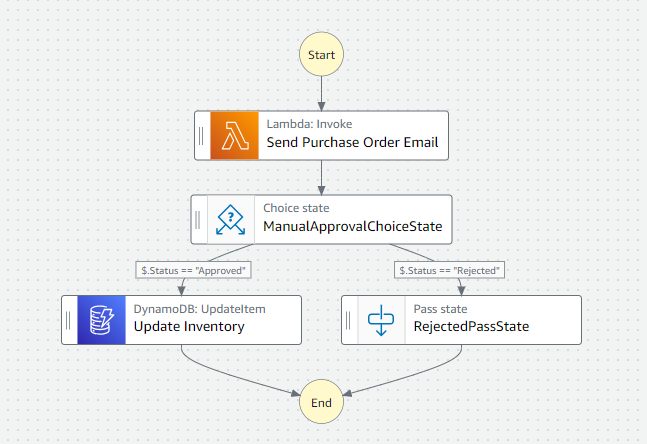
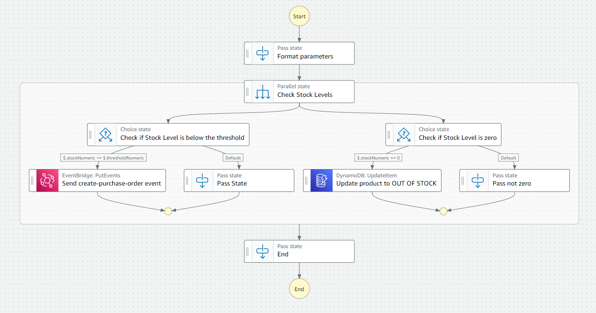

# Serverless Workflows for Real-time Inventory Management

This sample Inventory Management Microservice demonstrates how to manage inventory levels by reserving inventory when a new order is received from an Orders Microservice, alerts on low stock, and triggers purchase orders to replenish inventory.

Learn more about this workflow at Step Functions workflows collection: [https://serverlessland.com/workflows/inventory-management-sam](https://serverlessland.com/workflows/inventory-management-sam)

Important: this application uses various AWS services and there are costs associated with these services after the Free Tier usage - please see the [AWS Pricing page](https://aws.amazon.com/pricing/) for details. You are responsible for any AWS costs incurred. No warranty is implied in this example.

## Requirements

* [Create an AWS account](https://portal.aws.amazon.com/gp/aws/developer/registration/index.html) if you do not already have one and log in. The IAM user that you use must have sufficient permissions to make necessary AWS service calls and manage AWS resources.
* [AWS CLI](https://docs.aws.amazon.com/cli/latest/userguide/install-cliv2.html) installed and configured
* [Git Installed](https://git-scm.com/book/en/v2/Getting-Started-Installing-Git)
* [AWS Serverless Application Model](https://docs.aws.amazon.com/serverless-application-model/latest/developerguide/serverless-sam-cli-install.html) (AWS SAM) installed

## Deployment Instructions

1. Create a new directory, navigate to that directory in a terminal and clone the GitHub repository:
    ``` 
    git clone https://github.com/aws-samples/step-functions-workflows-collection
    ```
1. Change directory to the pattern directory:
    ```
    cd inventory-management-sam
    ```
1. From the command line, use AWS SAM to build and deploy the AWS resources for the workflow as specified in the template.yaml file:
    ```
    sam build
    sam deploy --guided
    ```
1. During the prompts:
    * Enter a stack name
    * Enter the desired AWS Region
    * Enter your email address for notifications and purchase order approvals
    * Allow SAM CLI to create IAM roles with the required permissions.

    Once you have run `sam deploy --guided` mode once and saved arguments to a configuration file (samconfig.toml), you can use `sam deploy` in future to use these defaults.

## How it works

The sample Inventory Management Microservice consists of:
1. An Event Bridge Schedule which invokes a Lambda Function to send a `new-order-received` event every minute, to generate some sample data which would be sent by a hypothetical Order Microservice. This schedule is disabled initially, instructions on enabling it are in the Testing section below.
2. An Event Bridge Rule handles the `new-order-received` event and persists it to an SQS Queue for durability. 
3. A `reserve-stock` Lambda function polls the SQS Queue and starts the `reserve-stock` workflow. 
4. The `reserve-stock` workflow is an [Express workflow](https://docs.aws.amazon.com/step-functions/latest/dg/concepts-standard-vs-express.html) as it should execute in under 5 minutes. It checks the Inventory DynamoDB table for the specified product and if the product status is `IN STOCK` and there is sufficient quantity, the workflow starts these steps in parallel - demonstrating the [Choice](https://docs.aws.amazon.com/step-functions/latest/dg/amazon-states-language-choice-state.html) and [Parallel State](https://docs.aws.amazon.com/step-functions/latest/dg/amazon-states-language-parallel-state.html):
    1. The inventory level is updated.
    2. A `stock-reserved` event is sent, which the Order Microservice would handle and continue with order processing.
    3. The stock reservation is written to the `Inventory Reservation` table. 

    If there isn't sufficient stock the workflow starts these steps in parallel:
        1. A `create-purchase-order` event is sent.
        2. A `stock-unavailable` event is sent, which the Order Microservice would handle and hold order processing until the stock was available
        3. A stock unavailable notification is sent
    
5. The `create-purchase-order` workflow is a [Standard workflow](https://docs.aws.amazon.com/step-functions/latest/dg/concepts-standard-vs-express.html) as it uses a [Callback](https://docs.aws.amazon.com/step-functions/latest/dg/connect-to-resource.html#connect-wait-token) which is not supported by Express workflows and it could take longer than 5 minutes to complete as it waits for a response. This workflow is the target for the `create-purchase-order` event, and it sends a purchase order email and waits for a callback. If the purchase order is `approved` the Inventory Table is updated for the specified product - the stock level is incremented by the purchase order amount and the product status is updated to `IN STOCK`.

6. The `check-inventory-level` workflow is initiated when there are changes in the Inventory Table. DynamoDB Streams is enabled on the Inventory table to continuously monitor inventory levels. A Lambda function processes the stream records and starts the `check-inventory-level` workflow which checks if the inventory level falls below the threshold for a product, and sends a `create-purchase-order` event. The purchase order event is handled by an Event Bridge Rule which starts the create purchase order workflow. In parallel, this workflow checks if the stock level is zero for the product and if so, updates the product status to `OUT OF STOCK` and sends an alert that the stock level is zero.

## Architecture Diagram


## reserve-stock workflow


## create-purchase-order workflow


## check-inventory-level workflow


## Testing

### If you would like to test manually:
Invoke the `SendNewOrderReceivedLambda` by getting the lambda name from the outputs after deployment or using (just substitute the stack name you used (default is `sam-app`)). This will generate an event containing a random product and quantity.
    ```bash
    
    aws lambda invoke --function-name $(aws cloudformation describe-stacks --stack-name <stack-name> --query "Stacks[*].Outputs[?OutputKey=='SendNewOrderReceivedLambdaName'].OutputValue" --output text) response.json
    ```
The event will trigger the `reserve-stock` workflow which you can view from the [Step Functions console](https://console.aws.amazon.com/states/home). If there is enough stock the reservation will be written to the Inventory Reservation Table. You can view the items in the DynamoDB table in the console or by using the below command:
    ```bash
    aws dynamodb scan --table-name $(aws cloudformation describe-stacks --stack-name <stack-name> --query "Stacks[*].Outputs[?OutputKey=='InventoryReservationTableName'].OutputValue" --output text)
    ```

If there isn't enough stock the `create-purchase-order` will be triggered and you will receive a Purchase Order request email. The `check-inventory-level` workflow will be triggered for any updates to the Inventory Table.


### If you would like to generate events every minute:
Enable the Event Bridge Schedule from the [Event Bridge Scheduler console](https://us-west-2.console.aws.amazon.com/scheduler/home)

You can view the `reserve-stock`, `create-purchase-order` and `check-inventory-level` workflows from the [Step Functions console](https://console.aws.amazon.com/states/home) as the `reserve-stock` Workflow will be triggered every minute. Disable the [Event Bridge Scheduler](https://us-west-2.console.aws.amazon.com/scheduler/home) schedule to stop `new-order-received` events from being sent and incurring additional costs in the console or delete the stack.


## Cleanup
 
1. Delete the stack
    ```bash
    sam delete
    ```
----
Copyright 2023 Amazon.com, Inc. or its affiliates. All Rights Reserved.

SPDX-License-Identifier: MIT-0
