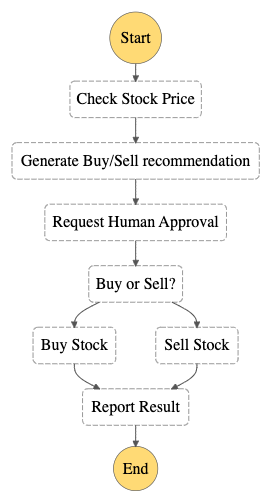

# Lambda Orchestration

This workflow demonstrates how to orchestrate Lambda Functions with Step Functions state machines. In this project, Step Functions uses a series of Lambda functions to check a stock price and determine a buy or sell trading recommendation. The recommendation is provided to the user and they  can choose whether to buy or sell the stock. The result of the trade is sent to a SNS topic.


Important: this application uses various AWS services and there are costs associated with these services after the Free Tier usage - please see the [AWS Pricing page](https://aws.amazon.com/pricing/) for details. You are responsible for any AWS costs incurred. No warranty is implied in this example.

## Requirements

* [Create an AWS account](https://portal.aws.amazon.com/gp/aws/developer/registration/index.html) if you do not already have one and log in. The IAM user that you use must have sufficient permissions to make necessary AWS service calls and manage AWS resources.
* [AWS CLI](https://docs.aws.amazon.com/cli/latest/userguide/install-cliv2.html) installed and configured
* [Git Installed](https://git-scm.com/book/en/v2/Getting-Started-Installing-Git)
* [Terraform Installed](https://www.terraform.io/downloads)

## Deployment Instructions

1. Create a new directory, navigate to that directory in a terminal and clone the GitHub repository:
    ``` 
    git clone https://github.com/aws-samples/step-functions-workflows-collection
    ```
1. Change directory to the pattern directory:
    ```
    cd lambda-orchestration-tf
    ```
1. If needed, update the variable ```region``` in ```variables.tf``` to the region of your choice.  The default is ```us-east-1```.

1. From the command line, use Terraform to deploy the AWS resources for the workflow as specified in the main.tf file:
    ```
    terraform init
    terraform apply
    ```


1. Note the outputs from the Terraform deployment process. These contain the resource names and/or ARNs which are used for testing:

    * ```topic_name```: Name of the SNS topic where result is sent.
    * ```state_machine_name```: Name of Step Functions State Machine orchestrating the process.
    * ```state_machine_arn```:  ARN of the Step Functions State Machine orchestrating the process.

## How it works

This workflow simulates a stock trading process.  The first state simulates checking a stock price by generating a random number representing the price of a stock.  The stage passes this price to the Generate Buy/Sell recommendation state which determines if the trader should buy or sell the stock.  This recommendation is passed to an SQS queue simulating a trader verifying the recommendation and approving it.  This decision is passed to the Buy or Sell choice state which directs the flow to the proper buy or sell Lambda function.  The final stage reports the result to an SNS Topic.

## Image



## Testing

After deployment, add an email subscription to the SNS Topic found in the stack Output. Manually trigger the Step Function, either in the Console or using the CLI.  A successful execution will send an email notification containing mock transaction data to the subscription.

## Cleanup
 
1. Delete the stack
    ```bash
    terraform destroy
    ```
1. Answer ```yes``` to the following prompt:
    
    ```
    Do you really want to destroy all resources?
    Terraform will destroy all your managed infrastructure, as shown above.
    There is no undo. Only 'yes' will be accepted to confirm.

    Enter a value: yes
    ```

----
Copyright 2022 Amazon.com, Inc. or its affiliates. All Rights Reserved.

SPDX-License-Identifier: MIT-0
