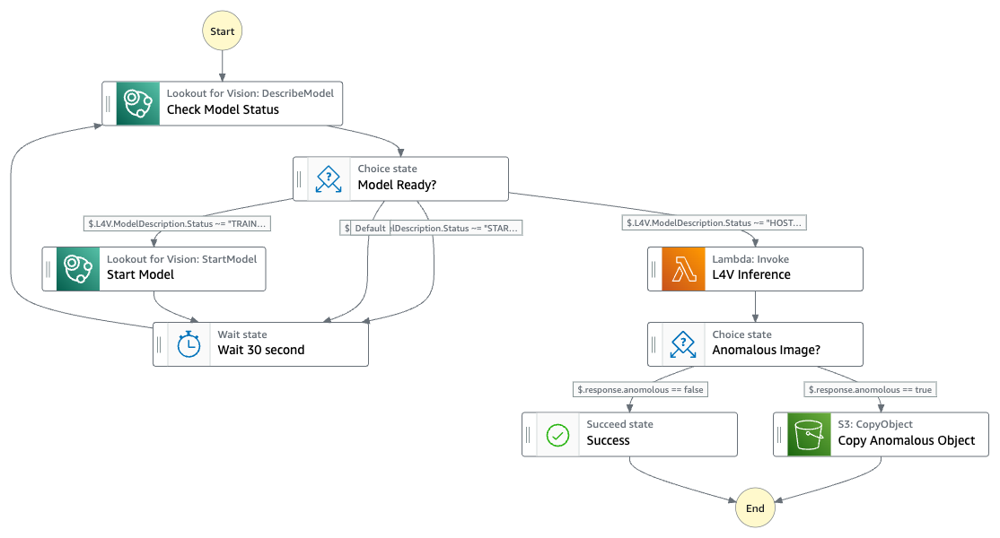

# Visual Defect Detector

This workflow demonstrates how to use Step Functions to orchestrate detection of anomalies in image uploaded into Amazon S3 bucket with Amazon Lookout for Vision. 

Learn more about this workflow at Step Functions workflows collection: https://serverlessland.com/workflows/lookout-for-vision-inference-sam

Important: this application uses various AWS services and there are costs associated with these services after the Free Tier usage - please see the [AWS Pricing page](https://aws.amazon.com/pricing/) for details. You are responsible for any AWS costs incurred. No warranty is implied in this example.

## Requirements

* [Create an AWS account](https://portal.aws.amazon.com/gp/aws/developer/registration/index.html) if you do not already have one and log in. The IAM user that you use must have sufficient permissions to make necessary AWS service calls and manage AWS resources.
* [AWS CLI](https://docs.aws.amazon.com/cli/latest/userguide/install-cliv2.html) installed and configured
* [Git Installed](https://git-scm.com/book/en/v2/Getting-Started-Installing-Git)
* [AWS Serverless Application Model](https://docs.aws.amazon.com/serverless-application-model/latest/developerguide/serverless-sam-cli-install.html) (AWS SAM) installed

## Deployment Instructions

1. Create a new directory, navigate to that directory in a terminal and clone the GitHub repository:
    ``` 
    git clone https://github.com/aws-samples/step-functions-workflows-collection
    ```
1. Change directory to the pattern directory:
    ```
    cd _workflow-model
    ```
1. From the command line, use AWS SAM to deploy the AWS resources for the workflow as specified in the template.yaml file:
    ```
    sam deploy --guided
    ```
1. During the prompts:
    * Enter a stack name
    * Enter the desired AWS Region
    * Enter Amazon Lookout for Vision project name
    * Enter Amazon Lookout for Vision model version
    * Allow SAM CLI to create IAM roles with the required permissions.

    Once you have run `sam deploy --guided` mode once and saved arguments to a configuration file (samconfig.toml), you can use `sam deploy` in future to use these defaults.

1. Note the outputs from the SAM deployment process. These contain the resource names and/or ARNs which are used for testing.

## How it works

When an image is uploaded into the raw Amazon S3 bucket, Amazon EventBridge will trigger the workflow. To use a trained model in AWS Cloud, Step Functions first check the model status and start the model if necessary. AWS Lambda calls DetectAnomalies operation to detect anomalies. If the image is anomalous, it will be copied to result Amazon S3 bucket.

## Image


## Testing

Ensure you have a trained Amazon Lookout for Vision model. Refer [code examples and datasets](https://docs.aws.amazon.com/lookout-for-vision/latest/developer-guide/example-code.html) if necessary.

Upload an image into the raw S3 bucket. Amazon EventBridge will trigger the workflow. If anomalies are detected, the image will be copied to result S3 bucket.

## Cleanup
 
1. Delete the stack
    ```bash
    aws cloudformation delete-stack --stack-name STACK_NAME
    ```
1. Confirm the stack has been deleted
    ```bash
    aws cloudformation list-stacks --query "StackSummaries[?contains(StackName,'STACK_NAME')].StackStatus"
    ```
----
Copyright 2022 Amazon.com, Inc. or its affiliates. All Rights Reserved.

SPDX-License-Identifier: MIT-0
