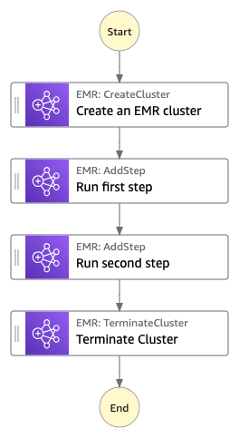

# Manage an Amazon EMR Job

This workflow demonstrates Amazon EMR and AWS Step Functions integration. It shows how to create an Amazon EMR cluster, add multiple steps and run them, and then terminate the cluster.

Important: this application uses various AWS services and there are costs associated with these services after the Free Tier usage - please see the [AWS Pricing page](https://aws.amazon.com/pricing/) for details. You are responsible for any AWS costs incurred. No warranty is implied in this example.

## Requirements

* [Create an AWS account](https://portal.aws.amazon.com/gp/aws/developer/registration/index.html) if you do not already have one and log in. The Identity and Access Management (IAM) user that you use must have sufficient permissions to make necessary AWS service calls and manage AWS resources.
* [AWS CLI](https://docs.aws.amazon.com/cli/latest/userguide/install-cliv2.html) installed and configured
* [Git installed](https://git-scm.com/book/en/v2/Getting-Started-Installing-Git)
* [AWS Cloud Development Kit](https://docs.aws.amazon.com/cdk/v2/guide/getting_started.html#getting_started_install) (AWS CDK) installed

## Deployment Instructions

1. Bootstrap your environment if this is your first time deploying stacks with AWS CDK.
    ``` 
    cdk bootstrap aws://{aws-account-number}/{region}
    ``` 
2. Create a new directory, navigate to that directory in a terminal, and clone the GitHub repository.
    ``` 
    git clone https://github.com/aws-samples/step-functions-workflows-collection
    ```
3. Change directory to the pattern directory.
    ```
    cd manage-emr-job-cdk
    ```
4. From the command line, create a virtual environment.
    ```
    python3 -m venv .venv
    ```
5. Then, activate your virtual environment. 

    ```
    source .venv/bin/activate
    ```

    If you are on a Windows platform, you would activate the virtual environment like this.

    ```
    .venv\Scripts\activate.bat
    ```
6. Once the virtual environment is activated, you can install the required dependencies.

    ```
    pip install -r requirements.txt
    ```
7. From the command line, deploy the stack by running the following command.
    ```
    cdk deploy
    ```
8. You will receive the following prompt. Select `y` to deploy.
    ```
    Do you wish to deploy these changes (y/n)? y
    ```

## How it Works

This workflow shows how to automate an Amazon EMR job using AWS Step Functions. The workflow creates an Amazon EMR cluster, adds multiple steps and runs them, and then terminates the cluster. The Amazon EMR task is called synchronously and the state machine waits for the task to succeed or fail. After the two steps are run on the EMR cluster, the cluster is terminated. This allows users to process and analyze data with minimal code. The AWS Cloud Development Kit (CDK) code creates all of the resources needed to run this workflow, including Identity and Access Management (IAM) roles and policies, a Simple Storage Service (S3) bucket to store EMR logs, and the State Machine for managing the EMR job.

## Image



## Testing

In order to successfully validate the Step Functions workflow, follow the steps below:

1. Deploy the stack via CDK.
2. Invoke the State Machine via the console or the AWS CLI. No input is required for this.
3. The state machine will go through all steps successfully by creating an EMR cluster, running both steps on the cluster, and then terminating the cluster. 

## Cleanup
 
1. Delete the stack.
    ```bash
    cdk destroy
    ```
2. You will receive the following prompt. Select `y` to delete the stack.
    ```bash
    Are you sure you want to delete: manage-emr-job (y/n)? y
    ```
----
Copyright 2023 Amazon.com, Inc. or its affiliates. All Rights Reserved.

SPDX-License-Identifier: MIT-0
