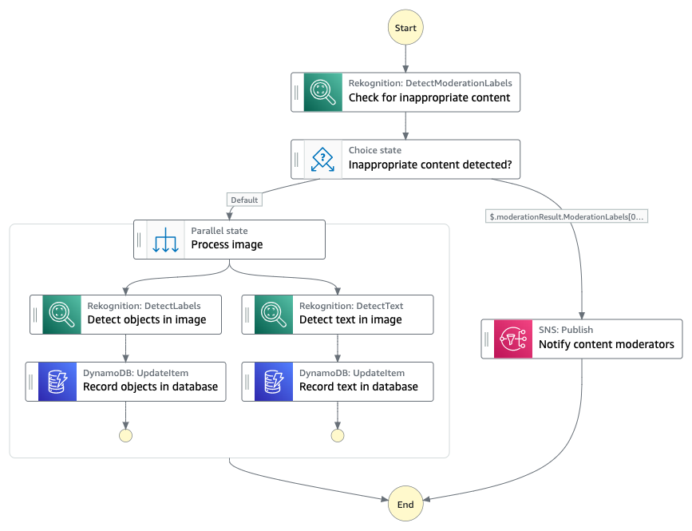

# Moderated Image Catalog

## What's here?

Choose your preferred language to work with [CDK](https://aws.amazon.com/cdk/):

* [python/](python/) - uses AWS CDK to build and deploy the infrastructure using Python

* [typescript/](typescript/) - uses AWS CDK to build and deploy the infrastructure using Typescript

See README's in specific language folders for specific requirements and deployment steps.

## What does this workflow do?

This workflow implements a moderated image cataloging pipeline. It includes content moderation, automated tagging, parallel image processing and automated notifications. The workflow relies exclusively on [AWS SDK service integrations](https://docs.aws.amazon.com/step-functions/latest/dg/supported-services-awssdk.html) and contains no custom Lambda code that needs to be maintained.

1. An image stored in [Amazon S3](https://aws.amazon.com/s3/) is checked for inappropriate content using the [Amazon Rekognition](https://aws.amazon.com/rekognition/) `DetectModerationLabels` API.
2. Based on the result of (1), appropriate images are forwarded to image processing while inappropriate ones trigger an email notification.
3. Appropriate images undergo two processing steps in parallel: the detection of objects and text in the image via Amazon Rekognition’s `DetectLabels` and `DetectText` APIs. The results of both processing steps are saved in an [Amazon DynamoDB](https://aws.amazon.com/dynamodb/) table.
4. An inappropriate image triggers an email notification for manual content moderation via the [Amazon Simple Notification Service (SNS)](https://aws.amazon.com/sns/).

## Want more?

Check out more workflows on [ServerlessLand](https://serverlessland.com/workflows)

----
Copyright 2023 Amazon.com, Inc. or its affiliates. All Rights Reserved.

SPDX-License-Identifier: MIT-0
