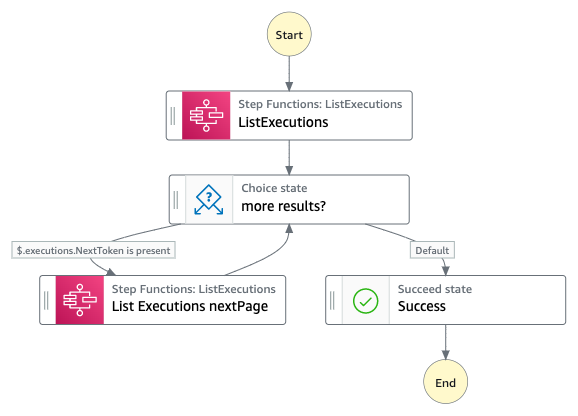

# Activity state machine

This pattern shows how to use Amazon States language (ASL) to implement a for-loop without writing code.  The workflow uses the `ListExecutions` SDK call, to retrive all previous Workflow executions.  
The maximum number of executions that can be returned for each call is 100.  If the workflow execution history shows more than 100, then a pagination token is returned, This can then be used to access the next 100 executions, and so on.

When no Pagination token is returned, the loop is complete.

Extend this pattern for any type of loop by using a `Choice` state with a default rule to check for more items, and an exit path if no more items are found.

## Requirements

* [Create an AWS account](https://portal.aws.amazon.com/gp/aws/developer/registration/index.html) if you do not already have one and log in. The IAM user that you use must have sufficient permissions to make necessary AWS service calls and manage AWS resources.
* [AWS CLI](https://docs.aws.amazon.com/cli/latest/userguide/install-cliv2.html) installed and configured
* [Git Installed](https://git-scm.com/book/en/v2/Getting-Started-Installing-Git)
* [AWS Serverless Application Model](https://docs.aws.amazon.com/serverless-application-model/latest/developerguide/serverless-sam-cli-install.html) (AWS SAM) installed

## Deployment Instructions

1. Create a new directory, navigate to that directory in a terminal and clone the GitHub repository:
    ``` 
    git clone https://github.com/aws-samples/step-functions-workflows-collection
    ```
1. Change directory to the pattern directory:
    ```
    cd pagination-loop
    ```
1. From the command line, use AWS SAM to deploy the AWS resources for the workflow as specified in the template.yaml file:
    ```
    sam deploy --guided
    ```
1. During the prompts:
    * Enter a stack name
    * Enter the desired AWS Region
    * Allow SAM CLI to create IAM roles with the required permissions.

    Once you have run `sam deploy --guided` mode once and saved arguments to a configuration file (samconfig.toml), you can use `sam deploy` in future to use these defaults.

1. Note the outputs from the SAM deployment process. These contain the resource names and/or ARNs which are used for testing.

## How it works




## Testing

1. After deployment, navigate to AWS Step Functions console and select the  workflow.
2. Select 'Start Execution' and use any valid JSON data as input.


## Cleanup
 
To delete the resources created by this template, use the following command:

```bash
sam delete
```

----
Copyright 2022 Amazon.com, Inc. or its affiliates. All Rights Reserved.

SPDX-License-Identifier: MIT-0