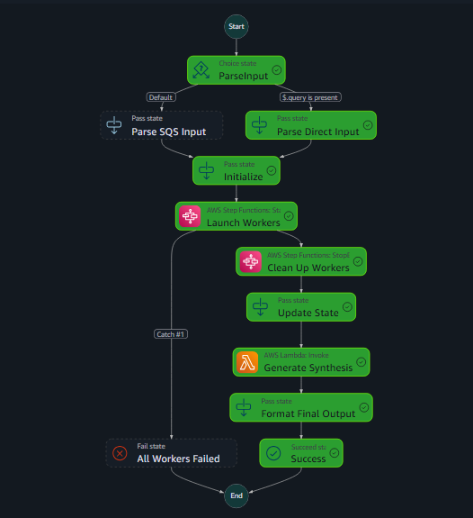
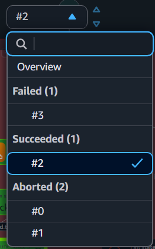

# Parallel Execution with Early Stopping pattern with AWS Step Functions and Amazon Bedrock

The **Parallel Agent Early Stopping** pattern uses AWS Step Functions and Amazon Bedrock to run multiple AI agents simultaneously on the same problem, with different approaches, and automatically terminates unnecessary processes once a high-confidence solution is discovered. The workflow coordinates Worker Agents that either retrieve information from the AWS Documentation MCP Server or generate responses using Amazon Bedrock models, while an Evaluation Agent continuously assesses confidence levels and triggers early stopping when a predetermined threshold is met. This design optimizes both performance and cost through parallel exploration, intelligent termination, and resource optimization techniques including agent tiering, token optimization, and Lambda memory tuning. 

Learn more about this workflow at Step Functions workflows collection: https://serverlessland.com/workflows/early-stopping-sf-bedrock

Important: this application uses various AWS services and there are costs associated with these services after the Free Tier usage - please see the [AWS Pricing page](https://aws.amazon.com/pricing/) for details. You are responsible for any AWS costs incurred. No warranty is implied in this example.

## Requirements

* [Create an AWS account](https://portal.aws.amazon.com/gp/aws/developer/registration/index.html) if you do not already have one and log in. The IAM user that you use must have sufficient permissions to make necessary AWS service calls and manage AWS resources.
* [AWS CLI](https://docs.aws.amazon.com/cli/latest/userguide/install-cliv2.html) installed and configured
* [Git Installed](https://git-scm.com/book/en/v2/Getting-Started-Installing-Git)
* [AWS Serverless Application Model](https://docs.aws.amazon.com/serverless-application-model/latest/developerguide/serverless-sam-cli-install.html) (AWS SAM) installed

## Deployment Instructions

1. Create a new directory, navigate to that directory in a terminal and clone the GitHub repository:
    ``` 
    git clone https://github.com/aws-samples/step-functions-workflows-collection
    ```
2. Change directory to the pattern directory:
    ```
    cd step-functions-workflows-collection/early-stopping-sf-bedrock
    ```
3. From the command line, use AWS SAM to deploy the AWS resources for the workflow as specified in the template.yaml file:
    ```
    sam deploy --guided
    ```
4. During the prompts:
    * Enter a stack name
    * Enter the desired AWS Region
    * Allow SAM CLI to create IAM roles with the required permissions.

    Once you have run `sam deploy --guided` mode once and saved arguments to a configuration file (samconfig.toml), you can use `sam deploy` in future to use these defaults.

5. Note the outputs from the SAM deployment process. These contain the resource names and/or ARNs which are used for testing.

## How it works

1. A user submits a query (eg. What is CloudFront ?), and AWS Step Functions orchestrates 4 parallel agent workflows simultaneously. Each agent uses a different specialized approach (service-specific, architecture patterns, cost optimization, and general overview).

2. Each agent independently retrieves information from the AWS Documentation MCP Server (Context Provider). If relevant information isn't available, agents fall back to Amazon Bedrock models to generate responses. Claude Haiku 3.5 is used in this example for its speed and cost-effectiveness. 

3. As results arrive, an Evaluation Agent assesses each response's confidence level. When any agent produces a result exceeding the confidence threshold (typically 0.95), Step Functions automatically terminates the other executing workflows to optimize resources and costs.

4. If no single agent achieves high confidence, a Synthesis Agent combines insights from multiple agents into a comprehensive answer. The final result is returned to the user with processing metadata.


## Image





## Testing

1. Log in to the AWS Step Functions Console
   - In the Step Functions dashboard, locate and click on the "MainStateMachine" that was created during deployment

2. Start a New Execution
   - Click the "Start execution" button
   - In the input field, enter a test query in JSON format:
     ```json
     {"query": "What is CloudFront?"}
     ```
   - Optionally, provide a name for your execution in the "Name" field
   - Click "Start execution" to begin the workflow

3. Monitor the Execution
   - The console will display a visual representation of your workflow execution
   - The main workflow starts execution of 4 worker agents in parallel using a distributed map 
   - Worker agent execution shows the agent with success, and others as aborted
   - Review the main workflow's output in the "Execution output" tab to see the synthesized result

4. Verify Results
   - Check that the output includes a "status" field (typically "synthesized")
   - Review the "processing_details" section to confirm early stopping functionality
   - Verify that responses include attribution to AWS Documentation


## Cleanup
 
1. Delete the stack
    ```bash
    aws cloudformation delete-stack --stack-name STACK_NAME
    ```
2. Confirm the stack has been deleted
    ```bash
    aws cloudformation list-stacks --query "StackSummaries[?contains(StackName,'STACK_NAME')].StackStatus"
    ```
----
Copyright 2025 Amazon.com, Inc. or its affiliates. All Rights Reserved.

SPDX-License-Identifier: MIT-0
