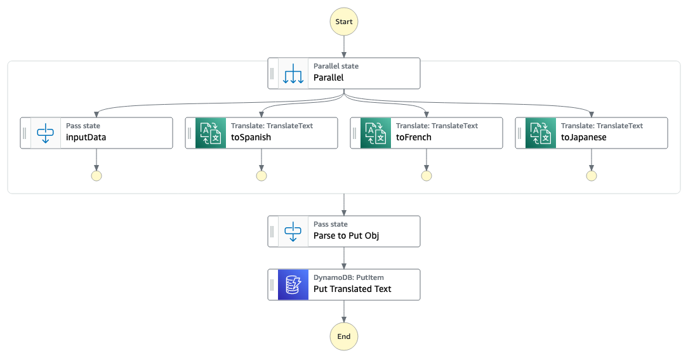

# Parallel Translate Text

This workflow will create a State Machine and a DynamoDB table. The State Machine will accept text from any language and will call out to Amazon Translate service API to convert to Spanish, French, and Japanese in parallel.  Once all translated values are returned the output array is parsed into a JSON object and a Put request is sent to DynamoDB for later use. The UUID instrinsic function is used as a key for the DyanmoDB item

Important: this application uses various AWS services and there are costs associated with these services after the Free Tier usage - please see the [AWS Pricing page](https://aws.amazon.com/pricing/) for details. You are responsible for any AWS costs incurred. No warranty is implied in this example.

## Requirements

* [Create an AWS account](https://portal.aws.amazon.com/gp/aws/developer/registration/index.html) if you do not already have one and log in. The IAM user that you use must have sufficient permissions to make necessary AWS service calls and manage AWS resources.
* [AWS CLI](https://docs.aws.amazon.com/cli/latest/userguide/install-cliv2.html) installed and configured
* [Git Installed](https://git-scm.com/book/en/v2/Getting-Started-Installing-Git)
* [AWS Serverless Application Model](https://docs.aws.amazon.com/serverless-application-model/latest/developerguide/serverless-sam-cli-install.html) (AWS SAM) installed

## Deployment Instructions

1. Create a new directory, navigate to that directory in a terminal and clone the GitHub repository:
    ``` 
    git clone https://github.com/aws-samples/step-functions-workflows-collection
    ```
1. Change directory to the pattern directory:
    ```
    cd ./parallel-translate
    ```
1. From the command line, use AWS SAM to deploy the AWS resources for the workflow as specified in the template.yaml file:
    ```
    sam build && sam deploy --guided
    ```
1. During the prompts:
    * Enter a stack name
    * Enter the desired AWS Region
    * Allow SAM CLI to create IAM roles with the required permissions.

    Once you have run `sam deploy --guided` mode once and saved arguments to a configuration file (samconfig.toml), you can use `sam deploy` in future to use these defaults.

1. Note the outputs from the SAM deployment process. These contain the resource names and/or ARNs which are used for testing.

## How it works

1. State Machine takes input object text and passes to parallel state.
2. In parallel state calls Amazon Translate API to auto determine input language and request output language of Spanish, French, and Japanese. The input data is also passed onto next state.
3. Once all translated values are returned the output array is parsed into a JSON object.
4. A Put request is sent to DynamoDB to save JSON object. The UUID instrinsic function is used as the key for the DyanmoDB item.



## Testing

1. Determine your AWS Account number and Region stack is deploy to
2. Navigate to Step Functions in the AWS console and select the TranslateText workflow. If you don't see it, make sure you are in the correct Region.
3. Send test text to state machine via test-data.json file. Replace your values in code and run AWS CLI command
    ```bash
    aws stepfunctions start-execution --state-machine-arn arn:aws:states:<YOUR REGION>:<YOUR AWS ACCOUNT>:stateMachine:TranslateText --input file://test-data.json
    ```
4. Observe the State Machine workflow execution. It may take several seconds for the workflow to complete. View the input and output of each state to see what data is passed and/or altered from one state to the next
5. Navigate to DynamoDB in the AWS console, select Tables, then select the TranslatedTextTable and click "Explore table items" and then perform a scan by clicking the Run button. You should have a record with original and translated versions.

## Cleanup
 
1. Delete the stack
    ```bash
    sam delete
    ```
1. Confirm the stack has been deleted
    ```bash
    aws cloudformation list-stacks --query "StackSummaries[?contains(StackName,'STACK_NAME')].StackStatus"
    ```
----
Copyright 2022 Amazon.com, Inc. or its affiliates. All Rights Reserved.

SPDX-License-Identifier: MIT-0
