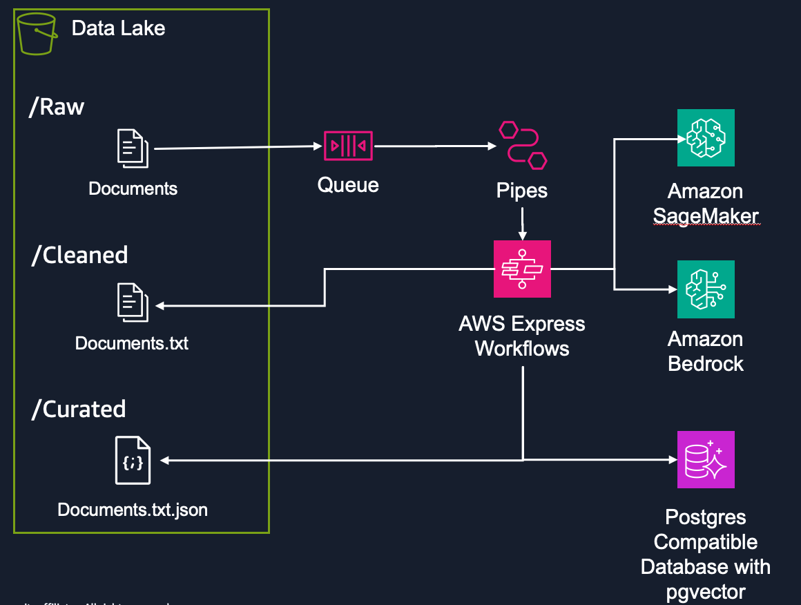
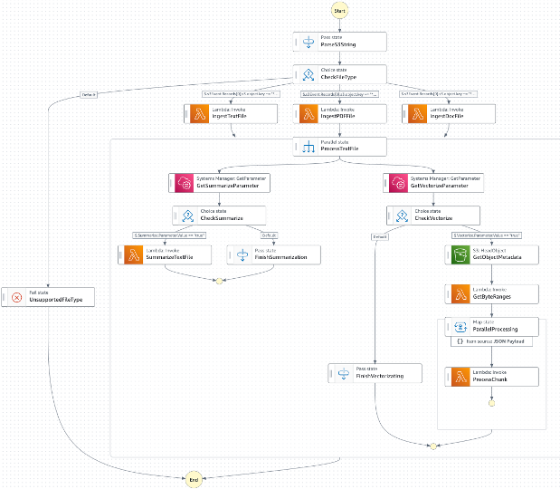

# Document Vectorization Pipeline

This project contains a document vectorization pipeline using AWS services, specifically designed to process text, PDF, and Word documents, extract their content, generate vector embeddings, and store them in a PostgreSQL database optimized for vector searches.

# Disclaimer

This is sample code, for non-production usage. You should work with your security and legal teams to meet your organizational security, regulatory and compliance requirements before deployment

## Recent Improvements

The pipeline has been enhanced with several important improvements:

1. **Better Text Processing**

   - Fixed UTF-8 encoding errors by removing null bytes (\x00) that caused PostgreSQL errors
   - Enhanced text sanitization for better database compatibility
   - Improved character encoding detection with multiple fallback options

2. **Advanced Embedding Model Handling**

   - Added automatic dimension adaptation to handle different embedding model dimensions
   - Implemented padding/truncation to match database schema requirements
   - Updated to use amazon.titan-embed-text-v2:0 with compatibility layer

3. **True Serverless Architecture**

   - Removed VPC attachment from VectorizeFunction for better scalability and performance
   - Ensured proper Data API access for database operations
   - Reduced cold start times and improved reliability

4. **Enhanced IAM Permissions**
   - Added application-autoscaling permissions required for database scaling
   - Included AmazonRDSFullAccess for comprehensive database management
   - Improved security posture with granular permissions

## Architecture



### Workflow Diagram

The following diagram illustrates the complete Step Functions workflow for the document vectorization pipeline:



This workflow shows the parallel processing capabilities of the pipeline, including:

- Document type detection and routing
- Parallel processing of different document formats (text, PDF, Word)
- Vector embedding generation using Amazon Bedrock
- Database storage with PostgreSQL and pgvector

### Data Processing Layers

The pipeline processes documents through three distinct S3 layers, each serving a specific purpose in the data transformation workflow:

- **Raw Layer** (`raw/` prefix): Original documents are uploaded here to trigger the pipeline. This layer contains unprocessed files in their native formats (PDF, DOCX, TXT).
- **Cleaned Layer** (`cleaned/` prefix): Documents are processed to extract and clean text content, removing formatting artifacts, null bytes, and encoding issues that could cause downstream processing errors.
- **Curated Layer** (`curated/` prefix): Final processed text chunks are stored here, optimized for vector embedding generation with proper chunking, overlap handling, and metadata enrichment.

This layered approach ensures data lineage, enables reprocessing at any stage, and maintains separation between raw source data and processed content ready for AI/ML workloads.

### Components:

- **Amazon S3**: Stores documents in different stages (raw, cleaned, curated)
- **Amazon SQS**: Handles document processing events
- **AWS Step Functions**: Orchestrates the document processing workflow
- **AWS Lambda**: Process documents and generate embeddings
- **Amazon Aurora PostgreSQL**: Database with pgvector extension for storing vectors

## Prerequisites

- [AWS SAM CLI](https://docs.aws.amazon.com/serverless-application-model/latest/developerguide/serverless-sam-cli-install.html)
- AWS CLI configured with appropriate credentials
- Docker (for local testing and building Lambda layers)
- Python 3 (for database initialization)

## Deployment Guide

### Deployment Scripts

| Script                   | Purpose                                                                          | When to Use                                                                    |
| ------------------------ | -------------------------------------------------------------------------------- | ------------------------------------------------------------------------------ |
| `deploy-with-db-init.sh` | **Complete deployment**:<br>1. Deploys infrastructure<br>2. Initializes database | **Use this for most cases**:<br>- New deployments<br>- Re-deploying everything |
| `deploy-db-init.sh`      | Database initialization only                                                     | When you need to (re)initialize the database without changing infrastructure   |
| `test-connection.sh`     | Test database connectivity                                                       | When you're having connection issues and want to diagnose them                 |
| `test-functionality.sh`  | End-to-end testing                                                               | Tests the entire pipeline by uploading a document and checking for vectors     |

### Script Parameters

All scripts support these parameters:

```
--region, -r      Specify AWS region (e.g., us-west-2, us-east-1, eu-west-1)
--stack-name, -s  Specify CloudFormation stack name
```

Additional parameters:

```
deploy-with-db-init.sh:
  --skip-db, -d   Skip database initialization

test-functionality.sh:
  --document, -d  Specify test document path (defaults to test-documents/sample-text.txt)
```

Examples:

```bash
# Deploy everything in a specific region
./deploy-with-db-init.sh --region us-east-1 --stack-name my-vectorization

# Deploy infrastructure only (skip database initialization)
./deploy-with-db-init.sh --region us-east-1 --stack-name my-vectorization --skip-db

# Initialize database in a specific region
./deploy-db-init.sh --region us-east-1 --stack-name my-vectorization

# Test connection to database
./test-connection.sh --region us-east-1 --stack-name my-vectorization

# Test full pipeline functionality
./test-functionality.sh --region us-east-1 --stack-name my-vectorization
```

### How It Works

#### Infrastructure Deployment

The `deploy-with-db-init.sh` script uses AWS SAM to deploy:

1. VPC with public and private subnets
2. Aurora PostgreSQL database with pgvector support
3. Lambda functions for document processing
4. Step Functions for workflow orchestration
5. Security groups and IAM roles

#### Database Initialization

The `deploy-db-init.sh` script:

1. Uses the AWS RDS Data API to connect to the database
2. Creates the pgvector extension
3. Creates necessary tables with vector columns
4. Sets up appropriate indexes including a similarity index

This script works in any environment with:

- Python 3 installed
- AWS credentials configured
- Network access to AWS API endpoints

## Parameters

| Parameter          | Description                      | Default                      |
| ------------------ | -------------------------------- | ---------------------------- |
| RawPrefix          | S3 prefix for raw documents      | raw/                         |
| CleanedPrefix      | S3 prefix for cleaned documents  | cleaned/                     |
| CuratedPrefix      | S3 prefix for curated documents  | curated/                     |
| ChunkSize          | Size of document chunks in bytes | 3000                         |
| ChunkOverlap       | Overlap between chunks in bytes  | 300                          |
| DatabaseName       | Aurora PostgreSQL database name  | mydb                         |
| TableName          | Database table name for vectors  | vectortable                  |
| EmbeddingModelId   | Bedrock embedding model ID       | amazon.titan-embed-text-v2:0 |
| EmbeddingModelType | Model service type               | bedrock                      |
| WorkspaceId        | Workspace identifier             | vectordb                     |

## Lambda Functions

- **DatabaseInitFunction**: Initializes the PostgreSQL database with pgvector extension
- **GetByteRangesFunction**: Chunks large documents into smaller pieces
- **VectorizeFunction**: Generates embeddings for text chunks
- **IngestTextFunction**: Processes text files
- **IngestPDFFunction**: Processes PDF documents
- **IngestDocFunction**: Processes Word documents

## Usage

1. Deploy the stack using the instructions above
2. Upload a document to the S3 bucket's "raw/" prefix:
   ```bash
   aws s3 cp my-document.pdf s3://[YOUR-BUCKET-NAME]/raw/
   ```
3. The document will be automatically processed and vectorized
4. Query vectors from the PostgreSQL database using vector similarity search

### Testing with Sample Documents

The repository includes sample test documents to verify the pipeline functionality:

1. **test-content.txt**: A simple text file that works reliably with the pipeline

   - Use this to verify basic functionality
   - Run: `./test-functionality.sh --document test-documents/test-content.txt --region [YOUR-REGION]`

2. **sample-text.txt**: Standard test document with sample content
   - Use this for regular testing after confirming basic functionality
   - Run: `./test-functionality.sh --region [YOUR-REGION]`

These test documents are processed by the pipeline with the following steps:

1. Document is uploaded to the S3 bucket's raw/ prefix
2. Step Functions workflow is triggered
3. Document is processed based on its type
4. Vectors are generated using Bedrock embedding models
5. Results are stored in the database with PostgreSQL's pgvector extension

## Cleanup

To remove all deployed resources:

```bash
aws cloudformation delete-stack --stack-name vectorization-pipeline --region [YOUR-REGION]
```

## License

This project is licensed under the MIT License - see the LICENSE file for details.

## Copyright

Copyright Amazon.com, Inc. or its affiliates. All Rights Reserved.

SPDX-License-Identifier: MIT-0
